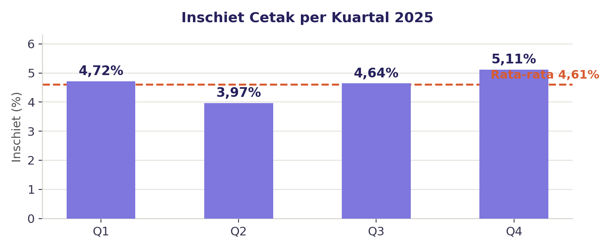
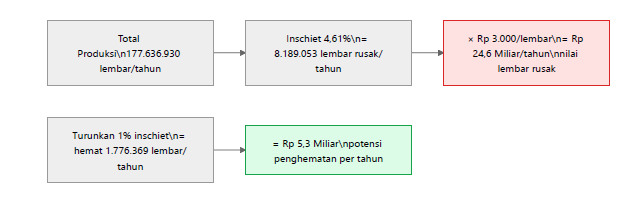

# BAB 1: LATAR BELAKANG DAN MASALAH

> ***Executive Takeaway:***  
> Unit Cetak Pita Cukai mengelola rata-rata pesanan strategis negara sebesar **160.000.000 Lembar Cetak / tahun** (dengan volume aktual tahun 2025 mencapai **177.636.930 Lembar Cetak**). Sepanjang tahun 2025, rata-rata *inschiet* (tingkat kerusakan cetak) berfluktuasi pada level **4,61%** (puncak Q4 mencapai **5,11%**), yang merepresentasikan potensi kerugian pemborosan biaya cetak sebesar **Rp 22,13 Miliar / tahun** (pada volume rata-rata) hingga **Rp 24,56 Miliar / tahun** (pada volume 2025). Pasca-implementasi SIRINE 2024 yang berhasil memetakan *defect category*, muncul titik buta operasional (*operational blind spot*) sejak Januari 2025: **ketiadaan data granular per mesin dan per kondisi operasional (*shift*/tim)**. Ketiadaan data ini mengakibatkan inspeksi perbaikan mesin yang memakan waktu hingga **lebih dari 1 *shift* per mesin** (> 8 jam *downtime*), rekapitulasi data manual yang menumpuk saat Penilaian Pegawai Kuartalan / Akhir Kontrak, serta menghambat potensi efisiensi biaya miliaran rupiah bagi perusahaan. Implementasi DSS SIRINE 4.0 pada semester pertama 2026 berhasil memangkas *inschiet* menjadi **4,34% di Q1** dan **3,33% di Q2**, mengamankan penghematan riil sebesar **Rp 2,23 Miliar dalam 6 bulan** (dengan proyeksi tahunan mencapai **Rp 6,14 – Rp 6,82 Miliar / tahun**).

---

## 1.1 Kondisi Eksisting & Urgensi Operasional Unit Cetak

### 1.1.1 Profil Operasional & Karakteristik Produk Sekuriti Negara
Berdasarkan **Peraturan Pemerintah Nomor 06 Tahun 2019**, **Perum Percetakan Uang Republik Indonesia (Peruri)** merupakan Badan Usaha Milik Negara (BUMN) yang mengemban amanah strategis dari Pemerintah Republik Indonesia untuk menyelenggarakan pencetakan Uang Rupiah serta dokumen sekuriti negara bernilai tinggi. Salah satu portofolio produk sekuriti non-uang yang memiliki kontribusi penerimaan negara sangat masif dan diproduksi secara berkelanjutan adalah **Pita Cukai**, yang mencakup **Pita Cukai Hasil Tembakau (PCHT)** dan **Minuman Mengandung Etil Alkohol (MMEA)**. Dokumen sekuriti ini berfungsi sebagai instrumen pengawasan fiskal sekaligus bukti fisik pelunasan penerimaan cukai negara di bawah kewenangan **Direktorat Jenderal Bea dan Cukai (DJBC) Kementerian Keuangan Republik Indonesia**.

Sebagai dokumen sekuriti negara, pita cukai dicetak dengan spesifikasi pengamanan bertingkat (*multi-layer security features*) untuk mencegah upaya pemalsuan. Fitur pengamanan tersebut mencakup penggunaan kertas sekuriti khusus yang mengandung serat kasat dan tak kasat mata (*security fibers*), tinta sekuriti berpendar di bawah sinar ultra-violet (*UV-fluorescent security ink*), ornamen *guilloche*, *microtext*, serta aplikasi *hologram foil* berpresisi tinggi. Mengingat fungsinya yang sangat sensitif terhadap penerimaan kas negara, setiap lembar cetak pita cukai yang mengalami deviasi mutu atau cacat cetak wajib dikategorikan secara ketat sebagai **Hasil Cetak Tidak Sempurna (HCTS)**. Seluruh lembar HCTS harus melalui proses rekonsiliasi dan verifikasi mutu yang diaudit secara ketat.

Dalam menjalankan mandat produksi tersebut, lini produksi Unit Cetak Pita Cukai beroperasi dengan intensitas tinggi selama **24 jam sehari secara non-stop** dengan menerapkan pola **3 *shift* kerja bergilir** (*Shift* Pagi pukul 07.00–15.00 WIB, *Shift* Sore pukul 15.00–23.00 WIB, dan *Shift* Malam pukul 23.00–07.00 WIB). Operasional harian ini didukung oleh armada mesin cetak *sheet-fed offset* berkecepatan tinggi yang terdiri dari **4 unit mesin Komori (KMR1, KMR2, KMR3, KMR4)**, **2 unit mesin Ryobi (RYB1, RYB2)**, serta **3 unit mesin cetak penunjang GTO (GTO-1, GTO-2, GTO-3)**, dengan melibatkan sekitar **$\pm 42$ personel operator cetak dan kepala kelompok**. Volume pesanan pita cukai yang dikelola unit ini mencapai rata-rata **160.000.000 lembar cetak per tahun**, dengan volume aktual pada tahun anggaran 2025 menembus **177.636.930 lembar cetak**.

Tabel 1.1 di bawah ini merangkum parameter operasional dan spesifikasi kapasitas produksi Unit Cetak Pita Cukai yang menjadi landasan operasional unit kerja.

Tabel 1.1 Profil Operasional dan Parameter Kapasitas Unit Cetak Pita Cukai

| Parameter Operasional | Nilai / Spesifikasi | Satuan | Periode Berlaku | Sumber Data Terverifikasi |
| :--- | :---: | :---: | :---: | :--- |
| **Armada Mesin Cetak Utama** | **Komori (1–4), Ryobi (1–2), GTO (1–3)** | Unit Mesin | Aktif 2025–2026 | Data Inventaris Aset Departemen Strategic Business Unit High Security Solution |
| **Pola Gilir Kerja (*Shift*)** | **3 (Pagi, Sore, Malam)** | *Shift* / Hari | Harian 2025 | Standar Pola Kerja Unit Cetak Pita Cukai |
| **Durasi Operasional Lini** | **24** | Jam / Hari | Harian 2025 | *Standard Operating Procedure* (SOP) Unit Cetak |
| **Total Tenaga Kerja Operator** | **$\pm 42$** | Personel | Tahun 2025 | Data Penugasan Gilir Kerja Seksi Cetak |
| **Rata-Rata Volume Order Tahunan** | **160.000.000** | Lembar Cetak | Standar Tahunan | Perencanaan Kapasitas Produksi & PPIC |
| **Volume Order Aktual 2025** | **177.636.930** | Lembar Cetak | Tahun 2025 | Modul *SAP Production Order* (`ZPPRSIPPC0012`) |
| **Realisasi Volume Produksi Q1 2026** | **57.385.254** | Lembar Cetak | Jan – Mar 2026 | Modul *SAP Production Order* (`ZPPRSIPPC0012`) |
| **Realisasi Volume Produksi Q2 2026** | **45.960.434** | Lembar Cetak | Apr – Jun 2026 | Modul *SAP Production Order* (`ZPPRSIPPC0012`) |
*(Sumber: Departemen Strategic Business Unit High Security Solution & Sistem SAP Perum Peruri)*

### 1.1.2 Keterbatasan Sistem Pencatatan Eksisting (*Data Silo* & Rekapitulasi Manual)
Meskipun lini produksi Unit Cetak Pita Cukai memproses jutaan lembar dokumen sekuriti negara setiap hari dengan mesin-mesin modern, sistem pencatatan operasional di lapangan hingga akhir tahun 2025 masih terperangkap dalam kondisi **pemisahan data (*data silo*)**. Terdapat jurang pemisah yang lebar antara pencatatan kuantitas produksi di lapangan dengan pencatatan data kualitas di unit verifikasi dan sistem Enterprise Resource Planning (SAP).

Dari sisi kuantitas operasional di lapangan, pencatatan hasil produksi harian, nomor mesin, nomor Production Order (PO), serta penugasan operator masih mengandalkan **pencatatan manual pada buku folio fisik** yang diletakkan di meja kontrol masing-masing mesin. Data pada buku folio ini tidak diolah atau diintegrasikan secara harian, melainkan hanya menumpuk dan **baru direkapitulasi secara manual oleh Kepala Kelompok atau Kepala Unit ketika momen evaluasi berkala tiba**, seperti pada saat **Penilaian Kinerja Pegawai Kuartalan** maupun **Evaluasi Akhir Masa Kontrak Pegawai**. Kondisi ini membuat proses rekapitulasi data menjadi sangat lambat, menguras waktu kerja administratif, **sangat rentan terhadap kesalahan manusia (*human error*)**, serta meniadakan visibilitas pemantauan performa harian yang berkesinambungan.

Sebaliknya, dari sisi kualitas dan data cacat cetak (*inschiet*), data kerusakan hasil cetak ditarik dari sistem SAP (T-Code: `ZPPRSIPPC0012`) atau rekapitulasi laporan Unit Verifikasi Pita Cukai. Namun, data yang tersaji dari sistem ini hanya berupa **ringkasan kerusakan global (*general aggregate summary*)** pada level unit secara keseluruhan. Data tersebut **tidak menyediakan atribut granular** yang menjelaskan mesin cetak nomor berapa yang menghasilkan cacat tersebut, pada nomor PO mana cacat terjadi, serta kelompok kerja (*shift*) mana yang bertugas saat proses pencetakan berlangsung.

### 1.1.3 Implikasi terhadap Kinerja Operasional & Pengambilan Keputusan
Ketiadaan integrasi data antara pencatatan kuantitas di lapangan dan kualitas di sistem verifikasi menimbulkan dampak lanjutan yang menghambat efisiensi operasional. Setidaknya terdapat tiga implikasi kritis yang dirasakan langsung di lapangan:

Pertama, **penanganan dan respon perbaikan mesin menjadi sangat lambat dan tidak efisien**. Ketika laporan verifikasi menunjukkan peningkatan angka cacat pada jenis kerusakan tertentu, teknisi pemeliharaan (*maintenance*) tidak memiliki petunjuk mengenai mesin mana yang menjadi sumber masalah utama. Akibatnya, teknisi terpaksa melakukan **inspeksi secara bergiliran ke seluruh armada mesin cetak (*trial-and-error*)**. Pola pemeriksaan spekulatif ini dapat memakan waktu hingga **lebih dari satu *shift* kerja (> 8 jam *downtime*) per mesin**, sementara mesin yang bermasalah terus beroperasi dan melipatgandakan jumlah lembar rusak.

Kedua, **evaluasi kinerja operator menjadi tertunda dan cenderung bias subjektif**. Kepala Unit dan Kepala Kelompok kesulitan memberikan bimbingan teknis (*coaching*) maupun evaluasi yang konstruktif karena rekam jejak kuantitas dan kualitas kerja operator baru diketahui berbulan-bulan setelah pekerjaan selesai. Ketiadaan data harian yang objektif membuat proses pembinaan pegawai kehilangan momentum perbaikan.

Ketiga, **tindakan perbaikan manajemen sering kali tidak tepat sasaran**. Manajemen kesulitan mengidentifikasi apakah lonjakan *inschiet* murni disebabkan oleh kendala teknis mekanis mesin (**Machine**) atau akibat variasi metode kerja dan kelelahan operator antar-*shift* (**Man & Method**). Kesalahan diagnosa ini berujung pada tindakan penanganan yang keliru, seperti menyetel ulang komponen mesin padahal permasalahan sebenarnya berada pada standarisasi prosedur kerja operator di *shift* tertentu.

---

## 1.2 Data Awal Pemicu Inovasi & Baseline Inschiet 2025

### 1.2.1 Data Volume Produksi & Baseline Inschiet Kuartalan 2025
Sepanjang tahun anggaran 2025, total pesanan cetak Pita Cukai Hasil Tembakau (PCHT) yang diterima dan diproses oleh Unit Cetak Pita Cukai mencapai **177.636.930 lembar cetak**. Berdasarkan rekapitulasi data mutu resmi dari sistem SAP (`ZPPRSIPPC0012`) dan Unit Verifikasi Pita Cukai, tingkat kerusakan cetak (*inschiet*) sepanjang tahun 2025 berfluktuasi pada level **rata-rata baseline sebesar 4,61%**.

Rincian fluktuasi tingkat *inschiet* cetak per kuartal sepanjang tahun 2025 disajikan secara lengkap pada Tabel 1.2 berikut ini.

Tabel 1.2 Data Baseline Volume Produksi dan Inschiet Cetak Tahun 2025

| Parameter Data | Nilai / Angka | Satuan | Periode | Sumber Data Terverifikasi |
| :--- | :---: | :---: | :---: | :--- |
| **Rata-Rata Order Tahunan** | **160.000.000** | Lembar Cetak | Standar Tahunan | Perencanaan Kapasitas Produksi & PPIC |
| **Total Order Produksi Aktual 2025** | **177.636.930** | Lembar Cetak | Tahun 2025 | Modul *SAP Production Order* (`ZPPRSIPPC0012`) |
| **Inschiet Kuartal 1 (Q1)** | **4,72%** | Persentase (%) | Jan – Mar 2025 | Rekap Verifikasi Mutu & SAP (`ZPPRSIPPC0012`) |
| **Inschiet Kuartal 2 (Q2)** | **3,97%** | Persentase (%) | Apr – Jun 2025 | Rekap Verifikasi Mutu & SAP (`ZPPRSIPPC0012`) |
| **Inschiet Kuartal 3 (Q3)** | **4,64%** | Persentase (%) | Jul – Sep 2025 | Rekap Verifikasi Mutu & SAP (`ZPPRSIPPC0012`) |
| **Inschiet Kuartal 4 (Q4)** | **5,11%** | Persentase (%) | Okt – Des 2025 | Rekap Verifikasi Mutu & SAP (`ZPPRSIPPC0012`) |
| **RATA-RATA BASELINE 2025** | **4,61%** | Persentase (%) | Tahun 2025 | Konsolidasi Tahunan SIRINE & SAP (`ZPPRSIPPC0012`) |
| **Durasi Trial Maintenance Mesin** | **> 1 *Shift* (> 8 Jam)** | Jam / Mesin | Tahun 2025 | *Maintenance Log* & Laporan Kerusakan Mesin |
*(Sumber: Rekapitulasi Data Mutu Verifikasi & SAP ZPPRSIPPC0012)*

### 1.2.2 Analisis Fluktuasi Kuartalan Baseline 2025
Fluktuasi data *inschiet* pada Tabel 1.2 memberikan gambaran analitis yang sangat krusial mengenai kapabilitas proses produksi di lapangan. Pada **Kuartal 2 (Q2) 2025**, tingkat *inschiet* berhasil ditekan hingga menyentuh **3,97%**. Angka ini membuktikan bahwa lini produksi secara teknis memiliki kapabilitas untuk mencapai tingkat kerusakan di bawah batas 4,00% apabila kondisi operasional berjalan stabil.

Namun, memasuki **Kuartal 4 (Q4) 2025**, terjadi **lonjakan *inschiet* yang sangat signifikan hingga mencapai puncaknya pada level 5,11%** (meningkat sebesar **+1,14 poin persentase** dibandingkan Q2 2025). Lonjakan tajam ini dipicu oleh masuknya volume pesanan pita cukai **desain baru dalam jumlah besar** menjelang akhir tahun anggaran. Karakteristik desain baru yang menuntut adaptasi setelan mesin, dipadukan dengan ketiadaan sistem pemantauan performa mesin secara *real-time*, mengakibatkan operator dan teknisi terlambat mendeteksi deviasi mutu yang terjadi pada masing-masing mesin. 

Distribusi data kuartalan tersebut divisualisasikan pada Gambar 1.1 di bawah ini, yang memperlihatkan perbandingan performa tiap kuartal terhadap garis batas rata-rata baseline tahunan 4,61%.

*Gambar 1.1: Grafik Distribusi Inschiet Cetak per Kuartal 2025 vs Garis Rata-rata Baseline 4,61% (Sumber: Rekap SIRINE & SAP ZPPRSIPPC0012)*

> ***Business Insight Gambar 1.1:***  
> Garis putus-putus oranye menunjukkan rata-rata baseline tahunan sebesar **4,61%**. Lonjakan batang Q4 ke level **5,11%** menegaskan bahwa ketiadaan sistem diagnostik berbasis kondisi mesin dan *shift* di lapangan mengakibatkan lonjakan volume pesanan selalu berbanding lurus dengan pembengkakan angka lembar rusak.

Grafik pada Gambar 1.1 menegaskan bahwa ketiadaan sistem diagnostik berbasis kondisi mesin dan *shift* di lapangan membuat lonjakan volume pesanan selalu diikuti oleh pembengkakan angka lembar rusak. Tanpa adanya intervensi sistemik, fluktuasi mutu ini akan terus berulang dan membebani kinerja biaya perusahaan.

### 1.2.3 Konversi Dampak Penghematan Realisasi 2026 (*Inschiet* $\rightarrow$ Lembar $\rightarrow$ Rupiah)
Untuk membuktikan urgensi penurunan *inschiet*, persentase kerusakan dikonversikan ke dalam parameter fisik lembar kertas sekuriti serta nilai finansial riil. Mengingat rincian biaya pokok produksi maupun harga jual resmi produk pita cukai merupakan informasi rahasia dan privasi perusahaan (*corporate privacy/confidential*), maka perhitungan dampak finansial dalam kajian ini menggunakan angka estimasi biaya cetak sebesar **Rp 3.000\* per lembar cetak**. Angka ini merupakan estimasi internal yang diperhitungkan secara rasional berdasarkan komponen biaya bahan baku (kertas sekuriti khusus dan tinta berpengaman), operasional serta depresiasi mesin, dan alokasi tenaga kerja. Nilai estimasi ini semata-mata digunakan sebagai model simulasi dampak finansial inovasi (*cost avoidance*), bukan merupakan rujukan biaya produksi resmi maupun harga penjualan resmi produk Pita Cukai dari Perum Peruri.

Dengan menggunakan **rata-rata baseline tahun 2025 (4,61%)** sebagai tolok ukur perbandingan (*benchmark*), implementasi **Decision Support System (DSS) SIRINE 4.0** pada Semester 1 tahun 2026 telah menunjukkan efektivitas nyata. Pada **Kuartal 1 (Q1) 2026** yang merupakan masa adaptasi sistem, tingkat *inschiet* berhasil turun menjadi **4,34% (-0,27 pp)**, menyelamatkan **154.940 lembar cetak** senilai **Rp 464,82 Juta**. Selanjutnya, pada **Kuartal 2 (Q2) 2026** di mana tindakan presisi berbasis data granular mesin dan *shift* telah berjalan penuh, *inschiet* terpangkas secara impresif menjadi **3,33% (-1,28 pp / -27,77%)**, menyelamatkan **588.294 lembar cetak** senilai **Rp 1,76 Miliar**.

Secara kumulatif, selama 6 bulan pertama implementasi (Januari – Juni 2026), inovasi ini telah berhasil menyelamatkan **743.234 lembar kertas sekuriti** dari pemborosan cetak dan mengamankan estimasi efisiensi biaya nyata (*cost avoidance*) sebesar **Rp 2,23 Miliar** bagi perusahaan. Rincian konversi data tersebut disajikan pada Tabel 1.3 berikut ini.

Tabel 1.3 Kertas Kerja Realisasi Penurunan Inschiet dan Efisiensi Finansial Semester 1 2026

| Periode Realisasi | Volume Produksi ($n$) | Inschiet Aktual (%) | Penurunan vs Baseline (4,61%) | Lembar Ekspektasi Cacat (Baseline 4,61%) | Lembar Cacat Aktual Realisasi | Lembar Diselamatkan (*Defect Reduction*) | Nilai Penghematan Riil ($\times \text{Rp } 3.000$)* |
| :--- | :---: | :---: | :---: | :---: | :---: | :---: | :---: |
| **Q1 2026** *(Masa Adaptasi)* | **57.385.254** | **4,34%** | -0,27 pp (-5,86%) | 2.645.460 lb | 2.490.520 lb | **154.940 Lembar** | **Rp 464.820.000** *(Rp 464,82 Juta)* |
| **Q2 2026** *(Tindakan Presisi)* | **45.960.434** | **3,33%** | **-1,28 pp (-27,77%)** | 2.118.776 lb | 1.530.482 lb | **588.294 Lembar** | **Rp 1.764.882.000** *(Rp 1,76 Miliar)* |
| **TOTAL SEMESTER 1 2026** | **103.345.688** | **3,89%** *(avg)* | **-0,72 pp (-15,62%)** | 4.764.236 lb | 4.021.002 lb | **743.234 Lembar** | **Rp 2.229.702.000** *(Rp 2,23 Miliar)* |
*(Sumber: Konsolidasi Data Produksi & Verifikasi Mutu Peruri 2026)*  
*\*Catatan Finansial: Angka Rp 3.000/lembar merupakan nilai estimasi internal biaya cetak untuk kebutuhan simulasi dampak finansial dan analisis potensi efisiensi (cost avoidance), bukan rincian biaya produksi atau harga jual resmi produk pita cukai yang bersifat rahasia perusahaan (confidential).*

> ***Key Financial Insight Tabel 1.3:***  
> 1. Pada **Q1 2026**, penurunan *inschiet* sebesar **0,27 pp** pada masa adaptasi sistem berhasil menyelamatkan **154.940 lembar** cetak senilai **Rp 464,82 Juta**.  
> 2. Pada **Q2 2026**, setelah implementasi penuh tindakan presisi berbasis data granular mesin & *shift*, penurunan *inschiet* melesat hingga **1,28 pp** (mencapai **3,33%**), menyelamatkan **588.294 lembar** cetak senilai **Rp 1,76 Miliar** hanya dalam satu kuartal.  
> 3. Secara akumulatif, dalam kurun waktu 6 bulan pertama implementasi (Januari – Juni 2026), inovasi ini telah mengamankan efisiensi biaya nyata sebesar **Rp 2,23 Miliar** dari **743.234 lembar** kertas sekuriti yang terselamatkan dari pemborosan.

---

## 1.3 Identifikasi Masalah Operasional: *The Operational Blind Spot*

### 1.3.1 Ruang Lingkup Masalah: Apa, Di Mana, Sejak Kapan, dan Siapa Terdampak
Identifikasi masalah operasional pada Unit Cetak Pita Cukai didefinisikan secara komprehensif berdasarkan fakta lapangan, lokasi proses, lini masa kejadian, dan pihak-pihak yang terdampak langsung:

Permasalahan utama yang terjadi adalah **ketidakmampuan sistem operasional eksisting dalam mengidentifikasi kontribusi kerusakan cetak (*inschiet*) secara granular per mesin dan per kondisi operasional (*shift*/tim kerja)**. Hal ini mengakibatkan terjadinya pemborosan biaya cetak bernilai miliaran rupiah, tingginya waktu henti mesin (*downtime*) akibat pemeriksaan teknis yang bersifat spekulatif, serta proses evaluasi kinerja operator yang lambat dan rentan bias.

Permasalahan ini berpusat pada **proses cetak *sheet-fed offset* di Unit Cetak Pita Cukai, Departemen Strategic Business Unit High Security Solution Perum Peruri**. Kondisi titik buta operasional (*operational blind spot*) ini mulai teridentifikasi secara kritis sejak **Januari 2025**, yaitu ketika implementasi sistem SIRINE versi sebelumnya (SIRINE 2024) telah mencapai titik jenuh (*plateau effect*) dan memerlukan pendalaman data operasional yang lebih spesifik.

Ketiadaan data granular ini memberikan dampak negatif yang dirasakan oleh berbagai pihak di lingkungan operasional perusahaan:
1. **Operator Cetak Lapangan ($\pm 42$ orang):** Mengalami kesulitan untuk memantau performa kualitas cetaknya secara harian, serta kehilangan kesempatan memperoleh umpan balik kinerja yang objektif dan konstruktif.
2. **Kepala Kelompok dan Kepala Unit:** Menanggung beban kerja administratif yang berat akibat penumpukan data buku folio fisik saat periode evaluasi berkala, sehingga kesulitan menyusun program pembinaan teknis (*coaching*) yang tepat sasaran.
3. **Teknisi Pemeliharaan (*Maintenance*):** Kehilangan jam kerja produktif hingga **lebih dari 1 *shift* kerja (> 8 jam) per mesin** karena harus melakukan penelusuran kerusakan mesin secara *trial-and-error*.
4. **Departemen Perencanaan Produksi (PPIC) & Manajemen:** Kesulitan melakukan perencanaan kapasitas produksi dan alokasi mesin yang presisi akibat ketiadaan profil performa riil dari masing-masing mesin cetak.
5. **Pelanggan Utama (Direktorat Jenderal Bea dan Cukai Kemenkeu RI):** Menghadapi potensi risiko keterlambatan pemenuhan jadwal pengiriman pita cukai akibat tingginya siklus cetak pengganti di lini produksi.

### 1.3.2 Retrospeksi SIRINE 2024 vs Titik Buta Baru 2025 (*The Missing Link*)
Pada ajang Innovation and Kaizen Award (IAKA) tahun 2024, tim inovasi telah meluncurkan sistem SIRINE versi 3.5 yang berhasil **menurunkan rata-rata *inschiet* tahunan dari 5,61% menjadi 4,06%** (menghemat **2.674.679 lembar kirim**). Keberhasilan tersebut dicapai karena SIRINE 2024 mampu memecahkan permasalahan mendasar pada saat itu, yaitu memetakan jenis kerusakan apa yang mendominasi hasil cetak secara umum di level unit (misalnya mengetahui bahwa cacat "blobor" atau "noda tinta" mendominasi produksi).

Namun, memasuki tahun 2025, ketersediaan data jenis kerusakan umum tersebut tidak lagi memadai untuk mendorong penurunan *inschiet* lebih lanjut. **Mengetahui *apa* jenis kerusakannya ternyata belum cukup tanpa mengetahui *di mesin mana* kerusakan tersebut terjadi dan *faktor operasional apa* yang memicunya.** Di sinilah letak mata rantai yang hilang (*the missing link*) yang menjadi titik buta baru operasional Unit Cetak Pita Cukai sepanjang tahun 2025.

Perbandingan evolusi titik buta operasional tersebut diuraikan sebagai berikut:
* **Capaian SIRINE 2024 (Telah Terjawab):** Berhasil menjawab pertanyaan *"Jenis kerusakan apa yang mendominasi unit cetak?"* melalui penyajian data agregat kategori cacat dari unit verifikasi.
* **Titik Buta Operasional 2025 (Kesenjangan Baru):** Belum mampu menjawab tiga pertanyaan fundamental di lapangan:
  1. *"Pada mesin cetak mana kerusakan spesifik tersebut terkonsentrasi?"*
  2. *"Apakah tingginya kerusakan dipicu oleh kendala mekanis mesin atau variasi metode kerja dan kelelahan operator pada shift tertentu?"*
  3. *"Berapa kontribusi kuantitas lembar cetak dan tingkat kerusakan dari masing-masing tim kerja?"*

### 1.3.3 Studi Kasus Inefisiensi di Lapangan
Dampak nyata dari titik buta operasional tersebut dapat dilihat melalui dua studi kasus inefisiensi yang terjadi di lapangan sepanjang tahun 2025:

Studi kasus pertama terjadi pada **bulan Juni 2025**, di mana data rekapitulasi SIRINE menunjukkan bahwa jenis kerusakan **"blobor"** mendominasi hasil cetak pita cukai. Karena sistem tidak menyediakan data atribusi per mesin, teknisi pemeliharaan tidak memiliki informasi mengenai mesin mana yang memicu cacat tersebut. Teknisi terpaksa memeriksa seluruh armada mesin satu per satu, mulai dari KMR1, KMR2, RYB1, hingga RYB2. Setelah memakan waktu pemeriksaan **lebih dari satu *shift* kerja (> 8 jam *downtime*)**, teknisi baru menemukan bahwa sumber masalah sebenarnya berada pada setelan rol air di mesin **Komori 3 (KMR3)**. Selama proses penelusuran acak tersebut berlangsung, mesin KMR3 terus beroperasi dan menghasilkan ribuan lembar produk rusak yang seharusnya dapat dicegah apabila data mesin tersedia sejak awal.

Studi kasus kedua berkaitan dengan **bias diagnosa antara kendala teknis mesin versus variasi kerja *shift* (*Man & Method*)**. Dalam pola operasional 3 *shift*, performa cetak pada mesin yang sama sering kali menunjukkan disparitas yang ekstrem. Sebagai contoh, mesin KMR3 pada penugasan ** *Shift* Malam menghasilkan *inschiet* sebesar 8,5%**, sedangkan pada ** *Shift* Pagi di mesin yang sama hanya menghasilkan *inschiet* 2,5%**. Tanpa adanya sistem pencatatan yang memisahkan data per *shift*, manajemen cenderung mengasumsikan bahwa kendala berada pada kerusakan mekanis mesin dan berulang kali melakukan penyetelan suku cadang. Padahal, akar permasalahan sebenarnya berkaitan dengan **faktor kelelahan operator di *shift* malam atau ketidakseragaman penerapan SOP penyetelan tinta**. Ketiadaan data granular menyebabkan tindakan penanganan menjadi keliru dan tidak menyentuh akar masalah.

---

## 1.4 Skala Dampak Finansial & Risiko Pembiaran (*Cost of Inaction*)

### 1.4.1 Kertas Kerja Dampak Finansial Baseline 2025
Persentase *inschiet* rata-rata sebesar **4,61%** pada volume produksi tahunan pita cukai menimbulkan konsekuensi biaya yang sangat besar bagi perusahaan. Mengingat struktur biaya produksi resmi dan harga jual produk pita cukai dilindungi oleh kerahasiaan dan privasi perusahaan (*confidentiality*), maka simulasi dampak finansial dalam kertas kerja ini menggunakan **nilai estimasi biaya cetak sebesar Rp 3.000\* per lembar cetak** (estimasi internal berbasis biaya kertas sekuriti, tinta khusus, depresiasi mesin, dan alokasi jam kerja tenaga kerja).

Untuk menyajikan transparansi skala kerugian yang dialami perusahaan akibat *inschiet* baseline 2025, kalkulasi dampak finansial disusun ke dalam dua skenario perhitungan matematis terbuka:

#### Skenario A: Berdasarkan Standar Rata-Rata Order Tahunan (160.000.000 Lembar)
$$\begin{aligned}
\text{Volume Rata-Rata Order Tahunan} &= 160.000.000 \text{ Lembar Cetak} \\
\text{Estimasi Lembar Rusak Baseline (4,61\%)} &= 160.000.000 \times 4,61\% = \mathbf{7.376.000 \text{ Lembar Rusak / Tahun}} \\
\text{Nilai Kerugian Finansial Baseline} &= 7.376.000 \text{ lembar} \times \text{Rp } 3.000 = \mathbf{\text{Rp } 22.128.000.000 \text{ / Tahun}} \\
&\approx \mathbf{\text{Rp } 22,13 \text{ Miliar / Tahun (atau Rp 1,84 Miliar / Bulan)}}
\end{aligned}$$

#### Skenario B: Berdasarkan Volume Order Aktual Tahun 2025 (177.636.930 Lembar)
$$\begin{aligned}
\text{Total Volume Order Aktual 2025} &= 177.636.930 \text{ Lembar Cetak} \\
\text{Jumlah Lembar Rusak Aktual Baseline (4,61\%)} &= 177.636.930 \times 4,61\% = \mathbf{8.189.062 \text{ Lembar Rusak / Tahun}} \\
\text{Nilai Kerugian Finansial Aktual 2025} &= 8.189.062 \text{ lembar} \times \text{Rp } 3.000 = \mathbf{\text{Rp } 24.567.186.000 \text{ / Tahun}} \\
&\approx \mathbf{\text{Rp } 24,56 \text{ Miliar / Tahun (atau Rp 2,05 Miliar / Bulan)}}
\end{aligned}$$

Perhitungan di atas membuktikan bahwa pada kondisi baseline 4,61%, potensi pemborosan biaya operasional yang ditanggung perusahaan berkisar antara **Rp 22,13 Miliar hingga Rp 24,56 Miliar per tahun**.

### 1.4.2 Simulasi Valuasi Penghematan Tiap 1,00% Penurunan Inschiet
Besarnya skala volume produksi pita cukai menunjukkan bahwa setiap keberhasilan menurunkan **1,00% (100 basis poin) *inschiet*** akan mengamankan efisiensi biaya (*cost avoidance*) yang sangat signifikan bagi Perum Peruri:

Pada standar rata-rata volume tahunan (160 Juta lembar), setiap penurunan 1,00% *inschiet* setara dengan penyelamatan **1.600.000 lembar kertas sekuriti** atau menghasilkan efisiensi sebesar **Rp 4,80 Miliar per tahun**:
$$\text{Penghematan per 1,00\%} = (160.000.000 \times 1,00\%) \times \text{Rp } 3.000 = 1.600.000 \text{ lembar} \times \text{Rp } 3.000 = \mathbf{\text{Rp } 4.800.000.000 \text{ / Tahun}}$$

Sementara itu, pada volume aktual pesanan tahun 2025 (177,6 Juta lembar), setiap penurunan 1,00% *inschiet* setara dengan penyelamatan **1.776.369 lembar kertas sekuriti** atau menghasilkan efisiensi sebesar **Rp 5,33 Miliar per tahun**:
$$\text{Penghematan per 1,00\%} = (177.636.930 \times 1,00\%) \times \text{Rp } 3.000 = 1.776.369 \text{ lembar} \times \text{Rp } 3.000 = \mathbf{\text{Rp } 5.329.107.000 \text{ / Tahun}}$$

Hubungan antara skala kerugian finansial baseline 4,61% dengan potensi valuasi penghematan tiap penurunan 1,00% diilustrasikan pada diagram alur Gambar 1.2 di bawah ini.

*Gambar 1.2: Diagram Alur Skala Finansial Kerugian Inschiet Baseline 4,61% vs Potensi Penghematan Tiap 1% Penurunan (Sumber: Kertas Kerja Finansial Unit Cetak)*

> ***Business Insight Gambar 1.2:***  
> Pada tingkat baseline 4,61%, perusahaan menanggung beban kerugian antara **Rp 22,13 Miliar s.d. Rp 24,56 Miliar/tahun**. Setiap perbaikan proses yang mampu memangkas 1% *inschiet* menghasilkan *cost avoidance* nyata sebesar **Rp 4,80 Miliar s.d. Rp 5,33 Miliar/tahun**.

Ilustrasi pada Gambar 1.2 memperjelas ruang peluang efisiensi biaya yang dapat diraih perusahaan. Apabila inovasi mampu menurunkan tingkat kerusakan dari 4,61% menuju level 3,33% (penurunan sebesar 1,28 pp), maka perusahaan dapat mengamankan **potensi penghematan biaya produksi hingga lebih dari Rp 6,82 Miliar per tahun**.

### 1.4.3 Matriks Risiko Pembiaran Terintegrasi (*The 5 Pillars Cost of Inaction*)
Apabila kondisi ketiadaan sistem integrasi data granular ini dibiarkan terus berlangsung tanpa adanya langkah perbaikan terstruktur (*inaction*), unit kerja dan perusahaan akan menghadapi risiko multidimensi yang merugikan. Analisis risiko pembiaran ditinjau melalui lima pilar evaluasi operasional:

1. **Pilar Biaya (*Cost*):** Terjadinya akumulasi pemborosan biaya cetak yang mencapai **Rp 22,13 hingga Rp 24,56 Miliar per tahun** akibat terbuangnya bahan baku berharga tinggi dan inefisiensi jam kerja mesin.
2. **Pilar Mutu (*Quality*):** Angka *inschiet* akan terus berfluktuasi tanpa kendali hingga menembus **5,11%**. Ketiadaan data historis perbaikan mesin menyebabkan tindakan perbaikan kualitas bersifat sementara dan masalah serupa akan terus berulang.
3. **Pilar Kepatuhan (*Compliance*):** Berisiko melanggar standar akuntabilitas dan keterlacakan (*traceability*) dokumen sekuriti negara. Pencatatan manual di buku folio fisik menyulitkan proses audit operasional serta tidak sejalan dengan standar manajemen mutu **ISO 9001:2015**.
4. **Pilar Keselamatan, Kesehatan Kerja & Lingkungan (*Safety & ESG*):** Menghasilkan timbulan limbah padat lembar rusak (*inschiet*) sebesar **7,37 hingga 8,18 juta lembar per tahun ($\pm 60–65$ ton kertas terbuang)** yang memicu pemborosan sumber daya bahan baku (kertas sekuriti dan tinta kimia) serta konsumsi energi listrik mesin cetak, di samping meningkatkan beban kerja fisik dan risiko kelelahan (*fatigue*) operator akibat kejar target produksi di *shift* malam.
5. **Pilar Layanan (*Service SLA*):** Mengancam ketepatan waktu serah terima produk ke DJBC akibat antrean proses cetak pengganti lembar rusak, yang berpotensi menurunkan tingkat kepuasan pelanggan utama dan menimbulkan **sanksi keterlambatan Service Level Agreement (SLA)**.

Rangkuman analisis dampak risiko pembiaran pada kelima pilar operasional tersebut disajikan secara sistematis pada Tabel 1.4 berikut ini.

Tabel 1.4 Matriks Risiko Pembiaran Operasional (*Cost of Inaction*)

| Pilar Evaluasi | Bentuk Risiko Nyata Bila Dibiarkan (*Inaction*) | Tingkat Keparahan | Indikator Dampak Terukur |
| :--- | :--- | :---: | :--- |
| **1. Biaya (*Cost*)** | Akumulasi pemborosan biaya cetak mencapai **Rp 22,13 – Rp 24,56 Miliar per tahun** akibat terbuangnya bahan baku berharga tinggi. | **KRITIS** | Beban pemborosan biaya cetak & penurunan efisiensi unit. |
| **2. Mutu (*Quality*)** | Tingkat *inschiet* berfluktuasi tidak terkendali hingga **5,11%**. Ketiadaan data historis mesin membuat tindakan perbaikan kualitas tidak bertahan lama. | **TINGGI** | Angka *defect rate* tinggi dan risiko lembar cacat lolos ke proses lanjutan. |
| **3. Kepatuhan (*Compliance*)** | Pelanggaran standar akuntabilitas pelacakan (*traceability*) dokumen sekuriti negara karena pencatatan produksi manual di buku folio tidak dapat diaudit secara digital. | **TINGGI** | Temuan audit operasional internal dan ketidaksesuaian standar ISO 9001:2015. |
| **4. K3L (*Safety & ESG*)** | Timbulan lembar rusak (*inschiet*) mencapai **7,37 – 8,18 Juta lembar / tahun** ($\pm 60–65$ Ton kertas terbuang), pemborosan konsumsi tinta/energi, dan peningkatan kelelahan kerja operator di *Shift* Malam. | **SEDANG** | Pemborosan sumber daya material/energi dan risiko kelelahan kerja (*fatigue*). |
| **5. Layanan (*Service SLA*)** | Keterlambatan serah terima pesanan pita cukai ke DJBC akibat antrean proses cetak pengganti, yang berisiko mengganggu kelancaran pasokan pita cukai ke industri nasional. | **TINGGI** | Penurunan skor kepuasan pelanggan DJBC dan ancaman denda keterlambatan SLA. |
*(Sumber: Hasil Analisis Risiko Manajemen Unit Cetak Pita Cukai)*

---

### Kesimpulan Bab 1
Berdasarkan tinjauan kondisi eksisting di lapangan, data baseline terverifikasi dari sistem SAP (`ZPPRSIPPC0012`), serta analisis risiko pembiaran pada kelima pilar operasional di atas, dapat disimpulkan bahwa pengembangan dan implementasi **Decision Support System (DSS) SIRINE 4.0** merupakan kebutuhan operasional yang sangat mendesak (*operational imperative*). Inovasi ini hadir untuk menjembatani jurang data (*data silo*) antara lapangan dan sistem manajemen mutu, mentransformasikan pencatatan manual menjadi wawasan preskriptif *real-time*, serta memampukan teknisi dan supervisor mengambil tindakan korektif yang terarah per mesin dan per *shift* kerja. Keberhasilan awal pada Semester 1 2026 yang mengamankan penghematan biaya sebesar **Rp 2,23 Miliar (743.234 lembar diselamatkan)** membuktikan bahwa sistem ini memberikan dampak nyata yang terukur bagi perusahaan. Pembahasan mengenai analisis akar penyebab masalah (*root cause analysis*) secara mendalam akan diuraikan pada Bab 2.
