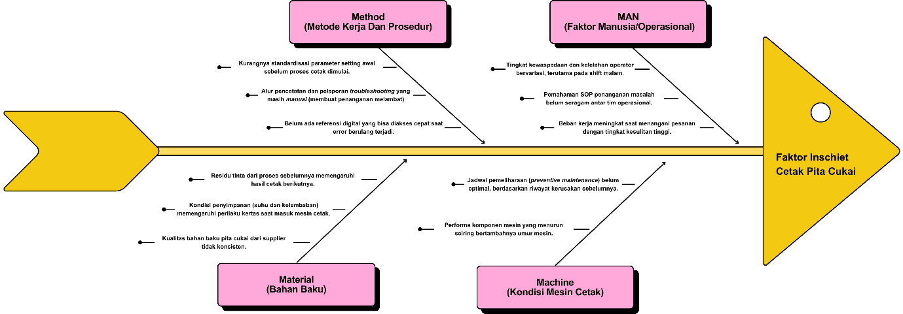
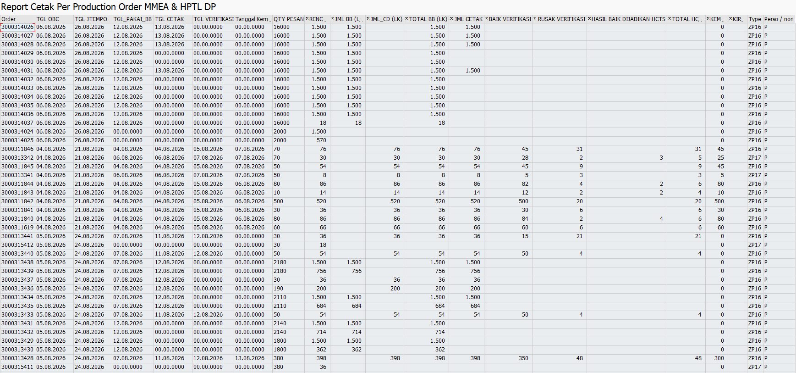

# BAB 2: ANALISIS PENYEBAB (ROOT CAUSE ANALYSIS)

> ***Executive Takeaway:***  
> Fluktuasi tingkat *inschiet* cetak pita cukai pada rata-rata **4,61%** (dengan puncak **5,11%** pada Q4 2025 yang memicu potensi kerugian hingga **Rp 24,56 Miliar / tahun**) berakar dari interaksi empat dimensi operasional pabrik: **Man, Machine, Method, dan Material (4M)**. Melalui dekonstruksi **Diagram Tulang Ikan (*Fishbone 4M*)** dan penelusuran kausalitas berjenjang **5-Why Analysis**, ditemukan bahwa akar masalah utama (*core root cause*) dari inefisiensi ini adalah **terjadinya pemisahan sistem data (*data silo*) dan ketiadaan sistem pendukung keputusan (*Decision Support System*) terpadu yang mampu menghubungkan data jenis kerusakan hasil cetak dengan data penugasan operasional (mesin, *shift*, operator, dan nomor PO) secara *real-time***. Kondisi ini menciptakan kebutaan diagnostik (*diagnostic blindness*): penanganan pemeliharaan mesin terpaksa dilakukan secara spekulatif (*trial-and-error*) dengan *downtime* **> 1 *shift* (> 8 jam) per mesin**, sedangkan pembinaan operator terhambat oleh keterlambatan evaluasi kinerja berbasis buku folio manual. Menghilangkan akar masalah sistemik ini menjadi prasyarat mutlak untuk menurunkan *inschiet* secara berkelanjutan.

---

## 2.1 Metode Analisis Diagram Tulang Ikan (*Fishbone 4M Framework*)

### 2.1.1 Kompleksitas Operasional & Rasional Pemilihan Metode
Lini produksi Unit Cetak Pita Cukai di Departemen Strategic Business Unit High Security Solution Perum Peruri merupakan lingkungan manufaktur berkecepatan tinggi yang sarat dengan variabel dinamis. Proses pencetakan dokumen sekuriti negara di atas mesin *sheet-fed offset* melibatkan interaksi simultan dan berkesinambungan antara presisi mekanis mesin cetak, karakteristik fisika-kimia bahan baku bernilai tinggi (kertas berpengaman dan tinta sekuriti), standarisasi prosedur penyetelan awal (*make-ready*), serta keahlian motorik dan kewaspadaan operator dalam siklus kerja 24 jam non-stop (3 *shift*).

Dalam ekosistem pabrik yang sedemikian kompleks, lonjakan angka cacat cetak (*inschiet*) tidak pernah berdiri sendiri sebagai akibat dari satu faktor linier yang sederhana. Sebagai contoh, timbulnya cacat blobor (*ink bleeding*) pada lembaran pita cukai dapat dipicu oleh setelan rol air mesin yang bergeser (**Machine**), kelelahan visual operator dalam mengontrol keseimbangan air dan tinta pada jam kerja dini hari (**Man**), deviasi viskositas tinta akibat perubahan suhu ruangan (**Material**), atau ketiadaan panduan parameter penyetelan terstandar di meja kontrol (**Method**). Apabila manajemen mengambil kesimpulan terburu-buru tanpa analisis menyeluruh, tindakan perbaikan yang dilakukan berisiko salah sasaran, memboroskan sumber daya, dan membiarkan masalah serupa terulang kembali di kemudian hari.

Untuk membedah seluruh jalinan variabel penyebab tersebut secara objektif dan terstruktur, tim inovasi menggunakan pendekatan **Diagram Tulang Ikan (*Fishbone / Ishikawa Diagram*)** berbasis kerangka kerja **4M (Man, Machine, Method, Material)**. Metode ini dipilih karena menyediakan sistematika berpikir yang kokoh untuk mengurai gejala permukaan (*symptoms*) ke dalam sub-faktor yang dapat diuji dan diverifikasi secara empiris di lapangan (*shop floor*).

Pemetaan menyeluruh faktor-faktor penyebab tingginya *inschiet* cetak pita cukai divisualisasikan pada Gambar 2.1 berikut.

*Gambar 2.1: Diagram Fishbone 4M Dekonstruksi Variabel Penyebab Tingginya Inschiet Cetak Pita Cukai (Sumber: Kajian Mutu & Operasional Unit Cetak)*

> ***Business Insight Gambar 2.1:***  
> Pemetaan Fishbone 4M memperlihatkan potensi penyebab tingginya *inschiet* pada seluruh pilar operasional. Titik lemah utama di lapangan adalah **terputusnya aliran data (*data disconnect*) antar-cabang**, sehingga manajemen dan teknisi tidak dapat memastikan apakah lonjakan kerusakan pada suatu *order* dipicu oleh penurunan performa komponen mesin (**Machine**), inkonsistensi penyetelan (**Method**), penurunan stamina kerja gilir (**Man**), atau variasi bahan baku (**Material**).

---

## 2.2 Dekonstruksi Mendalam Variabel Penyebab (Man, Machine, Method, Material)

Berdasarkan kerangka kerja Fishbone pada Gambar 2.1, dilakukan investigasi dan observasi langsung di lapangan untuk mengurai bagaimana masing-masing cabang 4M berkontribusi terhadap ketidakstabilan mutu cetak pita cukai:

### 2.2.1 Dimensi Man (Dinamika Manusia, Pola Kerja Gilir, & Variasi Kompetensi)
Operasional Unit Cetak Pita Cukai digerakkan oleh $\pm 42$ personel operator dan kepala kelompok yang terbagi ke dalam tim-tim kerja pada 3 pola *shift* bergilir selama 24 jam. Karakteristik faktor manusia yang berkontribusi terhadap fluktuasi mutu meliputi:

Pertama, **terjadinya penurunan kewaspadaan dan kelelahan fisik akibat ritme sirkadian (*circadian fatigue*), khususnya pada *Shift* Malam (pukul 23.00–07.00 WIB)**. Pada jam-jam kritis dini hari, kapasitas konsentrasi visual operator secara alami menurun di bawah penerangan lampu pabrik. Kondisi biologis ini memperlambat kecepatan operator dalam mendeteksi penyimpangan mikro pada lembaran cetak berjalan, seperti pergeseran *register* antar-warna atau perubahan kepekatan tinta sekuriti (*density drift*), sehingga lembaran rusak telanjur tercetak dalam jumlah yang cukup banyak sebelum penyetelan ulang dilakukan.

Kedua, **adanya disparitas pemahaman dan ketrampilan pemecahan masalah teknis (*troubleshooting competence*) antar-operator**. Lini cetak diisi oleh perpaduan antara operator senior berpengalaman dan operator muda. Tanpa adanya sistem panduan digital yang seragam di mesin, tindakan penanganan saat terjadi anomali cetak sangat bergantung pada intuisi individual masing-masing operator. Operator yang kurang terbiasa dengan karakteristik mesin tertentu kerap memerlukan waktu *trial-and-error* yang lebih lama untuk menstabilkan kembali proses cetak.

Ketiga, **peningkatan beban kognitif (*cognitive overload*) saat menangani pesanan pita cukai berdesain baru atau dengan ornamen sekuriti rumit**. Seperti yang terbukti pada lonjakan *inschiet* Q4 2025 (mencapai puncak 5,11%), masuknya volume pesanan desain baru menjelang akhir tahun anggaran menuntut konsentrasi ganda dari operator untuk membaca detail ornamen *guilloche*, *microtext*, dan posisi *hologram*. Tingginya tekanan target volume pada masa penutupan anggaran memperbesar peluang terjadinya kesalahan manusia (*human error*).

### 2.2.2 Dimensi Machine (Kondisi Armada Mesin Cetak & Pola Pemeliharaan)
Armada percetakan utama terdiri dari 4 unit mesin Komori (KMR1, KMR2, KMR3, KMR4), 2 unit mesin Ryobi (RYB1, RYB2), serta 3 unit mesin penunjang GTO yang memiliki karakteristik teknologi, spesifikasi kecepatan, dan usia pakai yang beragam. Faktor mesin yang memengaruhi tingginya *inschiet* meliputi:

Pertama, **penurunan kepresisian dan degradasi fisik komponen mesin akibat friksi operasional tinggi (*mechanical wear and tear*)**. Pengoperasian mesin cetak berkecepatan tinggi selama 24 jam non-stop secara alami memicu degradasi mekanis pada suku cadang presisi yang bergesekan secara kontinu:
* **Rol Karet Tinta & Air (*Inking & Dampening Rollers*):** Permukaan karet rol mengalami pengerasan (*rubber hardening*) atau menjadi licin dan mengkilap (*glazing*) setelah jutaan putaran cetak. Akibatnya, daya serap dan distribusi lapisan air pembasah serta transfer tinta sekuriti menjadi tidak seimbang, memicu cacat seperti tinta blobor (*ink bleeding*), noda bintik, atau garis warna (*streaking*).
* **Selimut Karet Cetak (*Rubber Blanket*):** Mengalami penurunan ketebalan dan elastisitas (*blanket fatigue / indentation*) akibat tekanan kompresi silinder secara terus-menerus, yang menyebabkan hasil cetak membayang (*ghosting*) atau kepekatan warna tidak seragam.
* **Penjepit Kertas Silinder (*Cylinder Grippers*):** Ujung penjepit kertas mengalami penurunan daya cengkeram per (*loss of spring tension*) dan permukaan jepit menjadi licin. Hal ini membuat lembaran kertas sekuriti rentan tergelincir atau masuk dalam posisi miring (*misfeed/trail-off*), yang berujung pada cacat pergeseran posisi cetak (*misregister*), kertas terlipat (*zig-zag*), hingga kertas robek di dalam mesin.

Kedua, **pola pemeliharaan pencegahan (*preventive maintenance*) yang masih kaku berbasis kalender (*time-based maintenance*) dan belum berbasis kondisi riil (*condition-based maintenance*)**. Jadwal servis berkala dilakukan secara bergiliran menurut jadwal waktu statis, bukan berdasarkan akumulasi data riwayat kerusakan aktual dari mesin yang bersangkutan. Ketiadaan data historis kerusakan spesifik per mesin membuat teknisi pemeliharaan tidak mengetahui komponen mana yang mengalami degradasi kritis lebih awal, sehingga penggantian suku cadang sering kali terlambat dilakukan dan mesin terpaksa beroperasi dalam kondisi suboptimal.

### 2.2.3 Dimensi Method (Prosedur Operasional, Penyetelan Awal, & Sistem Pelaporan)
Metode kerja dan tata kelola informasi operasional harian menghadapi sejumlah hambatan prosedural:

Pertama, **belum adanya standarisasi digital untuk parameter penyetelan awal mesin (*make-ready parameters*)**. Penyetelan awal tekanan silinder (*impression pressure*), bukaan celah bak tinta (*ink duct opening*), maupun penyetelan hisapan meja *feeder* masih dilakukan secara manual berdasarkan kebiasaan operator yang bertugas. Ketiadaan lembar parameter standar (*digital recipe*) menyebabkan durasi persiapan cetak menjadi panjang dan menghasilkan lembar afval penyetelan (*make-ready waste*) yang cukup tinggi pada setiap pergantian nomor pesanan (PO).

Kedua, **alur pelaporan kendala teknis dan *troubleshooting* masih bersifat lisan dan manual**. Ketika operator menjumpai anomali cetak di tengah proses produksi, penyampaian informasi kepada pengawas (*supervisor*) atau teknisi pemeliharaan dilakukan secara lisan. Pola komunikasi informal ini tidak hanya memperlambat waktu respon penanganan di lapangan, tetapi juga menghilangkan rekam jejak teknis (*historical log*), sehingga pengetahuan mengenai cara mengatasi suatu kerusakan tidak terdokumentasi dan tidak menjadi pembelajaran kolektif unit kerja.

Ketiga, **ketiadaan basis data referensi digital untuk penanganan masalah berulang**. Operator di lapangan tidak memiliki akses cepat ke katalog panduan solusi teknis (*digital troubleshooting catalog*). Saat mesin mengalami kendala serupa yang pernah diselesaikan oleh tim *shift* lain, operator yang bertugas saat itu harus mengulang proses pencarian solusi dari awal.

### 2.2.4 Dimensi Material (Karakteristik Bahan Baku Sekuriti & Lingkungan Pabrik)
Karakteristik bahan baku sekuriti yang bernilai tinggi sangat rentan terhadap fluktuasi kondisi fisik lingkungan:

Pertama, **sensitivitas kertas sekuriti khusus terhadap perubahan suhu dan kelembaban udara relatif (*Relative Humidity / RH*)**. Kertas sekuriti yang mengandung serat pengaman alami bersifat higroskopis, yakni mudah menyerap atau melepaskan uap air sesuai kondisi ruangan. Perubahan kelembaban di ruang penyimpanan maupun di sekitar unit *feeder* mesin dapat menyebabkan pinggiran kertas mengembang atau melengkung (*wavy edges / plooi*). Kondisi ini memicu gangguan transportasi kertas pada meja hantar mesin cetak (*misfeed / zig-zag*) dan ketidaktepatan register cetak.

Kedua, **akumulasi residu tinta sekuriti dan kontaminasi partikel debu kertas**. Tinta berpengaman tinggi (seperti tinta berpendar UV dan tinta magnetik) memiliki karakteristik viskositas dan kecepatan pengeringan yang spesifik. Penumpukan residu tinta pada bak tinta (*ink fountain*) atau serat kertas yang terlepas dan menempel pada permukaan *blanket* memicu timbulnya bintik noda (*hickies*) dan cetakan kotor yang merusak estetika dokumen sekuriti.

Ketiga, **variasi kualitas minor antar-lot pengiriman bahan baku**. Perbedaan toleransi kehalusan permukaan kertas atau viskositas *batch* tinta dari pemasok memerlukan penyesuaian parameter cetak mikro yang presisi di mesin, yang hanya dapat diantisipasi dengan baik apabila operator memiliki data komparatif dari pesanan-pesanan sebelumnya.

---

Rangkuman dekonstruksi variabel penyebab 4M tersebut disajikan secara sistematis pada Tabel 2.1 berikut.

Tabel 2.1 Matriks Dekonstruksi Variabel Penyebab 4M Faktor Inschiet Cetak Pita Cukai

| Kategori 4M | Variabel Penyebab Lapangan | Gejala / Dampak yang Terlihat | Kondisi Eksisting Pengendalian | Status Validasi |
| :--- | :--- | :--- | :--- | :---: |
| **MAN** | Fluktuasi kelelahan fisik pada *shift* malam & disparitas *skill troubleshooting* antar-operator. | Angka *inschiet* pada *shift* malam cenderung lebih tinggi; respon penanganan kendala cetak bervariasi. | Evaluasi hanya dilakukan berkala via pengamatan lisan kepala kelompok. | **Tervalidasi** |
| **MACHINE** | Degradasi fisik komponen presisi (rol mengeras/licin, elastisitas *blanket* turun, penjepit silinder melemah) & servis spekulatif. | Mesin tertentu menghasilkan cacat spesifik secara berulang (misal: blobor di KMR3). | Servis berkala dilakukan bergilir ke semua mesin secara spekulatif (> 8 jam). | **Tervalidasi** |
| **METHOD** | Parameter *setting make-ready* belum terstandarisasi & alur pelaporan kendala masih lisan tanpa rekam jejak. | Durasi persiapan cetak lama; timbul lembar afval penyetelan; solusi kendala tidak terdokumentasi. | Pencatatan transaksi manual di buku folio meja mesin tanpa panduan digital. | **Tervalidasi** |
| **MATERIAL** | Kertas sekuriti sensitif terhadap kelembaban udara & residu penumpukan tinta pada *blanket*. | Timbul cacat fisik kertas (*plooi, zig-zag*) serta cacat noda bintik (*hickies*) dan blobor. | Pengkondisian ruangan konvensional & pembersihan *blanket* manual saat kotor. | **Tervalidasi** |

*(Sumber: Hasil Identifikasi Tim Inovasi & Kajian Operasional Unit Cetak)*

---

## 2.3 Temuan Fakta Lapangan: Bukti Empiris *Data Silo*

Meskipun keempat faktor penyebab pada Tabel 2.1 telah teridentifikasi, pertanyaan paling krusial yang dihadapi manajemen dan tim inovasi adalah: **Mengapa faktor-faktor penyebab tersebut tidak pernah dapat diselesaikan secara tuntas dan terus berulang dari tahun ke tahun?**

Hasil investigasi di lapangan membuktikan bahwa kendala utama berakar dari **pemisahan data (*Data Silo*)**. Sistem informasi operasional terpecah menjadi tiga pulau data terpisah yang tidak saling berkomunikasi satu sama lain, sebagaimana dibuktikan oleh temuan empiris berikut:

### 2.3.1 Fakta Empiris 1: Data Transaksi SAP Terkunci dalam Format Mentah (*Unusable Dormant Data*)
Data pesanan kerja (*Production Order / PO*) dan rekapitulasi kuantitas hasil cetak sebenarnya tersimpan di dalam sistem Enterprise Resource Planning (SAP). Namun, data dari modul SAP (T-Code: `ZPPRSIPPC0012`) tersebut hanya dapat diakses melalui komputer kantor dalam format ekspor tabel mentah (*raw CSV/table*) yang memuat puluhan kolom parameter teknis yang rumit, sebagaimana ditunjukkan pada Gambar 2.2.

*Gambar 2.2: Bukti Tampilan Data Mentah Ekspor SAP Report Cetak Per Production Order (`ZPPRSIPPC0012`) (Sumber: Sistem SAP Perum Peruri)*

> ***Business Insight Gambar 2.2:***  
> Laporan SAP di atas memuat data pesanan dan hasil cetak mentah dalam format spreadsheet statis yang sangat rumit. Di tengah dinamika operasional lapangan yang bergerak cepat, kepala unit dan operator tidak memiliki waktu luang untuk mengolah ribuan baris data mentah ini menjadi grafik tren atau analisis performa per mesin. Akibatnya, data bernilai tinggi ini berakhir menjadi **data pasif (*dormant data*)** yang tidak dapat dimanfaatkan untuk pengambilan keputusan taktis di lapangan.

### 2.3.2 Fakta Empiris 2: Data Mutu Unit Verifikasi Bersifat Ringkasan Global (*Unit-Wide General Summary*)
Unit Verifikasi Pita Cukai secara rutin mencatat jumlah lembar Hasil Cetak Tidak Sempurna (HCTS) dan mengelompokkannya ke dalam kategori jenis kerusakan (seperti blobor, noda tinta, plooi, atau register geser). Namun, laporan yang diterbitkan hanya menyajikan **total lembar cacat per jenis kerusakan sebagai ringkasan global (*unit-wide general summary*) di tingkat unit cetak secara keseluruhan**.

Sistem verifikasi mutu ini sama sekali **tidak mencatat atribut operasional penugasan: pada nomor mesin cetak berapa lembar tersebut diproduksi, pada nomor PO mana cacat terjadi, dan tim kerja (*shift*) mana yang bertugas saat pencetakan berlangsung**. Ketiadaan atribut identitas ini menciptakan kondisi **kebutaan atribusi (*attribution blindness*)**, di mana manajemen mengetahui bahwa ada ribuan lembar cacat blobor, tetapi tidak memiliki petunjuk mengenai mesin mana yang harus diperbaiki dan operator mana yang memerlukan pendampingan teknis.

### 2.3.3 Fakta Empiris 3: Data Penugasan Lapangan Terperangkap di Buku Folio Fisik (*The Physical Paper Trap*)
Di lapangan, pencatatan transaksi harian—yang mencakup tanggal cetak, nomor mesin, nomor PO, nama operator yang bertugas, *shift* kerja, serta jumlah lembar cetak (LK)—seluruhnya ditulis dengan tangan menggunakan pulpen pada **buku folio fisik** yang diletakkan di meja kontrol masing-masing mesin cetak.

Buku-buku folio manual ini tidak pernah diintegrasikan dengan data mutu verifikasi secara harian. Tumpukan buku fisik tersebut hanya disimpan di laci meja mesin dan **baru direkapitulasi secara manual oleh Kepala Kelompok ketika masa evaluasi berkala tiba, seperti pada saat Penilaian Kinerja Pegawai Kuartalan maupun Evaluasi Akhir Masa Kontrak Tenaga Kerja**. Akibatnya, data lapangan ini sangat rentan terselip, rusak akibat tumpahan tinta/air, mengandung kesalahan transkripsi (*human error*), serta meniadakan transparansi pemantauan kinerja harian yang berkesinambungan.

---

Perbandingan mendalam antara kondisi fragmentasi data eksisting dengan kebutuhan diagnosa operasional ideal dirangkum pada Tabel 2.2 berikut.

Tabel 2.2 Matriks Perbandingan Sistem Pencatatan Eksisting (*Data Silo vs Kebutuhan Diagnostik*)

| Sumber Data Eksisting | Parameter yang Dicatat | Format Pencatatan | Aksesibilitas di Lapangan | Keterbatasan Kritis (*The Missing Link*) |
| :--- | :--- | :--- | :--- | :--- |
| **Sistem SAP (`ZPPRSIPPC0012`)** | Nomor PO, Target Order, Jml Cetak Baik, Jml Rusak Global. | *Raw Table* / CSV Mentah. | Terbatas di komputer kantor (tidak *mobile*). | Format rumit, tidak menampilkan performa visual harian per mesin. |
| **Unit Verifikasi (HCTS)** | Jumlah lembar rusak per kategori kerusakan (*blobor*, noda, dll). | Rekap Laporan Bulanan Mutu. | Laporan berkala ke manajemen. | **Tidak ada data nomor mesin pencetak, nomor PO, dan shift kerja.** |
| **Pencatatan Lapangan (Unit Cetak)** | Tanggal, Mesin, Shift, Tim/Operator, Jumlah Cetak. | **Buku Folio Fisik Manual.** | Fisik di meja mesin. | **Tidak terhubung ke data mutu, rawan hilang, baru direkap saat evaluasi.** |
| **Kebutuhan Diagnostik Ideal** | **PO $\rightarrow$ Mesin $\rightarrow$ Shift $\rightarrow$ Tim $\rightarrow$ Volume (LK) $\rightarrow$ Rusak $\rightarrow$ Jenis Cacat** | **DSS Digital Terpadu** | **Real-Time di Lapangan** | *Dibutuhkan untuk tindakan perbaikan presisi seketika.* |

*(Sumber: Hasil Audit Sistem Informasi & Alur Kerja Unit Cetak Pita Cukai 2025)*

---

## 2.4 Analisis 5-Why & Penetapan Akar Masalah Utama (*Core Root Cause*)

### 2.4.1 Penelusuran Kausalitas Melalui 5-Why Analysis
Untuk menembus batas gejala permukaan dan menemukan akar masalah paling mendasar yang menjadi pemicu seluruh inefisiensi di atas, tim inovasi melakukan penelusuran kausalitas sistemik menggunakan metode **5-Why Analysis**, sebagaimana disajikan pada Tabel 2.3.

Tabel 2.3 Rantai Analisis 5-Why Penetapan Akar Masalah Inschiet Cetak Pita Cukai

| Tingkat Pertanyaan (*Why Level*) | Pertanyaan Kausalitas (*Why?*) | Fakta / Jawaban Lapangan (*Because...*) | Bukti Pendukung Terverifikasi |
| :---: | :--- | :--- | :--- |
| **Why 1** | Mengapa tingkat *inschiet* cetak pita cukai berfluktuasi tinggi pada rata-rata **4,61%** (puncak **5,11%** di Q4 2025)? | Karena tindakan perbaikan mesin (*maintenance*) dan pembinaan operator sering kali **terlambat dan tidak tepat sasaran**. | Fluktuasi kuartalan Q1 (4,72%) s.d. Q4 (5,11%) pada Tabel 1.2. |
| **Why 2** | Mengapa tindakan perbaikan mesin dan pembinaan operator tidak tepat sasaran? | Karena teknisi dan supervisor **tidak mengetahui secara pasti mesin mana yang menjadi sumber masalah utama** dan apakah lonjakan cacat dipicu oleh faktor teknis mesin atau operasional *shift*. | Kasus penelusuran *blobor* acak ke 6 mesin pada Juni 2025 (> 8 jam *downtime*). |
| **Why 3** | Mengapa tidak diketahui mesin mana dan faktor operasional mana yang memicu kerusakan? | Karena **data jenis kerusakan tidak terhubung dengan data penugasan operasional** (nomor mesin, *shift*, tim, dan nomor PO) di lapangan. | Laporan verifikasi HCTS hanya menyajikan total akumulasi kerusakan global di level unit. |
| **Why 4** | Mengapa data kerusakan dan penugasan operasional tidak terhubung? | Karena terjadi **pemisahan data (*data silo*)**: data mutu tersimpan di sistem SAP/verifikasi, sementara data penugasan dan kuantitas harian dicatat manual di buku folio fisik meja mesin. | Bukti *raw data* SAP (Gambar 2.2) dan catatan buku folio di meja mesin. |
| **Why 5 (Root Cause)** | Mengapa data tersebut terpisah dan dicatat secara manual di buku folio fisik? | **Ketiadaan sistem pendukung keputusan terpadu (*Decision Support System*) yang mampu mendigitalisasi pencatatan produksi per PO di lapangan dan menghubungkannya secara *real-time* dengan data jenis kerusakan per mesin serta per kondisi operasional (*shift*/tim kerja).** | **Akar Masalah Fundamental yang Belum Pernah Diselesaikan di Unit Cetak.** |

*(Sumber: Hasil Rapat Brainstorming & Analisis 5-Why Tim Inovasi Unit Cetak Pita Cukai)*

---

### 2.4.2 Rumusan Akar Masalah Utama (*Core Root Cause Statement*)

Melalui sintesis komprehensif antara dekonstruksi Diagram Fishbone 4M (Gambar 2.1) dan pembuktian kausalitas 5-Why Analysis (Tabel 2.3), akar masalah utama (*core root cause*) yang melandasi perancangan inovasi ini dirumuskan sebagai berikut:

$$\begin{array}{c}
\mathbf{\text{AKAR MASALAH UTAMA (CORE ROOT CAUSE):}} \\
\hline
\text{\textit{"Ketiadaan sistem pendukung keputusan (Decision Support System) yang terintegrasi secara real-time}} \\
\text{\textit{untuk mendigitalisasi rekam jejak produksi per PO di lapangan, serta menghubungkan data kuantitas}} \\
\text{\textit{dan jenis kerusakan secara spesifik ke tingkat mesin dan kondisi operasional (shift/tim kerja)."}}
\end{array}$$

---

### 2.4.3 Rantai Logika Sebab-Akibat Menuju Solusi (*The Cause-and-Effect Bridge*)

Penetapan akar masalah utama di atas membangun jembatan logika sebab-akibat (*cause-and-effect logical chain*) yang sangat kokoh dan tak terbantahkan. Seluruh rantai inefisiensi yang dialami Unit Cetak Pita Cukai bermuara pada ketiadaan sistem digital terintegrasi di lapangan:

$$\begin{aligned}
\text{\textbf{[Akar Masalah]}} &\quad \text{Ketiadaan DSS terintegrasi per PO, Mesin, dan Shift} \\
&\quad\Big\downarrow \\
\text{\textbf{[Gejala 1]}} &\quad \text{Pencatatan manual buku folio \& format SAP mentah (Fenomena Data Silo)} \\
&\quad\Big\downarrow \\
\text{\textbf{[Gejala 2]}} &\quad \text{Kebutaan diagnosa: Maintenance spekulatif (> 8 jam) \& evaluasi operator bias} \\
&\quad\Big\downarrow \\
\text{\textbf{[Dampak Akhir]}} &\quad \text{Inschiet berfluktuasi tinggi (4,61\% / Potensi rugi Rp 24,56 Miliar/tahun)} \\
&\quad\Big\Downarrow \text{\textbf{(Intervensi Inovasi)}} \\
\text{\textbf{[Solusi Bab 3]}} &\quad \text{\textbf{DSS SIRINE 4.0: Two-Tier Architecture (Digital Form + Prescriptive Dashboard)}}
\end{aligned}$$

Dengan menyerang langsung akar masalah utama melalui penyediaan sistem digital dua lapisan (*Two-Tier Architecture*) pada **DSS SIRINE 4.0**, seluruh cabang penyebab 4M pada Diagram Fishbone dapat dieliminasi secara sistematis. Sistem ini mendigitalkan pencatatan penugasan per PO di mesin (*Lapisan 1*) dan secara otomatis mengolah data SAP serta verifikasi mutu menjadi dasbor aksi preskriptif bagi supervisor dan teknisi (*Lapisan 2*). Konsep rancang bangun, arsitektur sistem, dan mekanisme kerja solusi inovasi ini diuraikan secara mendalam pada **BAB 3**.
