# BAB 3: GAGASAN & MEKANISME SOLUSI (THE PROPOSED SOLUTION)

> ***Executive Takeaway:***  
> Untuk mengeliminasi akar masalah pemisahan data (*data silo*) dan ketiadaan sistem pendukung keputusan yang teridentifikasi pada Bab 2, tim inovasi merancang dan mengimplementasikan **Decision Support System (DSS) SIRINE 4.0**. Solusi ini dibangun di atas **Arsitektur Dua Lapisan (*Two-Tier Architecture*)**: *Lapisan 1 (Shop-Floor Data Capture)* mendigitalisasi pencatatan penugasan dan transaksi per *Production Order* (PO) secara *seamless* di lini mesin (< 30 detik per input), sementara *Lapisan 2 (Prescriptive Analytics Engine)* secara otomatis mengolah data SAP dan verifikasi mutu menjadi **6 Modul Fitur Unggulan** yang preskriptif dan *real-time*. Sistem ini mentransformasikan operasional Unit Cetak Pita Cukai dari pemeliharaan spekulatif (*trial-and-error downtime* > 8 jam) dan evaluasi subjektif manual, menjadi **tindakan perbaikan presisi berbasis data (*data-driven precision action*)**. Intervensi sistemik ini secara langsung membongkar 4 pilar penyebab *Fishbone* (Man, Machine, Method, Material) dan menjadi motor utama penurunan *inschiet* dari **4,61% ke 3,33%** yang mengamankan efisiensi biaya sebesar **Rp 6,82 Miliar / tahun**.

---

## 3.1 Konsep Solusi & Arsitektur Sistem Dua Lapisan (*Two-Tier Architecture*)

### 3.1.1 Paradigma Transformasi: Dari SIRINE 3.5 (2024) Menuju DSS SIRINE 4.0 (2026)
Pengembangan sistem pada ajang inovasi tahun 2026 ini bukan sekadar pembaruan tampilan grafis perangkat lunak, melainkan sebuah **lompatan paradigma operasional (*operational paradigm shift*)** dalam tata kelola produksi percetakan sekuriti negara di Perum Peruri. Gagasan ini berakar dari pengalaman empiris tim inovasi di area mesin saat mengawal target produksi pita cukai yang terus meningkat di tengah tuntutan toleransi cacat yang semakin ketat dari Direktorat Jenderal Bea dan Cukai (DJBC) Kemenkeu RI.

Pada tahun 2024, implementasi SIRINE versi 3.5 berhasil menjawab satu pertanyaan mendasar: *"Jenis kerusakan apa yang paling dominan di Unit Cetak Pita Cukai secara umum?"* Melalui penyajian data kategori cacat global di tingkat unit, sistem tersebut mampu mendeteksi bahwa cacat blobor dan noda tinta merupakan penyumbang afval terbesar. Namun, sebagaimana diuraikan pada Bab 1 dan Bab 2, capaian tersebut menemui titik jenuh (*plateau effect*) sepanjang tahun 2025. Manajemen dan pengawas lapangan dihadapkan pada kebuntuan baru karena ringkasan data global (*unit-wide general summary*) tidak memiliki daya jelajah atribusi: sistem tidak dapat memberitahukan **pada mesin mana** kerusakan terkonsentrasi, **faktor operasional (*shift*/tim) mana** yang memicu lonjakan cacat, serta **tindakan preskriptif apa** yang harus segera dieksekusi oleh teknisi pemeliharaan di lini produksi.

Untuk meruntuhkan dinding pembatas tersebut, **DSS SIRINE 4.0** dihadirkan sebagai sistem pendukung keputusan generasi baru yang cerdas dan terintegrasi. Sistem ini menjembatani jurang pemisah antara data verifikasi mutu di hilir dengan dinamika fisik mesin dan penugasan operator di hulu. Transformasi konseptual dari sistem pelaporan pasif menuju sistem pendukung keputusan aktif diilustrasikan pada Gambar 3.1.

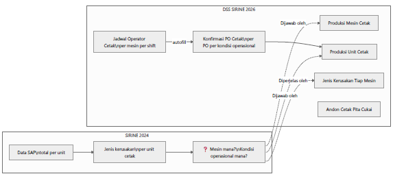
*Gambar 3.1: Diagram Alur Transformasi Konsep Solusi dari SIRINE 3.5 (2024) Menuju DSS SIRINE 4.0 (Sumber: Perancangan Arsitektur Sistem Unit Cetak 2026)*

> ***Business Insight Gambar 3.1:***  
> SIRINE 3.5 (2024) hanya berhenti pada penyajian ringkasan kerusakan global di tingkat unit tanpa atribusi operasional. DSS SIRINE 4.0 memecah kebuntuan tersebut dengan menyajikan data granular yang langsung menjawab kebutuhan taktis lapangan: performa kuantitas dan *inschiet* dijawab oleh *Produksi Mesin Cetak*, evaluasi kondisi kerja dijawab oleh *Produksi Unit Cetak*, akar teknis komponen dijawab oleh *Jenis Kerusakan Tiap Mesin*, dan transparansi lini kerja dipantau langsung oleh *Andon Display*.

---

### 3.1.2 Landasan Teori & Pendekatan Desain Sistem (*Smart Factory & Lean UX*)
Perancangan DSS SIRINE 4.0 berpijak pada prinsip integrasi manufaktur cerdas (*Smart Factory*) sebagaimana dirumuskan oleh Lee, Kao, dan Yang (2014), yang menegaskan bahwa efisiensi industri manufaktur modern hanya dapat dicapai apabila sistem analitik mampu mengonversi data pasif menjadi wawasan preskriptif yang dapat dieksekusi langsung oleh operator di lapangan. Dalam konteks percetakan sekuriti berkecepatan tinggi di Peruri, sistem pendukung keputusan harus memenuhi tiga pilar kelayakan teknis:
1. **Kecepatan dan Kemudahan Akses di Lapangan (*Usability & Lean UX*):** Antarmuka dirancang dengan mengadopsi prinsip *10 Principles for Good Design* oleh Dieter Rams serta panduan *UI Style Guide* modern (Wathan & Schoger). Prinsip ini memastikan operator di meja kontrol mesin dapat melakukan entri data transaksi dalam hitungan detik tanpa memecah konsentrasi pengawasan cetak.
2. **Kualitas dan Integritas Informasi (*Information Quality*):** Mengacu pada kerangka *WebQual 4.0*, sistem menjamin bahwa seluruh data yang disajikan memenuhi standar relevansi tinggi, akurasi mutlak (ditarik langsung dari sistem SAP `ZPPRSIPPC0012` dan modul verifikasi mutu), ketepatan waktu *real-time*, serta kelengkapan atribut operasional per pesanan.
3. **Pemeliharaan Berbasis Kondisi Riil (*Condition-Based Maintenance / CBM*):** Mengubah paradigma servis armada mesin Komori dan Ryobi dari jadwal berkala statis (*time-based*) menjadi intervensi presisi berbasis profil anomali komponen (*defect-driven maintenance*).

---

### 3.1.3 Rancang Bangun Arsitektur Dua Lapisan (*Two-Tier Architecture*)
Untuk mengatasi kendala fragmentasi data di lapangan secara terstruktur dan permanen, DSS SIRINE 4.0 dibangun dengan mengimplementasikan kerangka kerja **Arsitektur Dua Lapisan (*Two-Tier Architecture*)**. Struktur ini membagi beban kerja sistem menjadi dua tingkatan fungsional yang saling terhubung secara harmonis:

Tingkatan pertama adalah **Lapisan 1: Pengumpulan Data Digital Lapangan (*Shop-Floor Digital Data Capture Layer*)**. Lapisan ini berfungsi sebagai ujung tombak digitalisasi yang menggantikan kebiasaan lama pencatatan manual pada buku folio fisik. Lapisan ini mengintegrasikan **Fitur 2 (Jadwal Operator Cetak & Template Tim)** dengan **Fitur 1 (Form Konfirmasi PO Cetak Digital)**. Ketika Person in Charge (PIC) atau operator mesin memasukkan atau memindai nomor Production Order (PO) dari kartu kerja di meja mesin, sistem secara otomatis melakukan penarikan data (*auto-populate / autofill*) parameter pesanan dari basis data SAP serta nama-nama operator yang bertugas dari jadwal mingguan aktif. Mekanisme ini mereduksi waktu input data hingga kurang dari 30 detik per pesanan, mengeliminasi potensi kesalahan ketik manusia (*human error*), dan menghasilkan rekaman transaksi digital yang terstruktur pada tabel transaksi sistem (`transaksi_cetak`).

Tingkatan kedua adalah **Lapisan 2: Analisis Preskriptif & Visualisasi Aksi (*Prescriptive Analytics & Actionable Visualization Layer*)**. Lapisan ini bertindak sebagai mesin pengolah kecerdasan data (*analytics aggregation engine*). Secara otomatis dan kontinu, sistem mengonsolidasikan tiga sumber data utama: data target pesanan dari SAP ERP (`order_pcht`), data transaksi penugasan lapangan dari Lapisan 1 (`transaksi_cetak`), serta data hasil pemeriksaan mutu lembar Hasil Cetak Tidak Sempurna dari Unit Verifikasi (`hcts_pikai`). Seluruh aliran data tersebut disintesis secara *real-time* menjadi empat modul dasbor visual aksi: **Fitur 3 (Produksi Mesin Cetak)** untuk mendeteksi anomali performa per mesin, **Fitur 4 (Produksi Unit Cetak)** untuk memetakan dinamika kinerja antar-tim dan antar-shift, **Fitur 5 (Audit Jenis Kerusakan Tiap Mesin)** untuk memandu teknisi pemeliharaan dengan diagram Pareto komponen kritis, serta **Fitur 6 (Layar Andon Real-Time Lapangan)** yang memancarkan transparansi operasional ke seluruh area lini cetak.

Rancang bangun dan alur integrasi data arsitektur dua lapisan tersebut divisualisasikan secara komprehensif pada Gambar 3.2.

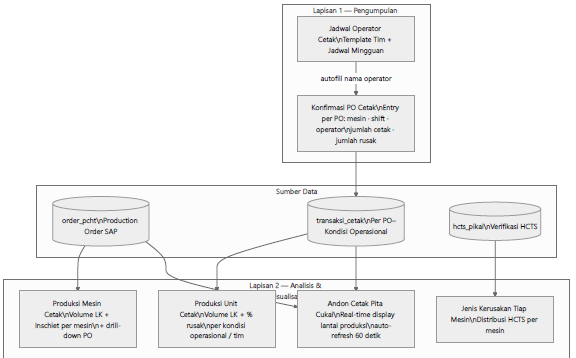
*Gambar 3.2: Diagram Alur Integrasi Sumber Data dan Arsitektur Dua Lapisan DSS SIRINE 4.0 (Sumber: Blueprint Sistem DSS SIRINE 2026)*

> ***Business Insight Gambar 3.2:***  
> Arsitektur Dua Lapisan meruntuhkan *data silo* dengan menyalurkan data penugasan operator dari *Lapisan 1* langsung ke basis data terpusat, menyatukannya dengan data SAP dan Verifikasi Mutu, untuk kemudian diolah menjadi 4 modul visual pada *Lapisan 2*. Informasi tidak lagi tersimpan pasif di buku folio atau komputer kantor, melainkan aktif memandu keputusan teknis harian di lini produksi.

---

## 3.2 Dekonstruksi 6 Modul Fitur Unggulan DSS SIRINE 4.0

Untuk menjawab seluruh kebutuhan operasional dan melenyapkan titik buta di lini produksi, DSS SIRINE 4.0 dirancang dengan 6 modul fitur unggulan yang saling menopang satu sama lain. Setiap modul dirancang secara spesifik berdasarkan profil pengguna (*user persona*) di lingkungan Unit Cetak Pita Cukai, mulai dari operator mesin, kepala kelompok, pengawas operasional, teknisi pemeliharaan, hingga jajaran manajemen unit.

---

### 3.2.1 Fitur 1 – Form Entry Konfirmasi PO Cetak Digital (*Seamless Shop-Floor Capture*)
Form Entry Konfirmasi PO Cetak Digital merupakan pintu gerbang utama dalam proses digitalisasi data produksi di lini cetak. Pengalaman lapangan membuktikan bahwa formulir digital sering kali ditinggalkan oleh operator apabila proses pengisiannya memakan waktu lama, rumit, atau mengganggu tugas utama mengawasi jalannya lembaran cetak berkecepatan tinggi. Oleh karena itu, antarmuka formulir ini dirancang dengan pendekatan *User-Centric Lean UX*, di mana sistem secara cerdas meminimalkan interaksi pengetikan manual melalui otomatisasi penuh.

Saat operator di meja kontrol mesin Komori atau Ryobi menerima kartu pesanan fisik, operator cukup memasukkan atau memindai nomor Production Order (PO). Seketika itu pula, sistem memicu mekanisme *autofill* yang menarik data spesifikasi teknis dari basis data SAP—mencakup kode Order Block Code (OBC), target Rencana Cetak (Rencet), variasi warna desain, hingga nomor plat cetak—ke dalam panel Info Produk di sisi kanan layar. Secara simultan, panel penugasan di bagian bawah otomatis terisi dengan nama-nama personel yang bertugas pada mesin dan *shift* tersebut berdasarkan jadwal mingguan aktif (Fitur 2). Operator hanya perlu memverifikasi kesesuaian data fisik dan menekan pintasan tombol *Ctrl + S* untuk menyimpan transaksi dalam hitungan detik.

Tampilan antarmuka formulir digital yang memadukan otomatisasi data SAP dan penugasan operator tersebut ditunjukkan pada Gambar 3.3.

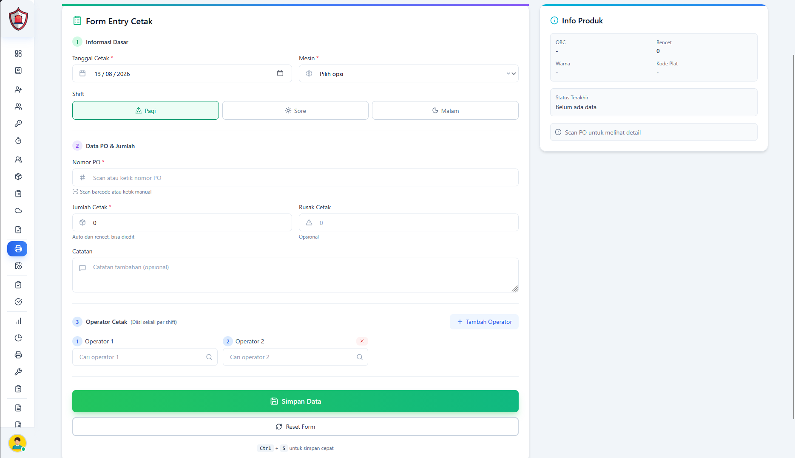
*Gambar 3.3: Tampilan Antarmuka Form Entry Konfirmasi PO Cetak Digital dengan Fitur Autofill Spesifikasi Produk dan Penugasan Operator (Sumber: Tangkapan Layar Aplikasi SIRINE 4.0)*

> ***Business Insight Gambar 3.3:***  
> Panel kanan (*Info Produk*) menampilkan parameter teknis (OBC, Rencet, Warna, Kode Plat) yang terisi otomatis dari basis data SAP saat nomor PO dimasukkan. Panel bawah (*Operator Cetak*) menarik data tim dari Jadwal Mingguan aktif. Dilengkapi pintasan tombol *Ctrl + S* untuk penyimpanan cepat dalam waktu kurang dari 30 detik.

Struktur parameter data operasional yang terekam secara otomatis dan terstandarisasi pada formulir digital ini dirangkum secara rinci pada Tabel 3.1.

Tabel 3.1 Struktur Parameter Data Transaksi Form Konfirmasi PO Cetak Digital

| Parameter Data | Metode Pengisian | Logika Sistem / Sumber Data Otomatis | Fungsi & Ketergantungan Operasional |
| :--- | :---: | :--- | :--- |
| **Tanggal Cetak** | Otomatis / Manual | *Default* tanggal hari ini (*Asia/Jakarta - WIB*). | Menetapkan linimasa transaksi produksi. |
| **Pilihan Mesin Cetak** | Seleksi Dropdown | Menampilkan daftar aktif: KMR1–4, RYB1–2, GTO1–3. | Mengatribusikan data ke unit mesin spesifik. |
| **Pola Gilir (*Shift*)** | Pilihan Tombol Cepat | Pilihan: Pagi (07–15), Sore (15–23), Malam (23–07). | Memetakan kondisi kerja sirkadian operator. |
| **Nomor PO (Production Order)** | Scan Barcode / Input | Terhubung langsung ke modul SAP (`ZPPRSIPPC0012`). | Menjadi *Primary Key* pelacakan order. |
| **Info Spesifikasi Produk** | **100% Autofill SAP** | Menarik otomatis: OBC, Rencet (Target Cetak), Warna, Plat. | Mencegah kesalahan pengetikan spesifikasi produk. |
| **Jumlah Lembar Cetak (LK)** | Autofill / Edit | Default angka rencet SAP, dapat disesuaikan riil. | Mencatat kuantitas fisik yang diproduksi. |
| **Jumlah Rusak (HCTS Lapangan)** | Input Opsional | Estimasi cacat awal di meja mesin sebelum verifikasi. | Peringatan dini deviasi mutu di area kerja. |
| **Identitas Operator Bertugas** | **100% Autofill Jadwal** | Menarik otomatis nama tim & operator dari Fitur 2. | Mengikat akuntabilitas kerja ke individu/tim. |

*(Sumber: Spesifikasi Fungsional Perangkat Lunak DSS SIRINE 4.0)*

Melalui integrasi formulir digital ini, Unit Cetak Pita Cukai berhasil mengukir tonggak sejarah baru dalam tata kelola operasionalnya. Untuk pertama kalinya, setiap lembar cetak pita cukai memiliki silsilah pelacakan (*traceability lineage*) yang lengkap dan terhubung langsung dari hulu ke hilir:

$$\mathbf{\text{PO Nomor 3000311244}} \longrightarrow \mathbf{\text{Mesin RYB1}} \longrightarrow \mathbf{\text{Shift Malam}} \longrightarrow \mathbf{\text{Tim B}} \longrightarrow \mathbf{3.154 \text{ LK Cetak}} \longrightarrow \mathbf{1.654 \text{ Rusak (52,44\%)}}$$

---

### 3.2.2 Fitur 2 – Jadwal Operator & Template Tim Mingguan (*Dynamic Shift Allocation*)
Manajemen penugasan tenaga kerja di unit percetakan sekuriti memiliki kompleksitas tersendiri akibat penerapan pola 3 gilir kerja non-stop selama 24 jam sehari yang melibatkan sekitar 42 personel operator. Sebelum adanya inovasi, Kepala Kelompok harus menyusun jadwal di atas kertas atau papan tulis manual yang rentan menimbulkan kekeliruan pencatatan saat terjadi pertukaran gilir mendadak (*shift swap*) atau ketidakhadiran karena izin sakit.

Modul Jadwal Operator Cetak hadir untuk mentransformasikan pengelolaan jadwal menjadi proses digital yang fleksibel dan dinamis melalui dua sub-fitur utama:
1. **Sub-Fitur Template Tim Mingguan:** Berfungsi sebagai cetak biru struktur penugasan kelompok kerja tetap di setiap armada mesin. Kepala Kelompok menetapkan susunan operator utama (Operator 1 dan Operator 2) untuk Tim A, Tim B, dan Tim C pada masing-masing mesin cetak, menentukan urutan gilir awal, serta mengaktifkan fungsi **Rotasi Shift Mingguan Otomatis** dengan pola standar perputaran: Pagi $\rightarrow$ Malam $\rightarrow$ Sore.
2. **Sub-Fitur Grid Jadwal Mingguan Interaktif:** Menyajikan matriks penugasan dinamis dalam format grid (*Mesin $\times$ Shift*) untuk rentang 7 hari kalender (Senin hingga Minggu). Kepala Kelompok dapat menerbitkan jadwal satu minggu penuh secara instan hanya dengan menekan tombol **Generate Semua dari Template**. Apabila di lapangan terjadi pergeseran penugasan atau izin mendadak, pengawas cukup memperbarui sel pada hari dan mesin yang bersangkutan tanpa perlu merombak konfigurasi template dasar.

Tampilan antarmuka penataan jadwal mingguan dan penyusunan template tim disajikan pada Gambar 3.4 dan Gambar 3.5.

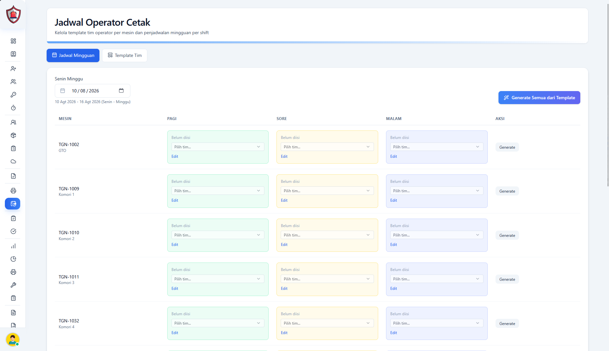
*Gambar 3.4: Antarmuka Grid Jadwal Mingguan Operator Cetak per Mesin dan per Shift Kerja (Sumber: Tangkapan Layar Aplikasi SIRINE 4.0)*

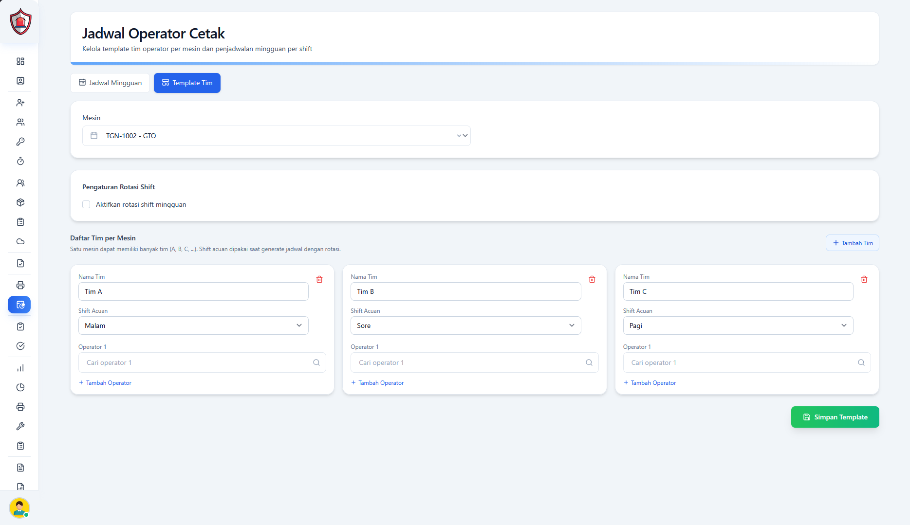
*Gambar 3.5: Antarmuka Konfigurasi Template Tim per Mesin dengan Fitur Rotasi Gilir Mingguan Otomatis (Sumber: Tangkapan Layar Aplikasi SIRINE 4.0)*

> ***Business Insight Gambar 3.4 & 3.5:***  
> Modul ini mengubah tata kelola penugasan dari instruksi lisan menjadi rekam penugasan digital yang terstruktur. Selain menghemat waktu perencanaan Kepala Kelompok hingga 80%, jadwal digital ini menjadi basis data otomatis (*data feeder*) yang menyuplai nama operator ke formulir konfirmasi PO pada Fitur 1.

---

### 3.2.3 Fitur 3 – Dashboard Produksi Mesin Cetak (*SAP Raw Data Transformation Engine*)
Fitur Produksi Mesin Cetak merupakan mesin transformasi data utama yang mengubah ribuan baris data mentah spreadsheet SAP yang pasif dan rumit (Gambar 2.2) menjadi visualisasi performa grafis yang komunikatif dan intuitif. Melalui modul ini, pengawas operasional dan manajemen tidak perlu lagi melakukan olah data manual yang memakan waktu berjam-jam, melainkan dapat langsung membaca dinamika performa seluruh armada mesin cetak dalam hitungan detik.

Dasbor ini menyediakan dua sudut pandang analisis analitik yang dapat dipantau secara mandiri maupun komparatif:

#### A. Analisis Metrik Kuantitas Produksi Cetak (Lembar Cetak / LK)
Pada mode kuantitas, sistem menampilkan agregasi volume lembar cetak yang berhasil diproduksi oleh masing-masing armada mesin dalam rentang waktu yang fleksibel (Harian, Mingguan, Bulanan, maupun Periode Kustom). Dasbor secara otomatis mengalkulasi total produksi unit, menghitung rata-rata produksi per mesin, menetapkan mesin dengan performa terbaik (*Top Performer Machine*), serta menyediakan grafik fluktuasi tren harian untuk setiap mesin secara individual.

Visualisasi dasbor kuantitas produksi unit dan grafik tren harian mesin disajikan pada Gambar 3.6 dan Gambar 3.7.

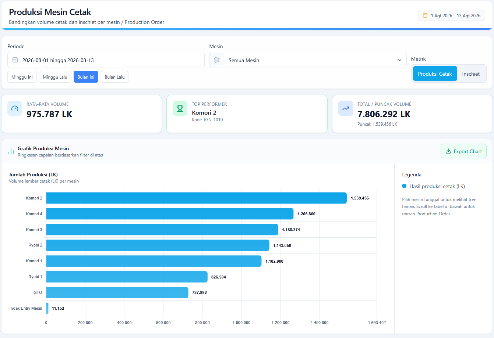
*Gambar 3.6: Dashboard Metrik Kuantitas Produksi Seluruh Mesin Cetak Periode Berjalan (Sumber: Tangkapan Layar Aplikasi SIRINE 4.0)*

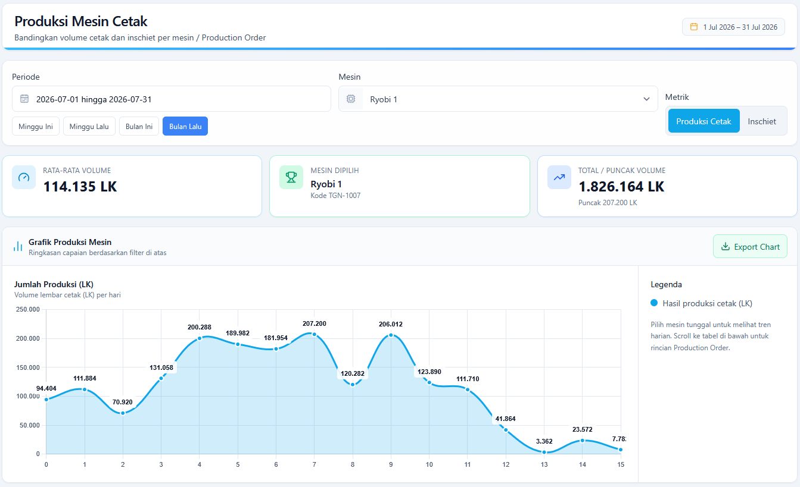
*Gambar 3.7: Grafik Fluktuasi Tren Harian Kuantitas Produksi Mesin Tunggal Ryobi 1 (Sumber: Tangkapan Layar Aplikasi SIRINE 4.0)*

> ***Business Insight Gambar 3.6 & 3.7:***  
> Pada Gambar 3.6, terlihat total produksi unit mencapai **7.806.292 LK** dengan **Komori 2 sebagai Top Performer (1.539.456 LK)**, disusul Komori 4 (1.266.860 LK) dan Komori 3 (1.188.274 LK). Gambar 3.7 memperlihatkan kemampuan penelusuran harian pada mesin Ryobi 1 (Total: 1.826.164 LK, Rata-rata: 114.135 LK/hari), memberikan informasi presisi mengenai stabilitas *output* harian mesin kepada bagian PPIC.

---

#### B. Analisis Metrik Inschiet Produksi Cetak (%) & Deteksi Deviasi per PO
Pada mode kualitas, sistem menyajikan rasio persentase kerusakan cetak (*inschiet*) per mesin secara komparatif. Untuk mempercepat pengenalan anomali di lapangan, sistem menerapkan standardisasi ambang batas berbasis kode warna visual (*Color-Coded Quality Thresholds*):
* **Zona Hijau ($< 3,50\%$):** Performa Mutu Mesin Terkendali Baik (*Under Control*).
* **Zona Kuning ($3,50\% - 5,00\%$):** Performa Mutu Mesin Cukup / Tahap Waspada (*Warning Stage*).
* **Zona Merah ($\ge 5,00\%$):** Performa Mutu Mesin Kritis / Prioritas Tindakan Korektif (*Critical Out of Control*).

Keunggulan paling mendasar dari modul ini adalah kemampuannya melakukan penelusuran mendalam (*drill-down analysis*). Ketika grafik mendeteksi adanya lonjakan *inschiet* pada mesin tertentu, pengguna cukup mengklik batang mesin tersebut untuk membuka tabel rincian transaksi per nomor PO.

Tampilan komparasi persentase kerusakan antar-mesin, grafik anomali harian mesin tunggal, serta tabel rincian per nomor PO ditunjukkan berturut-turut pada Gambar 3.8, Gambar 3.9, dan Gambar 3.10.

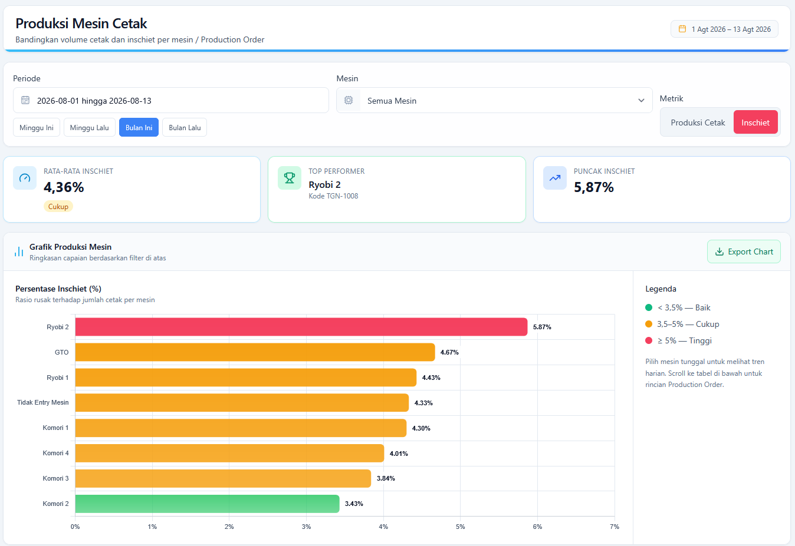
*Gambar 3.8: Peringkat Persentase Inschiet Antar-Mesin Cetak dengan Indikator Warna Batas Kendali Mutu (Sumber: Tangkapan Layar Aplikasi SIRINE 4.0)*

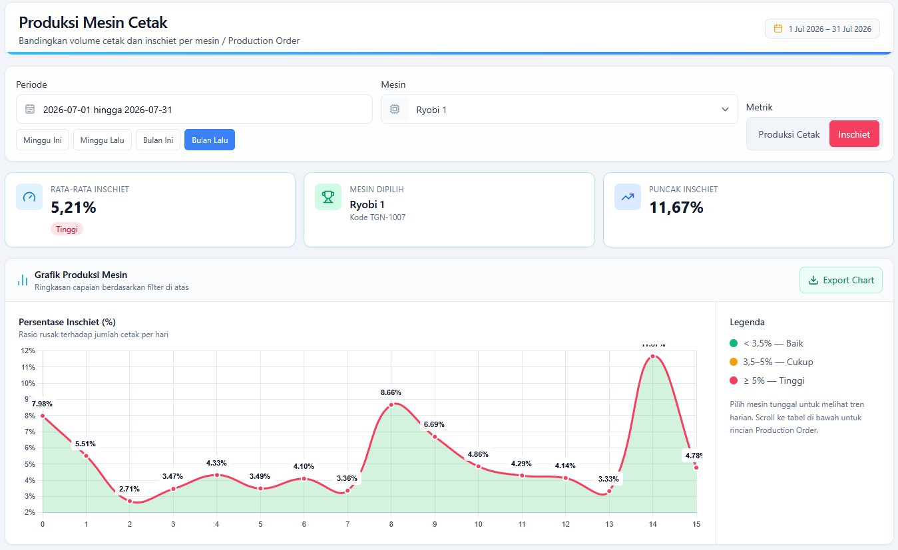
*Gambar 3.9: Grafik Tren Fluktuasi Inschiet Harian Mesin Ryobi 1 Menembus Puncak Kritis 11,67% (Sumber: Tangkapan Layar Aplikasi SIRINE 4.0)*

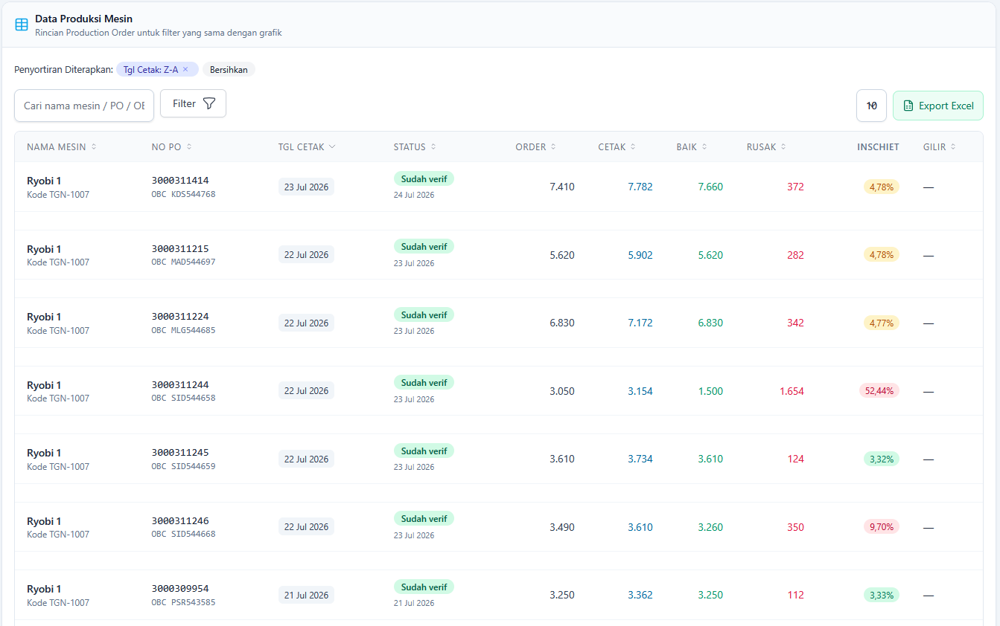
*Gambar 3.10: Tabel Rincian Breakdown Transaksi Produksi dan Verifikasi Mutu per Nomor PO (Sumber: Tangkapan Layar Aplikasi SIRINE 4.0)*

> ***Business Insight Gambar 3.8, 3.9 & 3.10:***  
> Gambar 3.8 secara gamblang memperlihatkan disparitas performa: **Ryobi 2 berada pada status Merah Kritis dengan inschiet 5,87%**, sementara **Komori 2 berada pada status Hijau Prima dengan inschiet 3,43%**. Gambar 3.9 mendeteksi anomali ekstrem pada Ryobi 1 di mana *inschiet* melonjak hingga **11,67%** pada tanggal 14. Gambar 3.10 membuktikan akar lonjakan tersebut melalui penelusuran tabel per PO: pesanan **PO 3000311244 mengalami inschiet ekstrem 52,44% (1.654 lembar rusak dari 3.154 cetak)**. Informasi presisi ini memangkas waktu diagnosa dari hitungan hari menjadi hitungan detik.

---

### 3.2.4 Fitur 4 – Dashboard Produksi Unit Cetak (*Operational Traceability & Coaching Tool*)
Fitur Produksi Unit Cetak dirancang khusus untuk membedah interaksi dinamis antara kinerja mesin dengan faktor manusia (*Man & Method*). Di masa lalu, ketika terjadi pembengkakan angka cacat pada suatu mesin, sering kali timbul perdebatan tanpa ujung antara operator dan teknisi pemeliharaan: apakah mesin yang mengalami kerusakan mekanis atau operator yang kurang teliti dalam menyetel mesin.

Fitur ini menjawab keraguan tersebut dengan menyajikan matriks data kuantitas cetak (LK) dan persentase kerusakan yang dikelompokkan secara bersilang menurut **Tim Kerja (Tim A, Tim B, Tim C)** dan **Pola Gilir (*Shift* Pagi, *Shift* Sore, *Shift* Malam)**. Untuk menjamin kenyamanan kerja, etika keterbukaan informasi, dan keamanan data di lingkungan pabrik, sistem menerapkan **Kontrol Akses Berbasis Peran (*Role-Based Access Control / RBAC*)**:
1. **Tingkat Operator / PIC:** Hanya memiliki hak akses untuk melihat rekam jejak performa kelompok kerjanya sendiri sebagai sarana evaluasi dan perbaikan mandiri (*self-improvement*).
2. **Tingkat Kepala Kelompok:** Memiliki wewenang untuk memantau performa seluruh anggota tim di bawah binaannya guna menyusun langkah pendampingan teknis harian.
3. **Tingkat Kepala Unit & Manajemen:** Memiliki wewenang akses penuh (*super-admin*) untuk melihat matriks komparatif lintas tim, lintas shift, dan lintas mesin di seluruh unit percetakan guna merumuskan kebijakan operasional strategis.

Dengan adanya data ini, manajemen dapat menerapkan model evaluasi diagnostik yang sangat objektif:

$$\begin{array}{c}
\mathbf{\text{SKENARIO EVALUASI DIAGNOSTIK KONDISI OPERASIONAL:}} \\
\hline
\text{Jika Mesin KMR3 telah melalui servis mekanis penuh, namun data Fitur 4 menunjukkan bahwa} \\
\text{\textbf{Shift Malam Tim C konsisten menghasilkan inschiet 7,8\%}} \text{ sementara } \text{\textbf{Shift Pagi Tim A hanya 2,9\%}}, \\
\text{maka manajemen dapat menyimpulkan secara valid bahwa akar masalah berada pada} \\
\mathbf{\text{aspek operasional (penerapan SOP penyetelan tinta / kelelahan kerja shift malam)}}, \\
\text{sehingga intervensi yang diambil adalah pendampingan teknis (coaching), bukan menyetel ulang mesin.}
\end{array}$$

---

### 3.2.5 Fitur 5 – Modul Audit Jenis Kerusakan Tiap Mesin (*Pareto Defect Diagnostic for Maintenance*)
Setelah Fitur 3 berhasil mendeteksi mesin mana yang berada dalam zona merah (*inschiet* tinggi), Fitur 5 memberikan jawaban preskriptif atas pertanyaan teknis berikutnya: **Komponen mekanis apa yang mengalami kerusakan pada mesin tersebut?**

Modul ini menyajikan analisis distribusi cacat Hasil Cetak Tidak Sempurna (HCTS) yang ditarik langsung dari data verifikasi mutu, lalu memetakannya ke dalam **Diagram Pareto Cacat Cetak** per mesin, baik dalam satuan lembar fisik maupun proporsi persentase, sebagaimana ditunjukkan pada Gambar 3.11 dan Gambar 3.12.

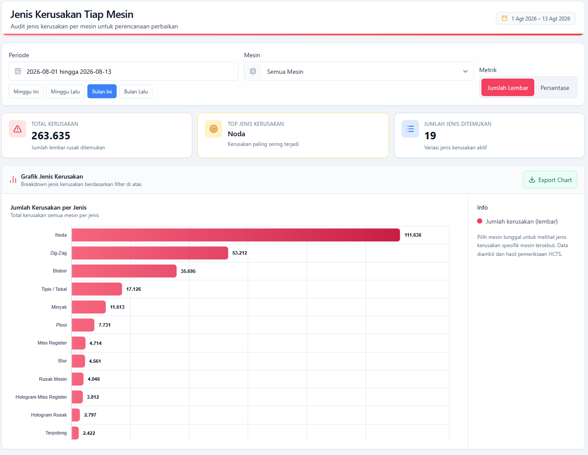
*Gambar 3.11: Diagram Distribusi Jenis Kerusakan HCTS Seluruh Mesin Cetak dalam Satuan Lembar Fisik (Sumber: Tangkapan Layar Aplikasi SIRINE 4.0)*

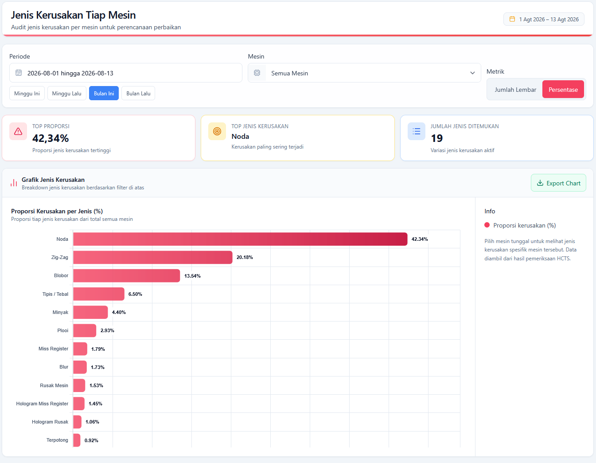
*Gambar 3.12: Diagram Pareto Proporsi Persentase Jenis Kerusakan HCTS Hasil Cetak Pita Cukai (Sumber: Tangkapan Layar Aplikasi SIRINE 4.0)*

> ***Business Insight Gambar 3.11 & 3.12:***  
> Dari total **263.635 lembar kerusakan** yang teridentifikasi pada periode audit, data membuktikan bahwa **tiga jenis cacat utama menguasai 76,06% dari seluruh total kerusakan**:
> 1. **Noda Tinta:** Menyumbang **42,34% (111.636 lembar)** $\rightarrow$ Mengindikasikan kebersihan *blanket* dan kontaminasi partikel debu kertas.
> 2. **Kertas Terlipat (Zig-Zag):** Menyumbang **20,18% (53.212 lembar)** $\rightarrow$ Mengindikasikan penurunan daya cengkeram ujung penjepit kertas silinder (*cylinder grippers*) dan gangguan transportasi meja *feeder*.
> 3. **Tinta Blobor (*Bleeding*):** Menyumbang **13,54% (35.695 lembar)** $\rightarrow$ Mengindikasikan ketidakseimbangan air-tinta dan degradasi rol karet pembasah.

Rincian menyeluruh mengenai 12 kategori jenis kerusakan hasil cetak pita cukai beserta area sumber penyebabnya dirangkum pada Tabel 3.2 berikut.

Tabel 3.2 Distribusi Audit Kategori Jenis Kerusakan HCTS Unit Cetak Pita Cukai

| Peringkat Pareto | Kategori Jenis Kerusakan HCTS | Volume Cacat (Lembar) | Proporsi (%) | Kumulatif (%) | Area & Sumber Penyebab Lapangan |
| :---: | :--- | :---: | :---: | :---: | :--- |
| **1** | **Noda Tinta (*Ink Spots/Hickies*)** | **111.636** | **42,34%** | 42,34% | Kebersihan *blanket cylinder*, bak tinta, kebersihan rol. |
| **2** | **Kertas Terlipat (*Zig-Zag / Misfeed*)** | **53.212** | **20,18%** | 62,52% | Setelan *feeder suction*, *cylinder grippers*, meja hantar kertas. |
| **3** | **Tinta Blobor (*Ink Bleeding*)** | **35.695** | **13,54%** | 76,06% | Keseimbangan rol air (*dampening*), setelan pH air, viskositas tinta. |
| **4** | Tinta Tipis / Tebal (*Color Density*) | 17.126 | 6,50% | 82,56% | Penyetelan kunci bak tinta (*ink keys*), putaran *ink duct roller*. |
| **5** | Kontaminasi Minyak (*Oil Contamination*) | 11.613 | 4,40% | 86,96% | Kebocoran *oil seal bearing*, pelumasan berlebih pada silinder. |
| **6** | Kertas Gelombang (*Plooi / Wavy Edges*) | 7.731 | 2,93% | 89,89% | Kelembaban kertas (RH ruang simpan), tekanan rol hantar. |
| **7** | Pergeseran Register (*Miss Register*) | 4.714 | 1,79% | 91,68% | Presisi penepat samping (*side lay*), klem plat cetak. |
| **8** | Cetakan Membayang (*Blur / Ghosting*) | 4.561 | 1,73% | 93,41% | Tekanan silinder kompresi, elastisitas *rubber blanket*. |
| **9** | **Kerusakan Mesin** | 4.046 | 1,53% | 94,94% | Kertas tergelincir miring (*trail-off*) dan rusak/hancur saat proses cetak berjalan di mesin. |
| **10** | ***Hologram Miss Register*** | 3.812 | 1,45% | 96,39% | Anomali bahan baku vendor (posisi register *hologram foil* bawaan pabrikan kertas tidak presisi). |
| **11** | ***Hologram Foil* Rusak / Terkelupas** | 2.797 | 1,06% | 97,45% | Anomali bahan baku vendor (lapisan pita foil sekuriti cacat/terkelupas dari suplai vendor). |
| **12** | **Potongan Lembar Miring (*Terpotong*)** | 2.422 | 0,92% | 98,37% | Khazanah awal (ketidaktepatan pemotongan/pemilahan sudut siku lembaran kertas bahan baku). |
| — | Variasi Cacat Minor Lainnya | 4.260 | 1,63% | 100,00% | Parameter operasional dan karakteristik kertas sekuriti campuran. |
| **TOTAL** | **Audit Verifikasi Mutu Cetak** | **263.635** | **100,00%** | **100,00%** | **19 Variasi Jenis Kerusakan Teridentifikasi** |

*(Sumber: Modul Jenis Kerusakan Tiap Mesin DSS SIRINE 4.0 & Unit Verifikasi Mutu)*

Informasi Pareto pada Tabel 3.2 mengubah total pola kerja teknisi pemeliharaan (*maintenance*). Sebelum membongkar mesin, teknisi membuka Fitur 5 untuk melihat profil cacat mesin target. Sebagai contoh, jika mesin **Ryobi 2 didominasi oleh cacat blobor (21,5%) dan noda tinta (44%)**, teknisi tidak perlu memeriksa seluruh bagian mesin secara spekulatif, melainkan langsung menuju ke unit rol air dan bak tinta dengan membawa suku cadang rol karet pengganti yang tepat. Pendekatan presisi ini **memangkas durasi henti mesin (*downtime*) dari > 8 jam menjadi kurang dari 2–4 jam**.

---

### 3.2.6 Fitur 6 – Real-Time Andon Display Lini Cetak (*Shop-Floor Visual Management*)
Sebagai wujud penerapan prinsip manajemen visual di area kerja (*Visual Management / Visual Factory*), DSS SIRINE 4.0 dilengkapi dengan modul Andon Display yang ditayangkan secara terpusat pada monitor layar lebar di aula lini cetak. Modul ini beroperasi mandiri secara *real-time* tanpa intervensi manual, dengan mekanisme pembaruan otomatis setiap **60 detik (*auto-refresh*)**.

Layar Andon menyajikan rotasi 4 layar informasi strategis yang dirancang untuk membangun kesadaran situasi (*situational awareness*) bersama bagi seluruh personel di area kerja:
1. **Layar 1 (Ringkasan Harian & Status Pesanan):** Memancarkan metrik utama produksi unit secara langsung, mencakup akumulasi lembar cetak berjalan (4.102.040 LK), hasil cetak sempurna / HCS (2.378.421 LK), lembar rusak / HCTS (105.169 LK), dan tingkat *inschiet* unit (2,56%). Layar ini juga memuat daftar pesanan yang mendekati tenggat waktu serta diagram lingkaran 4 jenis kerusakan dominan hari itu (Noda 48,5%, Zig-zag 24,8%, Blobor 16,4%, dan Tipis/Tebal 6,0%).
2. **Layar 2 (Komparasi Performa Seluruh Mesin):** Menyajikan perbandingan visual *head-to-head* volume lembar cetak dan tingkat *inschiet* antar-mesin (GTO, Komori 1–4, Ryobi 1–2). Layar ini langsung menunjukkan mesin dengan mutu terbaik (Komori 2 dengan *inschiet* 0,12%–3,43%) serta mesin yang memerlukan pengawasan ketat (Ryobi 2 dengan *inschiet* 4,50%–5,87%).
3. **Layar 3 (Drill-Down Mesin Kritis):** Menyoroti secara khusus profil mesin yang sedang mengalami deviasi performa (seperti Ryobi 2 dengan total cetak 595.082 LK dan kerusakan 26.798 LK), lengkap dengan diagram donat proporsi cacat dominannya (Noda 44% dan Blobor 21,5%) agar operator dan teknisi yang melintas di depan layar segera mengambil tindakan korektif.
4. **Layar 4 (Monitoring Sisa Order Bulanan & Peringatan Dini OBC Kritis):** Memantau kemajuan target bulanan produk PCHT dan MMEA (misalnya target 13.500.400 LK telah tercapai 6.060.552 LK atau 44,9%). Layar ini dilengkapi panel alarm visual berkode warna merah menyala untuk kode pesanan yang telah melewati batas jatuh tempo (seperti kode OBC MLG544772 berstatus -1 hari) serta warna kuning untuk pesanan yang mendekati batas kritis ($\le 3$ hari, seperti kode OBC MAD544789).

Tangkapan layar aktual dari keempat rotasi layar Andon Display tersebut disajikan pada Gambar 3.13, Gambar 3.14, Gambar 3.15, dan Gambar 3.16.

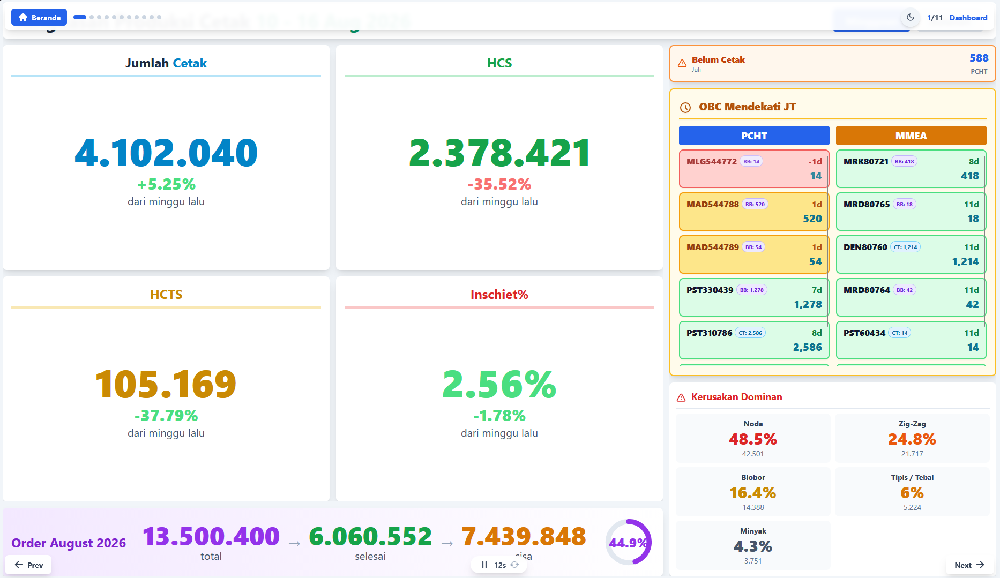
*Gambar 3.13: Layar Andon 1 – Ringkasan Produksi Mingguan, Status Inschiet Aktual 2,56%, Peringatan OBC Mendekati Jatuh Tempo, dan Kerusakan Dominan (Sumber: Layar Monitor Andon Unit Cetak)*

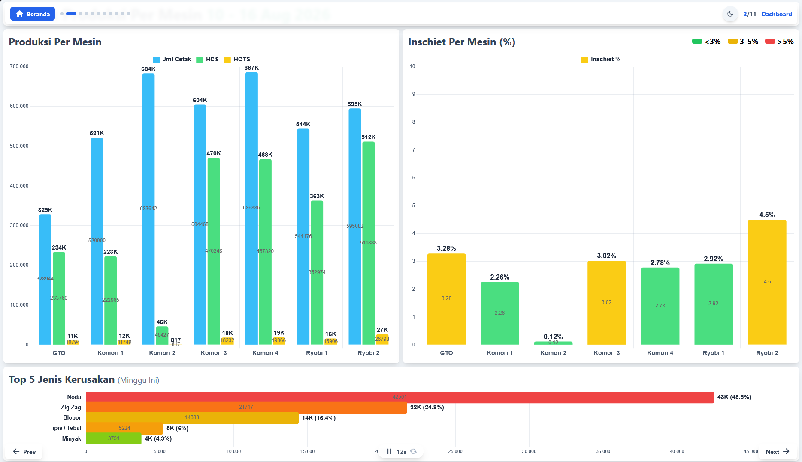
*Gambar 3.14: Layar Andon 2 – Matriks Komparasi Volume Lembar Cetak, HCS, HCTS, dan Persentase Inschiet Antar-Mesin Cetak (Sumber: Layar Monitor Andon Unit Cetak)*

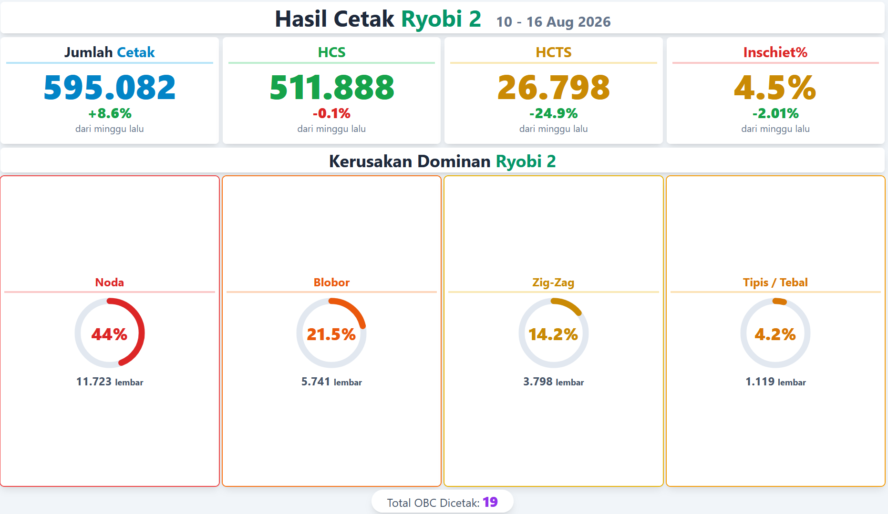
*Gambar 3.15: Layar Andon 3 – Visualisasi Status Khusus Mesin Ryobi 2 dengan Diagram Donat Kerusakan Dominan (Sumber: Layar Monitor Andon Unit Cetak)*

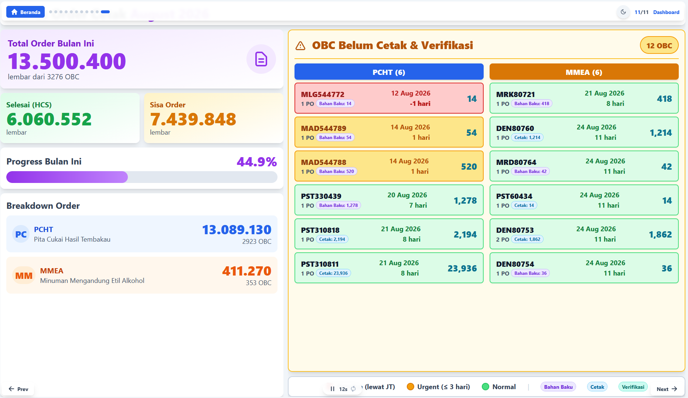
*Gambar 3.16: Layar Andon 4 – Monitoring Kemajuan Order Bulanan PCHT & MMEA serta Sistem Peringatan Dini Kode OBC Kritis (Sumber: Layar Monitor Andon Unit Cetak)*

> ***Business Insight Gambar 3.13 – 3.16:***  
> Layar Andon menghadirkan transparansi total di lini produksi cetak. Kepala *Shift* dan Operator tidak perlu membuka komputer untuk mengetahui kondisi produksi. Pada Gambar 3.16, sistem menampilkan **kode OBC kritis (seperti MLG544772 yang terlambat -1 hari dan MAD544789 yang sisa 1 hari)** dengan kode warna mencolok, memungkinkan tim gilir memprioritaskan pencetakan pesanan mendesak tanpa melanggar Service Level Agreement (SLA) DJBC Kemenkeu RI.

---

## 3.3 Mekanisme Kausalitas Solusi terhadap Akar Masalah (*The 4M Elimination Matrix*)

Rancang bangun 6 modul fitur unggulan pada DSS SIRINE 4.0 dirancang secara presisi untuk mematahkan setiap rantai penyebab yang telah diidentifikasi pada Diagram Fishbone 4M (Bab 2). Transformasi operasional yang dihasilkan pada masing-masing pilar diuraikan sebagai berikut:

### 3.3.1 Solusi Terhadap Dimensi MAN (Faktor Manusia & Kinerja Gilir)
Kelelahan fisik akibat ritme sirkadian (*circadian fatigue*) pada *Shift* Malam (pukul 23.00–07.00 WIB) serta disparitas keterampilan teknis antar-operator sebelumnya menjadi kendala yang sulit diintervensi karena ketiadaan tolok ukur harian. Kehadiran **Fitur 4 (Produksi Unit Cetak)** dan **Fitur 6 (Layar Andon)** memberikan solusi terpadu. Fitur 4 memetakan performa kuantitas dan mutu per tim kerja secara transparan, memungkinkan Kepala Unit mengidentifikasi operator yang membutuhkan pendampingan teknis (*coaching*) secara personal dan terarah tanpa menimbulkan prasangka subjektif. Sementara itu, Layar Andon yang menyala terang di aula lini cetak memberikan umpan balik visual seketika, sehingga operator *shift* malam tetap waspada terhadap pergerakan angka *inschiet* berjalan dan segera merespon saat terjadi anomali mutu.

### 3.3.2 Solusi Terhadap Dimensi MACHINE (Pemeliharaan Presisi Berbasis Kondisi Riil)
Sebelum adanya inovasi, penurunan kepresisian mekanis komponen mesin akibat gesekan operasional tinggi—seperti pengerasan dan licinnya permukaan rol karet tinta/air (*glazing*), penurunan elastisitas selimut karet (*blanket fatigue*), serta hilangnya daya cengkeram penjepit kertas silinder (*loss of gripper tension*)—ditangani melalui jadwal servis berkala yang kaku atau pemeriksaan spekulatif yang memakan waktu > 8 jam *downtime*. Melalui integrasi **Fitur 3 (Produksi Mesin Cetak)** dan **Fitur 5 (Audit Jenis Kerusakan Tiap Mesin)**, teknisi pemeliharaan kini menerapkan pemeliharaan berbasis kondisi riil (*Condition-Based Maintenance*). Ketika Fitur 3 menandai mesin tertentu dalam zona merah, teknisi langsung memeriksa diagram Pareto Fitur 5 untuk mengidentifikasi komponen spesifik yang bermasalah. Teknisi menuju ke unit mesin dengan membawa suku cadang yang tepat, sehingga waktu henti mesin untuk inspeksi dan perbaikan terpangkas lebih dari 50% (< 2–4 jam).

### 3.3.3 Solusi Terhadap Dimensi METHOD (Standarisasi Digital & Eliminasi Rekapitulasi Manual)
Kelemahan metode kerja konvensional yang bertumpu pada pencatatan manual di buku folio fisik meja mesin, ketiadaan resep parameter standar saat persiapan awal cetak (*make-ready*), serta pelaporan kendala teknis secara lisan berhasil dilenyapkan secara tuntas oleh **Fitur 1 (Form Konfirmasi PO Cetak Digital)** dan **Fitur 2 (Jadwal Operator & Template Tim)**. Operator kini mencatatkan transaksi per PO dalam waktu kurang dari 30 detik berkat tarikan data otomatis (*autofill*) dari SAP dan jadwal mingguan. Buku folio manual dieliminasi secara total, membebaskan Kepala Kelompok dari beban administrasi rekapitulasi saat masa evaluasi pegawai, sekaligus membangun rekam jejak historis perbaikan (*digital audit trail*) yang tersimpan rapi dan dapat ditelusuri kapan pun diperlukan.

### 3.3.4 Solusi Terhadap Dimensi MATERIAL (Deteksi Dini Anomali Bahan Baku & ESG Waste Reduction)
Sensitivitas kertas sekuriti terhadap kelembaban udara (*Relative Humidity*) yang memicu pinggiran kertas melengkung (*wavy edges / plooi*), anomali bahan baku kertas berhologram dari pihak *vendor* (*hologram miss register* atau lapisan *foil* cacat/terkelupas), ketidaktepatan pemotongan sudut siku di khazanah awal (*terpotong*), serta akumulasi residu tinta sekuriti UV pada *blanket* kini dapat dimitigasi sejak tahap paling awal. Melalui pemantauan deviasi mutu per nomor PO pada **Fitur 1, Fitur 3, dan Fitur 5**, operator dapat mendeteksi lonjakan anomali bahan baku dan cacat fisik lembaran pada cetakan awal suatu pesanan. Operator dapat segera melakukan pengondisian tumpukan kertas (*airing/conditioning*), membersihkan *blanket*, atau mengajukan klaim bahan baku ke bagian khazanah/gudang sebelum ribuan lembar tercetak rusak. Langkah preventif ini secara nyata menyelamatkan ratusan ribu lembar kertas sekuriti berharga tinggi dan mendukung program keberlanjutan lingkungan (*ESG Waste Reduction*) Perum Peruri.

---

Rangkuman pemetaan sebab-akibat intervensi solusi terhadap akar masalah 4M disajikan secara terstruktur pada Tabel 3.3.

Tabel 3.3 Matriks Kausalitas Intervensi Fitur DSS SIRINE 4.0 terhadap Akar Masalah 4M

| Dimensi 4M | Akar Masalah Spesifik (Bab 2) | Modul Fitur Intervensi | Mekanisme Kerja Solusi | Dampak Terukur pada Proses |
| :--- | :--- | :---: | :--- | :--- |
| **MAN** | Disparitas kompetensi *troubleshooting* & kelelahan sirkadian *shift* malam. | **Fitur 4 & Fitur 6** | Analisis komparatif kinerja per tim/shift & *live alert* monitor area kerja. | Evaluasi kinerja objektif; pendampingan teknis (*coaching*) tepat sasaran. |
| **MACHINE** | Servis mesin spekulatif (> 8 jam), degradasi fisik komponen presisi, & kertas rusak di mesin. | **Fitur 3 & Fitur 5** | Peringkat *inschiet* mesin real-time & Pareto kerusakan spesifik komponen/mesin. | *Condition-Based Maintenance*; *downtime* inspeksi turun $\ge 50\%$. |
| **METHOD** | Rekapitulasi buku folio manual & alur pelaporan kendala lisan. | **Fitur 1 & Fitur 2** | Digitalisasi entry PO (< 30 detik via *autofill*) & grid jadwal tim dinamis. | Eliminasi buku folio 100%; rekam jejak digital *full auditable*. |
| **MATERIAL** | Anomali bahan baku vendor (hologram), khazanah awal (potongan miring), & kertas higroskopis (*plooi*). | **Fitur 1, 3, & 5** | Peringatan dini deviasi mutu per PO & identifikasi cacat bahan baku di mesin. | Mencegah cacat massal; mereduksi limbah afval kertas sekuriti. |

*(Sumber: Sintesis Analisis Kausalitas Solusi Tim Inovasi Unit Cetak Pita Cukai)*

---

### Kesimpulan Bab 3
Melalui perancangan **Arsitektur Dua Lapisan** dan implementasi **6 Modul Fitur Unggulan**, DSS SIRINE 4.0 berhasil membuktikan dirinya sebagai solusi teknologi yang tepat sasaran, *lean*, dan secara fundamental meruntuhkan tembok pemisahan data (*data silo*). Sistem ini tidak hanya menyediakan rekam jejak produksi digital yang transparan dan dapat diaudit, tetapi juga memberdayakan seluruh jajaran personel—mulai dari operator lini, teknisi pemeliharaan, kepala kelompok, hingga manajemen unit—dengan wawasan preskriptif *real-time* untuk mengambil keputusan operasional yang cepat dan akurat. Pembahasan komparatif mengenai keunggulan, kebaruan, alur proses kerja *before-after*, serta target kuantitatif solusi ini diuraikan secara mendalam pada **BAB 4**.
