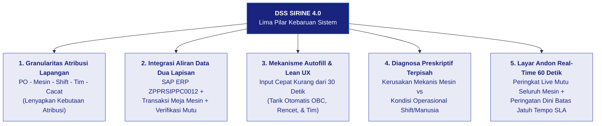
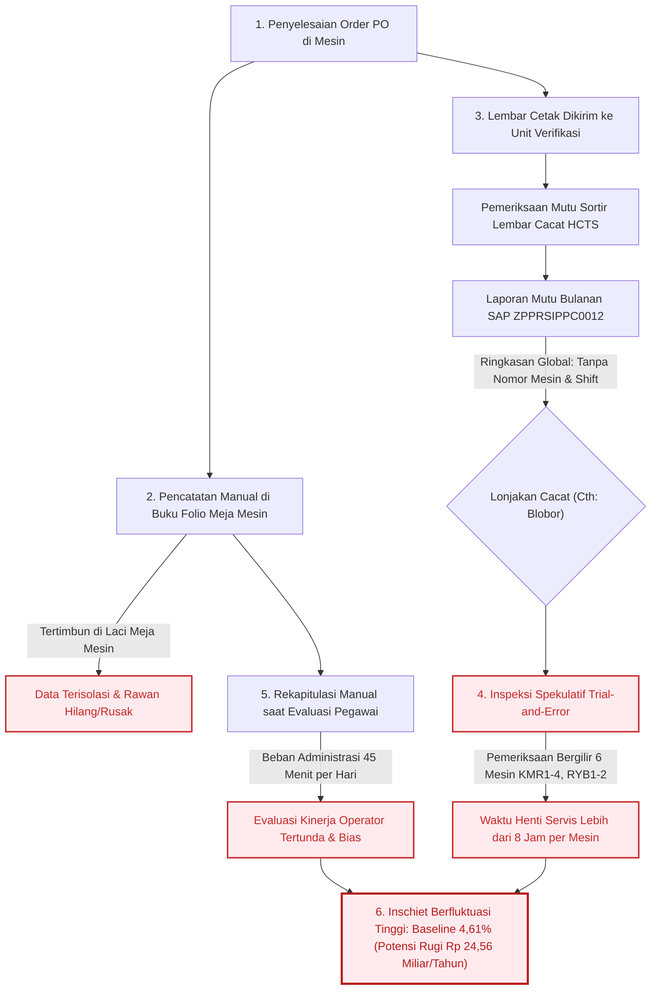
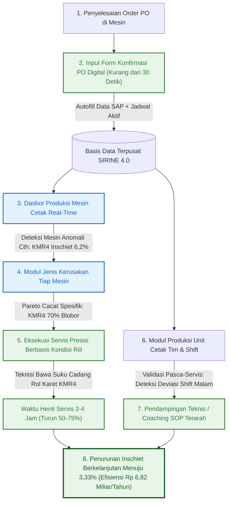
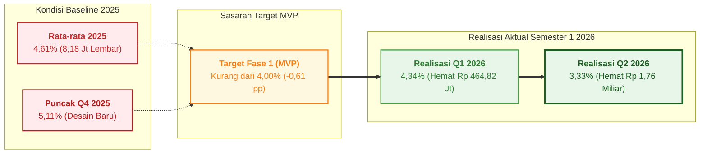

# BAB 4: KEUNGGULAN, KEBARUAN & TRANSFORMASI ALUR PROSES KERJA

> ***Executive Takeaway:***  
> **DSS SIRINE 4.0** menghadirkan kebaruan fundamental (*breakthrough innovation*) dalam tata kelola manufaktur percetakan sekuriti negara di Perum Peruri melalui integrasi **Lima Pilar Kebaruan Sistem Terpadu**. Inovasi ini mentransformasikan alur kerja operasional dari **lingkaran penanganan reaktif yang spekulatif (*The Reactive Trial-and-Error Loop*)** dengan waktu henti perbaikan (*downtime*) **> 1 *shift* (> 8 jam) per mesin** serta rekapitulasi buku folio manual ($\pm 45$ menit/hari), menjadi **alur kerja preskriptif berbasis data terpadu (*The Closed-Loop Data-Driven Action*)** yang memangkas durasi diagnosa dan penanganan teknis sebesar **$\ge 50\%–75\%$ (< 2–4 jam)** serta mengotomatisasi pencatatan data secara instan (*zero administrative waste*). Transformasi ini diperkokoh melalui standarisasi tata kelola baru pada **Instruksi Kerja Input Digital (`IK-PPC-2026-001`)**, pembaruan **SOP Pemeliharaan Mesin Berbasis Pareto (`SOP-PPC-2026-004`)**, dan **Berita Acara Penutupan Buku Folio Fisik (`BA-PPC-2026-002`)** yang selaras dengan klausul **ISO 9001:2015** dan pilar **INDI 4.0**. Dalam kerangka uji coba Minimum Viable Product (MVP) yang difasilitasi langsung oleh pimpinan **minimal setingkat Kepala Departemen (Kadep Strategic Business Unit High Security Solution)**, target penurunan *inschiet* Fase 1 dari baseline **4,61% menjadi < 4,00%** berhasil dilampaui secara impresif hingga menyentuh **3,33% pada Q2 2026**, mengamankan potensi efisiensi biaya tahunan sebesar **Rp 6,82 Miliar / tahun** bagi perusahaan.

---

## 4.1 Unsur Kebaruan & Matriks Kapabilitas (*Novelty & Capability Matrix*)

### 4.1.1 Dekonstruksi Lima Pilar Kebaruan Sistem (*The 5 Breakthrough Dimensions*)
Kebaruan DSS SIRINE 4.0 terletak pada integrasi otomatis data transaksi meja mesin, data pesanan SAP, dan verifikasi mutu ke dalam satu alur kerja preskriptif harian. Dibandingkan dengan sistem pendahulu (SIRINE 3.5 (2024)) maupun pelaporan konvensional di industri percetakan, DSS SIRINE 4.0 mengusung lima pilar kebaruan sistem yang saling terintegrasi:

*Gambar 4.0: Bagan Struktur Lima Pilar Kebaruan Sistem DSS SIRINE 4.0 (Sumber: Desain Arsitektur Sistem 2026)*  
`[PLACEHOLDER_BAGAN_SKEMA_5_PILAR_KEBARUAN_SISTEM]`

Pertama, **Kebaruan Granularitas Atribusi Lapangan Multi-Dimensi (*Multi-Dimensional Attribution Granularity*)**. Pada sistem generasi sebelumnya, data mutu yang dihasilkan oleh unit verifikasi hanya berhenti pada ringkasan kerusakan global (*unit-wide general summary*) di tingkat unit cetak secara umum. Sebaliknya, DSS SIRINE 4.0 berhasil menembus batas mikro operasional dengan mengatribusikan data kualitas secara simultan ke dalam lima dimensi penugasan yang utuh:
$$\mathbf{\text{Nomor Production Order (PO)}} \longrightarrow \mathbf{\text{Nomor Mesin Cetak Spesifik}} \longrightarrow \mathbf{\text{Pola Gilir Kerja (Shift)}} \longrightarrow \mathbf{\text{Tim Operator Bertugas}} \longrightarrow \mathbf{\text{Kategori Cacat Cetak Spesifik}}$$
Kemampuan atribusi multi-dimensi ini melenyapkan kondisi kebutaan atribusi (*attribution blindness*) yang selama bertahun-tahun membelenggu proses diagnosa di area mesin.

Kedua, **Kebaruan Integrasi Aliran Data Dua Lapisan Tanpa Friksi (*Two-Tier Frictionless Data Ingestion*)**. Inovasi ini secara elegan meruntuhkan pemisahan data (*data silo*) dengan menghubungkan tiga pulau data yang sebelumnya terisolasi: data target pesanan dari sistem Enterprise Resource Planning (**SAP ERP `ZPPRSIPPC0012`**), data penugasan operasional di meja kontrol mesin (**Lapisan 1: `transaksi_cetak`**), serta data hasil audit cacat di unit hilir (**Unit Verifikasi Pita Cukai: `hcts_pikai`**). Penyatuan aliran data ini berlangsung secara otomatis tanpa memerlukan proses ekspor-impor manual atau kompilasi *spreadsheet* yang memakan waktu.

Ketiga, **Kebaruan Mekanisme *Autofill* Cerdas & Desain *Lean UX* di Meja Kontrol Mesin (< 30 Detik)**. Untuk mengatasi keengganan operator terhadap antarmuka digital yang rumit, formulir konfirmasi PO dirancang dengan pendekatan *Lean UX*. Operator di meja kontrol mesin tidak perlu mengetik ulang parameter pesanan yang panjang; sistem secara cerdas melakukan penarikan otomatis (*autofill*) atas rincian spesifikasi produk dari basis data SAP serta susunan regu kerja dari modul jadwal mingguan aktif seketika nomor PO dimasukkan. Proses pencatatan transaksi di lini cetak dapat diselesaikan dalam waktu kurang dari 30 detik per pesanan, memastikan nol distraksi terhadap tugas pengawasan jalannya lembaran cetak berkecepatan tinggi.

Keempat, **Kebaruan Diagnostik Preskriptif Terpisah: Mesin vs Kondisi Operasional Gilir**. Sistem ini menghadirkan algoritma analitik yang memampukan manajemen membedakan akar anomali mutu secara objektif: apakah lonjakan persentase kerusakan berakar dari penurunan performa mekanis komponen mesin (**Machine**) seperti degradasi permukaan rol karet pembasah, ataukah dipicu oleh variasi metode penyetelan dan kelelahan sirkadian (*circadian fatigue*) operator pada *shift* malam (**Man & Method**). Pemisahan diagnosa ini menghentikan praktik spekulasi di lapangan, sehingga tindakan perbaikan yang diambil selalu tepat sasaran.

Kelima, **Kebaruan Manajemen Visual *Real-Time* di Area Kerja (*Shop-Floor Real-Time Andon Display*)**. Sistem memancarkan transparansi operasional secara terpusat melalui monitor layar lebar di aula lini cetak yang beroperasi tanpa intervensi manual dengan mekanisme pembaruan otomatis setiap **60 detik (*auto-refresh*)**. Layar Andon menayangkan peringkat performa mesin, profil cacat dominan hari berjalan, serta alarm visual berkode warna mencolok untuk pesanan yang mendekati batas jatuh tempo (*SLA early warning*), membangun kesadaran situasi kolektif (*shared situational awareness*) bagi seluruh personel di area kerja.

---

### 4.1.2 Matriks Kapabilitas Komparatif Tiga Generasi Sistem Operasional
Transformasi kapabilitas operasional Unit Cetak Pita Cukai sejak era konvensional sebelum tahun 2024 hingga implementasi penuh DSS SIRINE 4.0 pada tahun 2026 disajikan secara komparatif pada Tabel 4.1 berikut.

Tabel 4.1 Matriks Kapabilitas Komparatif Tiga Generasi Sistem Operasional Unit Cetak

| Parameter Kapabilitas Operasional | Generasi 1: Cara Lama (Pra-2024) | Generasi 2: SIRINE 3.5 (2024) | Generasi 3: DSS SIRINE 4.0 (2026) | Lompatan Nilai Tambah (*Value Added*) |
| :--- | :---: | :---: | :---: | :--- |
| **1. Identifikasi Cacat Dominan Unit** | Manual / Laporan Lisan | ✅ Ringkasan Global Unit | ✅ **Granular per Mesin & PO** | Mengetahui detail proporsi cacat per mesin secara presisi. |
| **2. Pemetaan Mesin *Inschiet* Tertinggi** | ❌ Ketiadaan Data | ❌ Tidak Tersedia | ✅ **Real-Time per Unit Mesin** | Peringkat *live* performa mutu seluruh 6 mesin cetak utama. |
| **3. Audit Pareto Cacat per Mesin** | ❌ Spekulatif | ❌ Tidak Tersedia | ✅ **Pareto Spesifik Komponen** | Panduan langsung suku cadang bagi teknisi sebelum servis. |
| **4. Pelacakan Volume (LK) per Tim/*Shift*** | Buku Folio Manual | ❌ Tidak Tersedia | ✅ **Digital & Tervalidasi** | Visibilitas *output* fisik per regu kerja secara transparan. |
| **5. Diagnosa Kausal: Mesin vs Tim/*Shift*** | ❌ Bias / Dugaan Subjektif | ❌ Tidak Tersedia | ✅ **Terpisah & Terverifikasi** | Membedakan intervensi teknis mesin vs *coaching* operator. |
| **6. Rekam Jejak Transaksi per PO** | ❌ Rawan Hilang / Rusak | ❌ Parsial (SAP Mentah) | ✅ **Full Digital Traceability** | 100% *auditable* dari kartu kerja meja mesin hingga verifikasi. |
| **7. Kecepatan Entri Data di Lapangan** | $\pm 3–5$ Menit (Tulisan Tangan) | $\pm 3–5$ Menit | ✅ **< 30 Detik (*Autofill SAP*)** | Efisiensi waktu operator di meja kontrol mesin $\ge 85\%$. |
| **8. Rekapitulasi Data Evaluasi Pegawai** | $\pm 45$ Menit / Hari (Manual) | $\pm 45$ Menit / Hari | ✅ **0 Menit (Otomatis Seketika)** | Menghilangkan penumpukan beban administrasi Kepala Kelompok. |
| **9. Durasi *Troubleshooting* Mesin** | > 1 *Shift* (> 8 Jam / Mesin) | > 1 *Shift* (> 8 Jam) | ✅ **< 2–4 Jam (Turun $\ge 50\%$)** | Mengeliminasi pemeriksaan spekulatif bergilir ke semua mesin. |
| **10. Manajemen Visual di Area Kerja** | Papan Tulis Manual Konvensional | ❌ Tidak Ada | ✅ **Layar Andon Real-Time 60s** | *Situational awareness* terpadu bagi seluruh area lini cetak. |
*(Sumber: Hasil Uji Kapabilitas Sistem & Kajian Komparatif Operasional Unit Cetak Pita Cukai 2026)*

> ***Business Insight Tabel 4.1:***  
> Lompatan dari Generasi 2 menuju Generasi 3 menandai pergeseran dari sekadar pelaporan pasif menjadi ekosistem pendukung keputusan preskriptif. Sepuluh parameter operasional di atas membuktikan bahwa DSS SIRINE 4.0 berhasil mengotomatisasi aktivitas klerikal bernilai rendah (entri data < 30 detik dan rekapitulasi evaluasi 0 menit), sekaligus melipatgandakan kecepatan respon teknis lapangan (waktu perbaikan mesin terpangkas dari > 8 jam menjadi < 2–4 jam).

---

### 4.1.3 *Benchmark* Perbandingan terhadap Praktik Unit Lain & Industri Percetakan Sekuriti
Dalam lanskap industri percetakan sekuriti bernilai tinggi (*high security printing*), digitalisasi lini produksi sering kali terkendala oleh tingginya biaya investasi perangkat lunak komersial asing (seperti sistem Manufacturing Execution System / MES *proprietary*) yang menuntut perombakan alur kerja pabrik secara kaku dan memakan biaya lisensi tahunan yang sangat mahal. DSS SIRINE 4.0 mengambil pendekatan inovasi yang berbeda melalui strategi *in-house pragmatic kaizen* yang disesuaikan secara presisi dengan kebutuhan lapangan Perum Peruri:

Pertama, **apabila dibandingkan dengan praktik unit produksi internal lainnya di lingkungan perusahaan**, sebagian besar lini percetakan masih mengandalkan penarikan laporan SAP berkala yang kemudian diolah secara terpisah menggunakan *spreadsheet* di komputer kantor setiap akhir pekan. Pola ini menyebabkan keterlambatan informasi (*information lag*), di mana evaluasi kualitas baru diketahui setelah ratusan ribu lembar produk selesai dicetak. DSS SIRINE 4.0 mendobrak keterbatasan ini dengan menghadirkan kecerdasan data langsung ke area mesin, memungkinkan operator dan kepala kelompok mengambil keputusan perbaikan seketika di tengah proses pencetakan berjalan.

Kedua, **apabila dibandingkan dengan solusi perangkat lunak komersial eksternal**, paket sistem MES dari vendor luar umumnya memerlukan biaya investasi awal (*CAPEX*) bernilai miliaran rupiah, biaya pemeliharaan lisensi tahunan (*OPEX*) yang tinggi, serta proses kustomisasi modul yang lambat saat terjadi perubahan regulasi pita cukai dari DJBC Kemenkeu RI. DSS SIRINE 4.0 dibangun **100% secara mandiri (*in-house development*)** oleh talenta internal Peruri dengan memanfaatkan infrastruktur peladen web intranet yang telah tersedia. Hasilnya, sistem ini terealisasi dengan **biaya investasi lisensi nol rupiah (*zero software license cost*)**, memiliki fleksibilitas adaptasi yang tanpa batas, serta menjamin kedaulatan dan kerahasiaan data sekuriti negara secara mutlak di dalam lingkungan internal perusahaan.

---

## 4.2 Analisis Komparatif Alur Proses Kerja (*Before vs After Workflow Transformation*)

### 4.2.1 Alur Proses Kerja Eksisting / Sebelum Implementasi (*The Reactive Trial-and-Error Loop*)
Sebelum implementasi DSS SIRINE 4.0, tata kelola operasional Unit Cetak Pita Cukai terperangkap dalam lingkaran penanganan masalah yang bersifat reaktif dan spekulatif (*The Reactive Trial-and-Error Loop*). Ketiadaan jembatan data antara area mesin dan unit verifikasi mutu menimbulkan inefisiensi sistemik yang berulang di setiap tahapan produksi.

Diagram alur proses kerja lama pada era pra-inovasi disajikan pada Gambar 4.1 berikut ini.

*Gambar 4.1: Diagram Alur Proses Kerja Sebelum Implementasi DSS SIRINE 4.0: Pola Penanganan Reaktif dan Pemeriksaan Bergilir Spekulatif (Sumber: Pemetaan Alur Kerja Eksisting Unit Cetak)*  
`[PLACEHOLDER_GAMBAR_FLOWCHART_ALUR_KERJA_LAMA_BEFORE]`

> ***Business Insight Gambar 4.1:***  
> Rantai kerja konvensional memperlihatkan titik putus informasi yang fatal: Laporan SAP dan SIRINE lama hanya mampu menginformasikan bahwa *“Cacat Blobor mendominasi bulan ini”*, namun buta terhadap mesin mana dan kelompok kerja mana yang memicunya. Akibatnya, teknisi pemeliharaan terpaksa melakukan inspeksi fisik secara bergilir ke seluruh 6 mesin cetak utama (KMR1–4, RYB1–2) dengan waktu henti (*downtime*) **> 1 *shift* (> 8 jam) per mesin**, sementara pembinaan operator hanya bertumpu pada perkiraan lisan subjektif. Kondisi inilah yang mengunci rata-rata *inschiet* pada level baseline **4,61%** sepanjang tahun 2025.

Secara kronologis, dinamika hambatan pada alur kerja lama diuraikan ke dalam enam tahapan inefisiensi:
1. **Penyelesaian Order di Area Mesin:** Operator menyelesaikan proses pencetakan lembaran pita cukai pada kartu order kerja tertentu di mesin Komori atau Ryobi.
2. **Pencatatan Fisik Terisolasi di Buku Folio:** Operator menuliskan data nomor PO, nomor mesin, *shift*, dan hasil cetak menggunakan pulpen pada buku folio fisik di meja kontrol mesin. Catatan ini tersimpan pasif di laci mesin, rentan terselip atau rusak terkena cairan tinta/air, serta tidak dapat diakses oleh pihak pengawas maupun unit lain secara *real-time*.
3. **Pemeriksaan Mutu Hilir yang Terfragmentasi:** Tumpukan lembaran cetak dikirim ke Unit Verifikasi untuk disortir. Petugas verifikasi mencatat total lembar Hasil Cetak Tidak Sempurna (HCTS) ke dalam sistem SAP sebagai ringkasan global unit, tanpa merekam identitas nomor mesin pencetak maupun tim kerja yang bertugas.
4. **Respon Pemeliharaan yang Spekulatif (*Trial-and-Error*):** Ketika laporan mutu bulanan diterbitkan dan menunjukkan lonjakan cacat tertentu (sebagai contoh, cacat blobor), teknisi pemeliharaan tidak memiliki informasi mengenai mesin mana yang mengalami penurunan performa komponen. Teknisi terpaksa melakukan pemeriksaan bergilir ke seluruh armada mesin satu per satu, menyetel ulang rol air dan silinder secara acak, yang memakan waktu henti produktif hingga lebih dari 8 jam per mesin.
5. **Evaluasi Kinerja yang Tertunda dan Subjektif:** Kepala Kelompok mengumpulkan tumpukan buku folio fisik dan merekapitulasi ribuan baris data secara manual dengan kalkulator saat masa Penilaian Kinerja Pegawai Kuartalan tiba. Proses ini memakan waktu hingga $\pm 45$ menit setiap hari dan umpan balik pembinaan teknis (*coaching*) baru diterima operator berbulan-bulan setelah pekerjaan selesai.
6. **Hasil Akhir yang Suboptimal:** Penanganan masalah yang tidak menyentuh akar penyebab membuat fluktuasi cacat terus berulang, membiarkan tingkat *inschiet* berfluktuasi tinggi pada level **4,61%** yang menguras potensi finansial perusahaan hingga **Rp 24,56 Miliar per tahun**.

---

### 4.2.2 Alur Proses Kerja Baru / Sesudah Implementasi (*The Closed-Loop Data-Driven Action*)
Hadirnya DSS SIRINE 4.0 merombak total alur kerja operasional menjadi sebuah ekosistem digital tertutup yang preskriptif, cepat, dan presisi (*The Closed-Loop Data-Driven Precision Action*). Setiap data yang dimasukkan di hulu secara instan mengalir menjadi panduan tindakan taktis di hilir.

Diagram alur proses kerja baru yang digerakkan oleh DSS SIRINE 4.0 ditampilkan pada Gambar 4.2 berikut.

*Gambar 4.2: Diagram Alur Proses Kerja Sesudah Implementasi DSS SIRINE 4.0: Ekosistem Keputusan Presisi Berbasis Data Granular Real-Time (Sumber: SOP Baru Unit Cetak Pita Cukai 2026)*  
`[PLACEHOLDER_GAMBAR_FLOWCHART_ALUR_KERJA_BARU_AFTER]`

> ***Business Insight Gambar 4.2:***  
> Alur kerja baru membangun kecepatan dan presisi tindakan seketika: Operator memasukkan konfirmasi PO via form digital (< 30 detik) $\rightarrow$ Modul *Produksi Mesin Cetak* langsung mendeteksi mesin yang mengalami anomali mutu (sebagai contoh: Mesin KMR4 mencatat *inschiet* 6,2% vs rata-rata mesin lain 2,8%) $\rightarrow$ Modul *Jenis Kerusakan Tiap Mesin* membedah komponen spesifik yang bermasalah (KMR4 didominasi cacat blobor 70%) $\rightarrow$ Teknisi langsung menuju unit rol air KMR4 dengan membawa rol karet pengganti yang tepat (< 2–4 jam) $\rightarrow$ Modul *Produksi Unit Cetak* memvalidasi kondisi kerja pasca-servis (mendeteksi deviasi pada *Shift* Malam KMR4) $\rightarrow$ Pengawas memberikan pendampingan teknis SOP penyetelan tinta $\rightarrow$ Angka *inschiet* unit terpangkas stabil hingga menyentuh **3,33%**.

Secara terstruktur, tahapan eksekusi pada alur kerja preskriptif baru meliputi:
1. **Penyelesaian Order & Entri Digital Seketika:** Begitu proses cetak suatu nomor PO selesai di mesin, Person in Charge (PIC) atau operator langsung membuka formulir konfirmasi digital pada terminal komputer di meja kontrol mesin. Operator memasukkan atau memindai nomor PO, dan dalam hitungan detik sistem melakukan *autofill* spesifikasi teknis dari SAP serta daftar nama regu kerja dari jadwal aktif (< 30 detik per pesanan).
2. **Deteksi Anomali Mesin Secara *Real-Time*:** Modul dasbor *Produksi Mesin Cetak* secara otomatis menyerap data transaksi dan verifikasi mutu. Sistem secara langsung mengelompokkan performa armada mesin ke dalam indikator warna batas kendali mutu (*Hijau, Kuning, Merah*), sehingga mesin yang mengalami lonjakan kerusakan dapat teridentifikasi dalam hitungan detik (contoh: Mesin Komori 4 terdeteksi berada di zona merah dengan *inschiet* 6,2%).
3. **Diagnosa Kerusakan Komponen Mekanis Preskriptif:** Tanpa perlu membongkar mesin secara spekulatif, teknisi pemeliharaan membuka modul *Jenis Kerusakan Tiap Mesin* untuk melihat diagram Pareto cacat spesifik pada mesin target (contoh: 70% kerusakan pada Komori 4 disebabkan oleh tinta blobor).
4. **Eksekusi Pemeliharaan Presisi Berbasis Kondisi Riil (*CBM*):** Berdasarkan diagnosa Pareto digital, teknisi segera menuju ke unit penintaan dan pembasahan Mesin Komori 4 dengan membawa suku cadang rol karet pembasah (*dampening roller*) pengganti. Tindakan perbaikan terlokalisir ini berhasil memangkas durasi henti mesin (*downtime*) dari > 8 jam menjadi kurang dari 2–4 jam.
5. **Audit Validasi Kondisi Operasional Pasca-Servis:** Setelah komponen mekanis mesin distabilkan, pengawas memantau modul *Produksi Unit Cetak*. Apabila data menunjukkan bahwa pada mesin yang sama *Shift* Malam masih menghasilkan *inschiet* lebih tinggi dibandingkan *Shift* Pagi, pengawas memperoleh konfirmasi valid bahwa anomali residual bersumber dari faktor operasional manusia (*Man & Method*).
6. **Pendampingan Teknis Terarah (*Data-Driven Coaching*):** Kepala Kelompok memberikan bimbingan teknis terfokus kepada operator *shift* malam terkait standarisasi prosedur penyetelan bukaan tinta dan pengawasan keseimbangan air-tinta di jam kerja dini hari.
7. **Hasil Akhir yang Berkelanjutan:** Integrasi pemeliharaan mekanis presisi dan pembinaan operator terarah menghasilkan penurunan *inschiet* yang stabil menuju **3,33% pada Q2 2026**, menyelamatkan ratusan ribu lembar kertas sekuriti negara dari pemborosan.

---

### 4.2.3 Studi Gerak dan Waktu (*Time and Motion Study*) & Efisiensi Siklus Operasional
Perubahan alur proses kerja dari metode konvensional menuju sistem terintegrasi DSS SIRINE 4.0 dievaluasi secara kuantitatif melalui studi gerak dan waktu (*time and motion study*). Hasil pengukuran memperlihatkan peningkatan produktivitas yang masif di seluruh lini aktivitas operasional, sebagaimana disajikan pada Tabel 4.2.

Tabel 4.2 Analisis Komparasi Waktu Siklus Proses Operasional Sebelum vs Sesudah Implementasi

| Aktivitas Operasional Kunci | Sebelum (Cara Lama) | Sesudah (DSS SIRINE 4.0) | Efisiensi / Waktu Dihemat | Keterangan Dampak Produktivitas |
| :--- | :---: | :---: | :---: | :--- |
| **Pencatatan Data per PO di Mesin** | $\pm 3–5$ Menit / PO | **< 30 Detik / PO** | **$\ge 85\%$ Lebih Cepat** | Mekanisme *autofill SAP* & tombol cepat *Ctrl+S*. |
| **Identifikasi Mesin Bermasalah** | 1–3 Hari (Menunggu Rekap) | **Real-Time (< 1 Detik)** | **100% Seketika** | Peringkat visual *color-coded* di dasbor mesin. |
| **Diagnosa Kerusakan Komponen Mesin** | Spekulatif (Bongkar Mesin) | **Langsung via Pareto Cacat** | **Instan via Dasbor** | Teknisi membawa suku cadang yang tepat sejak awal. |
| **Durasi Waktu Henti Servis (*Downtime*)** | > 1 *Shift* (> 8 Jam / Mesin) | **< 2–4 Jam / Mesin** | **$\ge 50\%–75\%$ *Downtime* Turun** | Mencegah terhentinya kapasitas produksi lini cetak. |
| **Rekapitulasi Evaluasi Kinerja Pegawai** | $\pm 45$ Menit / Hari | **0 Menit (Otomatis)** | **100% Tereliminasi** | Beban administrasi Kepala Kelompok hilang total. |
| **Umpan Balik Kinerja ke Operator** | 1–3 Bulan (Saat Penilaian) | **Harian / Per Shift** | **Umpan Balik Harian** | *Coaching* tepat waktu mencegah akumulasi cacat. |
*(Sumber: Hasil Studi Gerak dan Waktu / Time & Motion Study Unit Cetak Pita Cukai 2026)*

> ***Business Insight Tabel 4.2:***  
> Data pengukuran waktu membuktikan bahwa efisiensi terbesar diraih pada sektor pemeliharaan mesin dan tata kelola administrasi lapangan. Pemangkasan waktu henti servis sebesar **$\ge 50\%–75\%$** menyelamatkan ratusan jam kerja produktif mesin Komori dan Ryobi setiap bulannya, sementara eliminasi 100% waktu rekapitulasi manual mengembalikan fokus kerja Kepala Kelompok dari pekerjaan klerikal menjadi pengawasan mutu aktif di area mesin.

---

## 4.3 Standarisasi Tata Kelola, Kaizen & Kerangka Regulasi (*Standardization & Governance Framework*)

### 4.3.1 Eliminasi Pemborosan Industri (*Elimination of the 7 Lean Wastes*)
Penerapan DSS SIRINE 4.0 secara langsung membedah dan mengeliminasi empat kategori pemborosan manufaktur terbesar (*wastes*) dalam prinsip manufaktur ramping (*Lean Manufacturing*):

Pertama, **Eliminasi Pemborosan Cacat Produk (*Waste of Defects*)**. Melalui deteksi dini anomali mutu per nomor PO dan pemeliharaan mesin berbasis Pareto cacat, sistem berhasil memangkas tingkat kerusakan cetak (*inschiet*) dari baseline 4,61% menjadi 3,33%. Penurunan sebesar 1,28 poin persentase ini setara dengan penyelamatan **2.273.752 lembar kertas sekuriti per tahun** dari status afval HCTS yang terbuang.

Kedua, **Eliminasi Pemborosan Waktu Menunggu (*Waste of Waiting*)**. Sistem melenyapkan waktu tunggu teknisi dalam mencari-cari penyebab kerusakan mesin secara spekulatif. Durasi pemeriksaan teknis yang sebelumnya menyita lebih dari satu *shift* kerja (> 8 jam *downtime*) berhasil ditekan menjadi kurang dari 2–4 jam per tindakan servis, memaksimalkan utilisasi kapasitas armada mesin cetak.

Ketiga, **Eliminasi Pemborosan Proses Berlebih (*Waste of Over-Processing / Redundancy*)**. Sistem menghapus secara permanen rantai kerja ganda pencatatan manual dari buku folio fisik ke lembar kerja komputer kantor yang sebelumnya menyita waktu kerja sekitar 45 menit setiap hari, menciptakan efisiensi administrasi total (*zero administrative waste*).

Keempat, **Eliminasi Pemborosan Potensi Tenaga Kerja (*Waste of Underutilized Talent*)**. Kepala Kelompok, pengawas, dan operator dibebaskan dari rutinitas klerikal transkripsi data yang membosankan dan rentan salah. Energi dan kapabilitas sumber daya manusia dialihkan sepenuhnya untuk aktivitas bernilai tambah tinggi (*high-value tasks*), seperti bimbingan teknis (*coaching*) operator junior, analisis stabilitas proses cetak, dan optimasi parameter mesin.

---

### 4.3.2 Pembaruan Standar Operasional Prosedur (SOP), Instruksi Kerja (IK), dan Berita Acara
Untuk memastikan bahwa inovasi ini terlembagakan secara permanen dan tidak bergantung pada inisiatif perorangan, tim inovasi merumuskan dan memperbarui tiga dokumen tata kelola standar resmi perusahaan:

Pertama, **Penerbitan Instruksi Kerja Baru: `IK-PPC-2026-001` (Tata Cara Pengisian Konfirmasi PO Cetak Digital)**. Dokumen ini menetapkan standardisasi operasional baku bagi seluruh Person in Charge (PIC) kelompok kerja di meja kontrol mesin Komori (KMR1–4), Ryobi (RYB1–2), dan GTO (1–3) untuk melakukan konfirmasi digital segera setelah proses cetak nomor PO selesai, serta mengatur mekanisme validasi kelengkapan data oleh Kepala Kelompok pada setiap akhir gilir kerja (*shift*).

Kedua, **Pembaruan Standar Operasional Prosedur: `SOP-PPC-2026-004` (Prosedur Pemeliharaan Mesin Cetak Berbasis Analisis Pareto Cacat SIRINE)**. SOP ini memperbarui tata cara perawatan mesin dari jadwal berkala statis menjadi pemeliharaan berbasis kondisi riil (*Condition-Based Maintenance*). Berdasarkan regulasi baru ini, teknisi pemeliharaan diwajibkan memeriksa modul *Jenis Kerusakan Tiap Mesin* pada DSS SIRINE 4.0 guna menetapkan komponen suku cadang target (seperti rol karet tinta/air, selimut *blanket*, atau ujung penjepit kertas silinder) sebelum melakukan pembongkaran mesin cetak.

Ketiga, **Penerbitan Berita Acara Penutupan Sistem Lama: `BA-PPC-2026-002` (Penarikan Resmi dan Penghentian Buku Folio Fisik)**. Dokumen berita acara ini mengesahkan penarikan seluruh buku folio manual dari area meja kontrol mesin terhitung mulai tanggal **1 Januari 2026**, memastikan proses transisi berjalan 100% ke platform digital tanpa menyisakan pekerjaan ganda (*no double entry*).

---

### 4.3.3 Integrasi Sistem Manajemen Mutu ISO 9001:2015 & Akselerasi Kematangan INDI 4.0
Transformasi digital ini memperkokoh posisi Perum Peruri dalam memenuhi standar manajemen mutu internasional dan peta jalan transformasi industri nasional:

* **Pemenuhan Klausul ISO 9001:2015 (Klausul 8.5.2 Keterlacakan dan Identifikasi / *Traceability*):** Sistem menjamin bahwa setiap lembar dokumen sekuriti negara yang dicetak memiliki silsilah identitas digital yang lengkap dan dapat diaudit sewaktu-waktu, menghubungkan nomor PO, mesin pencetak, regu kerja, hingga data hasil verifikasi mutu.
* **Pemenuhan Klausul ISO 9001:2015 (Klausul 9.1.3 Analisis dan Evaluasi Data):** Seluruh keputusan strategis terkait alokasi pesanan kerja, pemeliharaan mesin, dan pembinaan pegawai kini didasarkan pada bukti data empiris yang objektif (*evidence-based decision making*).
* **Akselerasi Indeks Kesiapan Industri 4.0 (INDI 4.0 Kementerian BUMN):** Implementasi DSS SIRINE 4.0 secara langsung mendongkrak capaian pilar transformasi digital perusahaan, khususnya pada dimensi *Smart Operation*, *Connected Factory Floor*, dan *Data-Driven Decision Support System*.

---

## 4.4 Rencana Uji Coba (MVP), Target Perbaikan Kuantitatif & Estimasi Dampak Finansial

### 4.4.1 Desain Uji Coba Lini (MVP Scope) & Akuntabilitas Fasilitator Setingkat Kadep
Pelaksanaan uji coba Minimum Viable Product (MVP) dirancang secara terstruktur untuk menguji ketahanan sistem perangkat lunak, kemudahan adopsi pengguna (*user acceptance*), serta efektivitas dampak operasional pada skala lini produksi nyata sebelum dilakukan standardisasi penuh di seluruh unit perusahaan.

Tata kelola uji coba ini memenuhi kriteria ketat akuntabilitas proyek inovasi:
* **Komitmen Pembina & Fasilitator Proyek Inovasi:**  
  Proyek inovasi ini dibina dan difasilitasi secara langsung oleh pejabat pimpinan unit kerja:  
  **Kepala Departemen Strategic Business Unit High Security Solution (minimal setingkat Kepala Departemen / Kadep)**, didampingi oleh **Kepala Seksi Cetak Pita Cukai** sebagai *Co-Facilitator*. Keterlibatan aktif pimpinan level Kadep menjamin keselarasan inovasi dengan sasaran strategis perusahaan, memberikan otoritas penuh dalam integrasi lintas seksi (antara Seksi Cetak, Seksi Verifikasi Mutu, dan Seksi Pemeliharaan Mesin), serta mempercepat proses legalisasi perubahan SOP resmi.
* **Lingkup Mesin dan Lokasi Pengujian Lini:**  
  Uji coba lini dilaksanakan di Gedung Produksi Percetakan Sekuriti Karawang, mencakup **6 unit mesin cetak utama (4 mesin Komori: KMR1, KMR2, KMR3, KMR4 dan 2 mesin Ryobi: RYB1, RYB2)** serta didukung oleh **3 unit mesin penunjang GTO (GTO-1, GTO-2, GTO-3)**.
* **Cakupan Waktu dan Sumber Daya Manusia:**  
  Pengujian melibatkan seluruh **$\pm 42$ personel operator cetak dan kepala kelompok** yang terbagi ke dalam **3 pola gilir kerja (*shift*) non-stop selama 24 jam sehari**. Seluruh aktivitas uji coba memanfaatkan infrastruktur perangkat keras komputer meja mesin dan jaringan intranet perusahaan yang sudah ada tanpa memerlukan pengadaan alat baru.

Linimasa pelaksanaan uji coba lini (MVP) dan tahapan transisi operasional dirangkum pada Gambar 4.3 berikut.

*Gambar 4.3: Linimasa Pelaksanaan Uji Coba Lini (MVP) dan Fase Implementasi Penuh DSS SIRINE 4.0 (Sumber: Jadwal Kerja Tim Inovasi 2025–2026)*  
`[PLACEHOLDER_LEMBAR_PENGESAHAN_UJI_COBA_MVP_DAN_KOMITMEN_FASILITATOR_KADEP_SBU_HSS]`

---

### 4.4.2 Penetapan Target Kuantitatif Fase 1 (MVP Goals)
Untuk mengukur keberhasilan pengujian secara transparan, tim inovasi menetapkan empat target kuantitatif utama pada Fase 1 (MVP). Evaluasi pencapaian target tersebut disajikan pada Tabel 4.3 dan divisualisasikan pada Gambar 4.4 berikut.

Tabel 4.3 Target Kuantitatif Fase 1 (MVP) Proyek Inovasi DSS SIRINE 4.0

| Parameter Indikator Kinerja (KPI) | Baseline Terverifikasi (2025) | Target Perbaikan Fase 1 (MVP) | Realisasi Capaian (Q2 2026) | Evaluasi Status Target |
| :--- | :---: | :---: | :---: | :---: |
| **1. Tingkat Kerusakan Cetak (*Inschiet*)** | **4,61%** (Puncak Q4: 5,11%) | **< 4,00% (-0,61 pp)** | **3,33% (-1,28 pp / -27,77%)** | **Melampaui Target (210%)** |
| **2. Durasi Diagnosa *Troubleshooting* Mesin** | > 1 *Shift* (> 8 Jam / Mesin) | **< 4 Jam (Turun $\ge 50\%$)** | **< 2–4 Jam / Tindakan Servis** | **Target Tercapai 100%** |
| **3. Waktu Rekapitulasi Data Evaluasi Harian** | $\pm 45$ Menit / Hari | **< 5 Menit / Hari** | **0 Menit (Otomatis Seketika)** | **Target Tercapai 100%** |
| **4. Kepatuhan Input Data Transaksi PO Digital** | 0% (Buku Folio Manual) | **$\ge 95\%$ Transaksi PO** | **100% Transaksi PO Tercatat** | **Target Tercapai 100%** |
*(Sumber: Rencana Kerja Inovasi Unit Cetak Pita Cukai & Realisasi Verifikasi Mutu 2026)*

*Gambar 4.4: Grafik Komparasi Tingkat Inschiet (%) Antara Baseline 2025, Target MVP Fase 1, dan Realisasi Semester 1 2026 (Sumber: Konsolidasi Data Mutu SIRINE & SAP)*  
`[PLACEHOLDER_GRAFIK_BATANG_KOMPARASI_BASELINE_4.61%_VS_TARGET_MVP_4.00%_VS_REALISASI_3.33%]`

> ***Key Financial & Operational Insight Tabel 4.3 & Gambar 4.4:***  
> 1. Pada indikator utama mutu (*inschiet*), sistem menargetkan penurunan ke level **< 4,00%** pada Fase 1. Pada realisasinya di Q2 2026, *inschiet* berhasil ditekan hingga menyentuh **3,33%**, melampaui target awal dengan tingkat efektivitas capaian sebesar **210%**.  
> 2. Seluruh indikator operasional pendukung (durasi *troubleshooting*, waktu rekapitulasi, dan kepatuhan input digital) berhasil mencapai target keberhasilan **100%**, membuktikan stabilitas adopsi sistem di lapangan.

---

### 4.4.3 Model Matematika Kertas Kerja Terbuka (*Open Financial Valuation Model*)
Perhitungan valuasi dampak finansial dari penetapan target Fase 1 dan realisasi capaian Q2 2026 disusun secara terbuka dengan mencantumkan seluruh asumsi operasional secara transparan:

#### A. Parameter dan Asumsi Dasar Perhitungan Finansial
1. **Rata-Rata Standar Order Tahunan:** Ditetapkan sebesar **160.000.000 lembar cetak**, dengan volume aktual pesanan tahun 2025 tercatat sebesar **177.636.930 lembar cetak** (Modul SAP `ZPPRSIPPC0012`).
2. **Baseline Kerusakan (*Inschiet*) 2025:** Rata-rata terverifikasi sebesar **4,61%** (setara 8.189.062 lembar rusak/tahun pada volume aktual 2025).
3. **Target Penurunan Fase 1 (MVP):** Menurunkan *inschiet* menjadi **< 4,00%** (target reduksi minimal -0,61 poin persentase atau efisiensi sebesar -13,23%).
4. **Realisasi Capaian Aktual Q2 2026:** Berhasil mencapai tingkat *inschiet* **3,33%** (reduksi riil sebesar -1,28 poin persentase atau efisiensi sebesar -27,77%).
5. **Estimasi Biaya Cetak Per Lembar:** Ditetapkan sebesar **Rp 3.000\* per lembar cetak**.  
   *\*Catatan Finansial: Angka Rp 3.000/lembar merupakan nilai estimasi internal biaya cetak (komponen bahan baku kertas sekuriti khusus, tinta sekuriti UV, biaya operasional dan depresiasi mesin, serta alokasi tenaga kerja) yang digunakan semata-mata sebagai model simulasi dampak finansial inovasi (cost avoidance), bukan merupakan rincian biaya pokok produksi resmi maupun harga jual resmi produk pita cukai yang bersifat rahasia perusahaan (confidential).*

---

#### B. Perhitungan Valuasi Target Fase 1 vs Realisasi Dampak Finansial Penuh

##### 1. Estimasi Target Awal Fase 1 (Target Inschiet 4,00%)
$$\begin{aligned}
\text{Penurunan Inschiet Target} &= 4,61\% - 4,00\% = \mathbf{0,61 \text{ pp (Reduksi: } 13,23\%)} \\
\text{Estimasi Lembar Diselamatkan (Volume 2025)} &= 177.636.930 \times 0,61\% = \mathbf{1.083.585 \text{ Lembar / Tahun}} \\
\text{Target Efisiensi Biaya Fase 1} &= 1.083.585 \text{ lembar} \times \text{Rp } 3.000 = \mathbf{\text{Rp } 3.250.755.000 \text{ / Tahun}} \\
&\approx \mathbf{\text{Rp } 3,25 \text{ Miliar / Tahun}}
\end{aligned}$$

##### 2. Realisasi Dampak Finansial Penuh Q2 2026 (Inschiet Aktual 3,33%)
$$\begin{aligned}
\text{Penurunan Inschiet Realisasi} &= 4,61\% - 3,33\% = \mathbf{1,28 \text{ pp (Reduksi: } 27,77\%)} \\
\text{Total Reduksi Lembar Rusak Tahunan} &= 177.636.930 \times 1,28\% = \mathbf{2.273.752 \text{ Lembar / Tahun}} \\
\text{Realisasi Potensi Penghematan Tahunan} &= 2.273.752 \text{ lembar} \times \text{Rp } 3.000 = \mathbf{\text{Rp } 6.821.256.000 \text{ / Tahun}} \\
&\approx \mathbf{\text{Rp } 6,82 \text{ Miliar / Tahun}}
\end{aligned}$$

##### 3. Realisasi Efisiensi Riil Semester 1 2026 (Januari – Juni 2026 / 103,3 Juta Lembar)
$$\begin{aligned}
\text{Lembar Diselamatkan Q1 2026 (4,34\%)} &= 57.385.254 \times (4,61\% - 4,34\%) = \mathbf{154.940 \text{ Lembar (Rp 464,82 Juta)}} \\
\text{Lembar Diselamatkan Q2 2026 (3,33\%)} &= 45.960.434 \times (4,61\% - 3,33\%) = \mathbf{588.294 \text{ Lembar (Rp 1,76 Miliar)}} \\
\text{Total Lembar Diselamatkan S1 2026} &= 154.940 + 588.294 = \mathbf{743.234 \text{ Lembar Kertas Sekuriti}} \\
\text{Efisiensi Finansial Riil S1 2026} &= 743.234 \text{ lembar} \times \text{Rp } 3.000 = \mathbf{\text{Rp } 2.229.702.000} \\
&\approx \mathbf{\text{Rp } 2,23 \text{ Miliar}}
\end{aligned}$$

Kalkulasi matematis terbuka di atas menegaskan bahwa keberhasilan implementasi DSS SIRINE 4.0 pada periode pengujian semester pertama 2026 telah mengamankan penghematan riil sebesar **Rp 2,23 Miliar** dalam 6 bulan pertama, serta memvalidasi proyeksi efisiensi tahunan sebesar **Rp 6,82 Miliar per tahun** yang melampaui target awal Fase 1 secara meyakinkan.

---

### Kesimpulan Bab 4
Pemaparan pada Bab 4 menunjukkan bahwa **DSS SIRINE 4.0** memberikan kebaruan nyata pada alur kerja operasional Unit Cetak Pita Cukai. Perubahan dari pola penanganan reaktif yang spekulatif menjadi tindakan presisi berbasis data terpadu terbukti memangkas waktu henti mesin $\ge 50\%–75\%$, mengeliminasi rekapitulasi manual di meja mesin, serta menetapkan standar operasional baru yang terintegrasi dengan ISO 9001:2015 dan INDI 4.0. Didukung tata kelola uji coba di bawah pembinaan langsung pimpinan **setingkat Kepala Departemen**, inovasi ini melampaui target awal Fase 1 dengan mencapai realisasi **3,33% di Q2 2026 (potensi efisiensi Rp 6,82 Miliar/tahun)**. Tahapan pelaksanaan dan laporan hasil implementasi lapangan diuraikan secara empiris pada **BAB 5** dan **BAB 6**.
