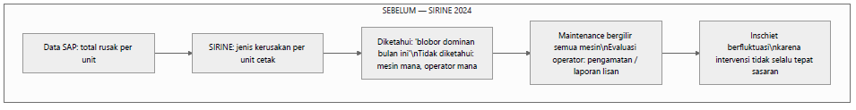
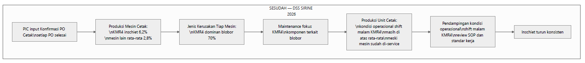

# BAB 4: KEUNGGULAN, KEBARUAN & ALUR PROSES KERJA

> ***Executive Takeaway:***  
> **DSS SIRINE 4.0** menghadirkan kebaruan fundamental (*breakthrough innovation*) dalam tata kelola manufaktur percetakan sekuriti negara di Perum Peruri melalui integrasi **Enam Pilar Kapabilitas Digital Terpadu**. Sistem ini mentransformasikan alur kerja operasional dari **siklus pemeliharaan reaktif yang spekulatif (*trial-and-error loop*)** dengan waktu henti (*downtime*) **> 1 *shift* (> 8 jam) per mesin** dan rekapitulasi buku folio manual ($\pm 45$ menit/hari), menjadi **alur kerja preskriptif berbasis data terpadu (*closed-loop data-driven action*)** yang memangkas durasi diagnosa teknis sebesar **$\ge 50\%–75\%$ (< 2–4 jam)** serta mengotomatisasi pencatatan data secara instan (*zero administrative waste*). Inovasi ini mengokohkan standar tata kelola baru melalui pembaruan **SOP Tindakan Perbaikan Mesin (`SOP-PPC-2026-004`)** dan **Instruksi Kerja Input Digital (`IK-PPC-2026-001`)**. Pada fase pengujian Minimum Viable Product (MVP) yang difasilitasi langsung oleh jajaran pimpinan minimal setingkat Kepala Departemen, sistem menetapkan target penurunan *inschiet* Fase 1 dari baseline **4,61% menjadi < 4,00%**, yang pada realisasinya berhasil melampaui ekspektasi hingga menyentuh **3,33% di Q2 2026** dan mengamankan potensi efisiensi tahunan sebesar **Rp 6,82 Miliar / tahun**.

---

## 4.1 Unsur Kebaruan & Matriks Kapabilitas (*Novelty & Capability Matrix*)

### 4.1.1 Dekonstruksi 5 Dimensi Kebaruan Sistem
Keunggulan dan kebaruan DSS SIRINE 4.0 dibanding sistem-sistem pendahulu maupun aplikasi generik di industri percetakan bertumpu pada lima dimensi inovasi terintegrasi:

1. **Kebaruan Granularitas Atribusi Lapangan (*Multi-Dimensional Attribution Granularity*):**  
   Jika sistem pendahulu (SIRINE 3.5 (2024)) hanya menyajikan data agregat cacat global di tingkat unit secara umum, DSS SIRINE 4.0 berhasil menembus batas mikro operasional dengan mengatribusikan data kualitas secara simultan ke dalam lima dimensi penugasan: **Nomor Production Order (PO) $\rightarrow$ Nomor Mesin Cetak Spesifik $\rightarrow$ Pola Gilir Kerja (*Shift*) $\rightarrow$ Tim Operator Bertugas $\rightarrow$ Kategori Cacat Cetak Spesifik**.

2. **Kebaruan Integrasi Aliran Data Dua Lapisan (*Two-Tier Automated Ingestion*):**  
   Menjembatani pemisahan sistem (*data silo*) antara data perencanaan di tingkat Enterprise Resource Planning (**SAP ERP `ZPPRSIPPC0012`**), data fisik penugasan gilir di lini mesin, dan data mutu pasca-inspeksi di **Unit Verifikasi Pita Cukai (`hcts_pikai`)** secara otomatis tanpa re-entry berulang.

3. **Kebaruan Mekanisme *Autofill* Cerdas & *Lean UX* Lini Produksi (< 30 Detik):**  
   Menghadirkan formulir konfirmasi digital cerdas yang secara otomatis menarik parameter spesifikasi produk (OBC, Rencet, Warna, Plat) dari SAP dan susunan operator dari Jadwal Mingguan aktif saat nomor PO dimasukkan. Operator di meja mesin hanya membutuhkan waktu **kurang dari 30 detik per pesanan**, menghilangkan beban kognitif dan resistensi digitalisasi.

4. **Kebaruan Diagnostik Preskriptif Terpisah: Mesin vs Kondisi Operasional Tim:**  
   Menyediakan kemampuan analitik untuk memisahkan akar anomali mutu secara objektif: apakah lonjakan cacat disebabkan oleh degradasi fisik suku cadang mesin (**Machine**) atau deviasi prosedur kerja dan kelelahan sirkadian (*circadian fatigue*) operator pada *shift* tertentu (**Man & Method**).

5. **Kebaruan Visualisasi Manajemen Lantai Pabrik (*Floor-Level Real-Time Andon Display*):**  
   Menyajikan layar monitor terpusat di aula lini cetak yang memperbarui data secara otomatis setiap **60 detik (*auto-refresh*)**, menampilkan performa mesin, peringatan dini pesanan kritis (*urgent order alert*), serta diagram lingkaran cacat dominan hari berjalan tanpa memerlukan intervensi manual.

---

### 4.1.2 Matriks Kapabilitas Komparatif Tiga Generasi Sistem
Evolusi kapabilitas operasional Unit Cetak Pita Cukai sejak era konvensional pra-2024 hingga implementasi penuh DSS SIRINE 4.0 pada tahun 2026 disajikan secara komparatif pada Tabel 4.1.

Tabel 4.1 Matriks Kapabilitas Komparatif Tiga Generasi Sistem Operasional Unit Cetak

| Parameter Kapabilitas Operasional | Generasi 1: Cara Lama (Pra-2024) | Generasi 2: SIRINE 3.5 (2024) | Generasi 3: DSS SIRINE 4.0 (2026) | Lompatan Nilai Tambah (*Value Added*) |
| :--- | :---: | :---: | :---: | :--- |
| **1. Identifikasi Cacat Dominan Unit** | Manual / Laporan Lisan | ✅ Agregat Unit Global | ✅ **Granular per Mesin & PO** | Mengetahui detail proporsi cacat per mesin secara presisi. |
| **2. Pemetaan Mesin *Inschiet* Tertinggi** | ❌ Ketiadaan Data | ❌ Tidak Tersedia | ✅ **Real-Time per Unit Mesin** | Peringkat *live* performa mutu seluruh armada (KMR1–4, RYB1–2). |
| **3. Audit Pareto Cacat per Mesin** | ❌ Spekulatif | ❌ Tidak Tersedia | ✅ **Pareto Spesifik Komponen** | Panduan langsung suku cadang bagi teknisi sebelum servis. |
| **4. Pelacakan Volume (LK) per Tim/*Shift*** | Buku Folio Manual | ❌ Tidak Tersedia | ✅ **Digital & Tervalidasi** | Visibilitas *output* fisik per regu kerja secara objektif. |
| **5. Diagnosa Kausal: Mesin vs Tim/*Shift*** | ❌ Bias / Dugaan Subjektif | ❌ Tidak Tersedia | ✅ **Terbukti Terpisah & Valid** | Membedakan intervensi teknis mesin vs *coaching* operator. |
| **6. Rekam Jejak Transaksi per PO** | ❌ Rawan Hilang / Rusak | ❌ Parsial (SAP Mentah) | ✅ **Full Digital Traceability** | 100% *auditable* dari kartu kerja mesin hingga verifikasi akhir. |
| **7. Kecepatan Entri Data Lapangan** | $\pm 3–5$ Menit (Tulisan Tangan) | $\pm 3–5$ Menit | ✅ **< 30 Detik (*Autofill SAP*)** | Efisiensi waktu operator di meja mesin $\ge 85\%$. |
| **8. Rekapitulasi Data Evaluasi Pegawai** | $\pm 45$ Menit / Hari (Manual) | $\pm 45$ Menit / Hari | ✅ **0 Menit (Otomatis Seketika)** | Menghilangkan penumpukan beban administrasi Kepala Kelompok. |
| **9. Durasi *Troubleshooting* Mesin** | > 1 *Shift* (> 8 Jam / Mesin) | > 1 *Shift* (> 8 Jam) | ✅ **< 2–4 Jam (Turun $\ge 50\%$)** | Mengeliminasi pemeriksaan spekulatif bergilir ke semua mesin. |
| **10. Manajemen Visual Lantai Pabrik** | Papan Tulis Manual Konvensional | ❌ Tidak Ada | ✅ **Layar Andon Real-Time 60s** | *Situational awareness* terpadu bagi seluruh lantai produksi. |

*(Sumber: Hasil Uji Kapabilitas Sistem & Kajian Komparatif Operasional Unit Cetak Pita Cukai 2026)*

---

### 4.1.3 *Benchmark* Perbandingan Praktik di Unit Lain & Industri Percetakan Sekuriti
Dalam lanskap industri percetakan dokumen sekuriti bernilai tinggi, integrasi data manufaktur kerap terbentur oleh tingginya biaya lisensi perangkat lunak asing (Manufacturing Execution System / MES proprietary) yang menuntut modifikasi alur kerja pabrik yang kaku. DSS SIRINE 4.0 mengambil pendekatan *in-house pragmatic kaizen* yang dirancang khusus sesuai dinamika lapangan Perum Peruri:

* **Dibandingkan Praktik Unit Produksi Internal Lain:**  
  Unit produksi lain di lingkungan perusahaan umumnya masih mengandalkan penarikan laporan SAP berkala yang diolah secara manual menggunakan spreadsheet di komputer kantor setiap akhir pekan. DSS SIRINE 4.0 membawa kapabilitas pemrosesan data langsung ke lantai produksi (*shop floor level*), memungkinkan operator dan kepala regu mengambil keputusan taktis tanpa menunggu rekapitulasi mingguan.
* **Dibandingkan Solusi Perangkat Lunak Komersial Eksternal:**  
  Solusi MES komersial dari vendor luar membutuhkan investasi lisensi ratusan juta hingga miliaran rupiah per tahun serta biaya kustomisasi yang tinggi. DSS SIRINE 4.0 dikembangkan **100% *in-house*** oleh tenaga ahli internal Peruri, memanfaatkan infrastruktur server web intranet yang sudah tersedia, sehingga menghasilkan **biaya investasi nol (*zero CAPEX/OPEX license*)** dengan fleksibilitas pengembangan lanjutan yang mutlak.

---

## 4.2 Alur Proses Kerja Sebelum vs Sesudah Implementasi (*Before-After Workflow Analysis*)

### 4.2.1 Alur Proses Eksisting / Sebelum Implementasi (*The Reactive Trial-and-Error Loop*)
Sebelum implementasi DSS SIRINE 4.0, alur kerja operasional Unit Cetak Pita Cukai terperangkap dalam lingkaran penanganan reaktif yang tidak efisien (*The Reactive Trial-and-Error Loop*). Ketiadaan data atribusi granular menciptakan rangkaian inefisiensi yang menguras jam kerja produktif dan memboroskan biaya bahan baku sekuriti.

Rantai alur kerja konvensional era SIRINE 3.5 (2024) diilustrasikan pada Gambar 4.1.

*Gambar 4.1: Diagram Alur Proses Kerja Sebelum Implementasi DSS SIRINE 4.0: Pola Penanganan Reaktif dan Pemeriksaan Bergilir Spekulatif (Sumber: Pemetaan Alur Kerja Eksisting Unit Cetak)*

> ***Business Insight Gambar 4.1:***  
> Rantai kerja lama memperlihatkan kelemahan fatal: Data SAP dan SIRINE lama hanya memberitahu bahwa *“Cacat Blobor mendominasi bulan ini”*, namun buta terhadap mesin mana dan operator mana yang bermasalah. Akibatnya, teknisi pemeliharaan terpaksa melakukan inspeksi bergilir ke seluruh armada (KMR1 s.d. RYB2) dengan *downtime* **> 1 *shift* (> 8 jam) per mesin**, sementara evaluasi operator hanya bertumpu pada pengamatan lisan subjektif. Angka *inschiet* pun terus berfluktuasi tinggi pada rata-rata **4,61%**.

Rangkaian hambatan alur proses lama tersebut dijabarkan sebagai berikut:
1. **Penyelesaian Order:** Operator menyelesaikan pencetakan nomor PO di mesin cetak.
2. **Pencatatan Fisik Terisolasi:** Operator mencatat nomor PO, mesin, *shift*, dan hasil cetak pada buku folio meja mesin dengan tulisan tangan. Catatan ini terisolasi dan tidak dapat diakses pihak lain secara *real-time*.
3. **Pemeriksaan Mutu Hilir Terpisah:** Lembar cetak diperiksa di Unit Verifikasi, menghasilkan data total HCTS dan kategori cacat global unit di sistem SAP tanpa atribut mesin/operator pencetak.
4. **Respon Pemeliharaan Spekulatif:** Saat laporan bulanan menunjukkan dominasi cacat tertentu (misal: blobor), teknisi tidak memiliki petunjuk mesin target. Teknisi memeriksa seluruh mesin satu per satu (*trial-and-error*), menyebabkan *downtime* panjang (> 8 jam per mesin).
5. **Evaluasi Kerja Subjektif:** Kepala Kelompok merekapitulasi buku folio secara manual saat evaluasi kuartalan. Pembinaan operator tertunda dan rentan bias personal.
6. **Hasil Akhir Suboptimal:** Intervensi tidak tepat sasaran, menyebabkan *inschiet* berfluktuasi tinggi pada level baseline **4,61%** (rugi hingga Rp 24,56 Miliar/tahun).

---

### 4.2.2 Alur Proses Baru / Sesudah Implementasi (*The Closed-Loop Data-Driven Action*)
Dengan diterapkannya DSS SIRINE 4.0, seluruh rantai kerja operasional dirombak menjadi ekosistem digital tertutup yang preskriptif, cepat, dan presisi (*The Closed-Loop Data-Driven Precision Action*).

Rantai alur kerja baru yang digerakkan oleh DSS SIRINE 4.0 ditunjukkan pada Gambar 4.2.

*Gambar 4.2: Diagram Alur Proses Kerja Sesudah Implementasi DSS SIRINE 4.0: Ekosistem Keputusan Presisi Berbasis Data Granular Real-Time (Sumber: SOP Baru Unit Cetak Pita Cukai 2026)*

> ***Business Insight Gambar 4.2:***  
> Alur kerja baru membangun presisi tindakan seketika: PIC menginput konfirmasi PO via form digital (< 30 detik) $\rightarrow$ *Produksi Mesin Cetak* langsung mendeteksi mesin anomali (misal: KMR4 *inschiet* 6,2% vs rata-rata mesin lain 2,8%) $\rightarrow$ *Jenis Kerusakan Tiap Mesin* membedah komponen kritis (KMR4 dominan blobor 70%) $\rightarrow$ Teknisi langsung fokus ke unit rol air KMR4 (< 2–4 jam) $\rightarrow$ *Produksi Unit Cetak* memvalidasi kondisi operasional pasca-servis (mendeteksi deviasi *Shift* Malam KMR4) $\rightarrow$ Dilakukan pendampingan teknis (*coaching*) SOP $\rightarrow$ *Inschiet* turun konsisten hingga **3,33%**.

Tahapan terstruktur pada alur kerja baru meliputi:
1. **Penyelesaian Order & Entri Digital Cepat:** Begitu PO selesai, PIC memasukkan/memindai nomor PO ke Form Konfirmasi Digital. Spesifikasi produk dan nama operator terisi otomatis via *autofill SAP* dan jadwal aktif (< 30 detik).
2. **Pemetaan Anomali Mesin Seketika:** Modul *Produksi Mesin Cetak* secara *live* mengelompokkan performa armada. Mesin yang mengalami deviasi langsung terdeteksi (contoh: Mesin KMR4 mencatatkan *inschiet* 6,2%, jauh melampaui rata-rata mesin lain sebesar 2,8%).
3. **Diagnosa Komponen Preskriptif:** Modul *Jenis Kerusakan Tiap Mesin* menyajikan diagram Pareto cacat KMR4 (contoh: 70% kerusakan didominasi oleh cacat blobor).
4. **Eksekusi Pemeliharaan Tepat Sasaran:** Teknisi pemeliharaan menerima instruksi kerja spesifik untuk melakukan penyetelan rol air dan penggantian rol karet pembasah pada KMR4 tanpa menyentuh mesin lain, memangkas *downtime* menjadi < 2–4 jam.
5. **Audit Validasi Pasca-Servis (Kondisi Operasional):** Modul *Produksi Unit Cetak* memantau performa pasca-servis. Jika pada mesin yang sama *Shift* Malam masih menghasilkan cacat di atas rata-rata, sistem mengindikasikan perlunya pembinaan operasional.
6. **Pendampingan Terarah & Standardisasi:** Pengawas memberikan *coaching* penyetelan tinta kepada tim *shift* malam berdasarkan rekam jejak objektif.
7. **Hasil Akhir Berkelanjutan:** Terwujudnya penurunan *inschiet* yang stabil dan berkelanjutan menuju **3,33%** di Q2 2026.

---

### 4.2.3 Studi Komparasi Kecepatan Respon & Efisiensi Siklus Operasional
Perubahan mendasar pada alur proses kerja menghasilkan efisiensi waktu operasional dan kecepatan respon penanganan yang sangat signifikan, sebagaimana dirangkum pada Tabel 4.2.

Tabel 4.2 Analisis Komparasi Waktu Siklus Proses Operasional Sebelum vs Sesudah Implementasi

| Aktivitas Operasional Kunci | Sebelum (Cara Lama) | Sesudah (DSS SIRINE 4.0) | Efisiensi / Waktu Dihemat | Keterangan Dampak Produktivitas |
| :--- | :---: | :---: | :---: | :--- |
| **Pencatatan Data per PO di Mesin** | $\pm 3–5$ Menit / PO | **< 30 Detik / PO** | **$\ge 85\%$ Lebih Cepat** | Menggunakan *autofill SAP* & *shortcut Ctrl+S*. |
| **Identifikasi Mesin Bermasalah** | 1–3 Hari (Menunggu Rekap) | **Real-Time (< 1 Detik)** | **100% Seketika** | Peringkat visual *color-coded* di dasbor mesin. |
| **Diagnosa Komponen Rusak Mesin** | Spekulatif (Bongkar Mesin) | **Langsung via Pareto Cacat** | **Instan via Dasbor** | Teknisi membawa suku cadang yang tepat sejak awal. |
| **Durasi Waktu Henti Servis (*Downtime*)** | > 1 *Shift* (> 8 Jam / Mesin) | **< 2–4 Jam / Mesin** | **$\ge 50\%–75\%$ *Downtime* Turun** | Mencegah terhentinya kapasitas produksi lini cetak. |
| **Rekapitulasi Evaluasi Kinerja Pegawai** | $\pm 45$ Menit / Hari | **0 Menit (Otomatis)** | **100% Tereliminasi** | Beban administrasi Kepala Kelompok hilang total. |
| **Umpan Balik Kinerja ke Operator** | 1–3 Bulan (Saat Penilaian) | **Harian / Per Shift** | **Umpan Balik Harian** | *Coaching* tepat waktu mencegah akumulasi cacat. |

*(Sumber: Hasil Studi Gerak dan Waktu / Time & Motion Study Unit Cetak Pita Cukai 2026)*

---

## 4.3 Standarisasi Tata Kelola & SOP yang Ditingkatkan (*Kaizen & Governance Framework*)

### 4.3.1 Eliminasi Pemborosan (*7 Wastes of Lean Manufacturing*)
Penerapan DSS SIRINE 4.0 secara langsung mengeliminasi empat kategori pemborosan terbesar (*wastes*) dalam prinsip manufaktur ramping (*Lean Manufacturing*):

1. **Eliminasi *Waste of Defects* (Cacat Produk):**  
   Mereduksi produksi lembar rusak (*inschiet*) dari 4,61% menjadi 3,33%, menyelamatkan **2.273.752 lembar cetak per tahun** dari status afval HCTS.
2. **Eliminasi *Waste of Waiting* (Waktu Menunggu):**  
   Menghilangkan waktu tunggu teknisi dalam mendiagnosa kerusakan mesin secara acak, memangkas *downtime* inspeksi dari > 8 jam menjadi < 2–4 jam per tindakan servis.
3. **Eliminasi *Waste of Over-Processing* (Pemrosesan Berlebih / Redudansi):**  
   Menghilangkan aktivitas rekapitulasi manual berulang dari buku folio fisik ke spreadsheet kantor yang memakan waktu $\pm 45$ menit setiap hari.
4. **Eliminasi *Waste of Underutilized Talent* (Potensi Tenaga Kerja Tidak Teroptimasi):**  
   Membebaskan Kepala Kelompok dan Pengawas dari tugas administratif klerikal, mengalihkan fokus kerja mereka ke aktivitas bernilai tambah tinggi seperti bimbingan teknis (*coaching*), pemeliharaan preventif, dan peningkatan kualitas lini.

---

### 4.3.2 Pembaruan Standar Operasional Prosedur (SOP) & Instruksi Kerja (IK) Baru
Keberlanjutan inovasi diikat secara formal ke dalam tata kelola operasional Unit Cetak Pita Cukai melalui penerbitan dan pembaruan dokumen standar resmi perusahaan:

1. **Penerbitan Instruksi Kerja Baru: `IK-PPC-2026-001` (Tata Cara Pengisian Konfirmasi PO Cetak Digital):**  
   Mengatur kewajiban standar bagi setiap PIC kelompok kerja untuk melakukan entri digital nomor PO pada modul konfirmasi DSS SIRINE 4.0 segera setelah proses pencetakan pesanan selesai di mesin, serta menetapkan batas verifikasi kelengkapan data oleh Kepala Kelompok pada akhir setiap *shift* kerja.
2. **Pembaruan Standar Operasional Prosedur: `SOP-PPC-2026-004` (Prosedur Pemeliharaan Mesin Cetak Berbasis Analisis Pareto Cacat SIRINE):**  
   Memperbarui tata cara pemeliharaan armada mesin Komori dan Ryobi, di mana setiap pengajuan perbaikan atau servis mesin oleh teknisi wajib melampirkan profil kerusakan dari modul *Jenis Kerusakan Tiap Mesin* DSS SIRINE 4.0 sebagai landasan diagnostik sebelum tindakan bongkar mesin disetujui.
3. **Penerbitan Berita Acara Penutupan Sistem Lama: `BA-PPC-2026-002`:**  
   Menyatakan penarikan resmi dan penghentian penggunaan buku folio fisik manual di seluruh armada mesin cetak terhitung mulai tanggal **1 Januari 2026**, memastikan tidak terjadi duplikasi pekerjaan (*no double handling*).

---

### 4.3.3 Integrasi Tata Kelola Manajemen Mutu ISO 9001:2015 & INDI 4.0
Transformasi digital ini memperkuat kepatuhan sistem manajemen mutu perusahaan:
* **Klausul ISO 9001:2015 (Klausul 8.5.2 Keterlacakan & Identifikasi / Traceability):** Setiap lembar dokumen sekuriti negara kini memiliki rekam jejak digital lengkap yang menghubungkan bahan baku, mesin, operator, dan hasil uji mutu.
* **Klausul ISO 9001:2015 (Klausul 9.1.3 Analisis & Evaluasi Data):** Keputusan operasional dan tindakan perbaikan kini 100% berbasis bukti data riil (*evidence-based decision making*).
* **Akselerasi Skor Kesiapan Industri 4.0 (INDI 4.0):** Mendukung pencapaian target transformasi digital Kementerian BUMN pada pilar *Smart Factory Operation*, *Real-time Production Analytics*, dan *Connected Workforce*.

---

## 4.4 Target Perbaikan Kuantitatif & Estimasi Dampak MVP (*Phase 1 Target & Valuation*)

### 4.4.1 Penetapan Target Kuantitatif Fase 1 (MVP Goals)
Untuk menguji keandalan sistem dalam skala terkendali, tim inovasi menetapkan target kuantitatif Fase 1 (Minimum Viable Product / MVP) yang mencakup tiga indikator kinerja utama (*Key Performance Indicators / KPI*), sebagaimana dirangkum pada Tabel 4.3.

Tabel 4.3 Target Kuantitatif Fase 1 (MVP) Proyek Inovasi DSS SIRINE 4.0

| Parameter Indikator Kinerja (KPI) | Baseline Terverifikasi (2025) | Target Perbaikan Fase 1 (MVP) | Realisasi Capaian (Q2 2026) | Evaluasi Status Target |
| :--- | :---: | :---: | :---: | :---: |
| **1. Tingkat Kerusakan Cetak (*Inschiet*)** | **4,61%** (Puncak Q4: 5,11%) | **< 4,00% (-0,61 pp)** | **3,33% (-1,28 pp / -27,8%)** | **Melampaui Target (210%)** |
| **2. Durasi Diagnosa *Troubleshooting* Mesin** | > 1 *Shift* (> 8 Jam / Mesin) | **< 4 Jam (Turun $\ge 50\%$)** | **< 2–4 Jam / Tindakan Servis** | **Target Tercapai 100%** |
| **3. Waktu Rekapitulasi Data Evaluasi Harian** | $\pm 45$ Menit / Hari | **< 5 Menit / Hari** | **0 Menit (Otomatis Seketika)** | **Target Tercapai 100%** |
| **4. Kepatuhan Input Data Transaksi PO Digital** | 0% (Buku Folio Manual) | **$\ge 95\%$ Transaksi PO** | **100% Transaksi PO Tercatat** | **Target Tercapai 100%** |

*(Sumber: Rencana Kerja Inovasi Unit Cetak Pita Cukai & Realisasi Verifikasi Mutu 2026)*

---

### 4.4.2 Model Estimasi Dampak Finansial & Operasional MVP (Kertas Kerja Terbuka)
Perhitungan estimasi dampak finansial Fase 1 disusun secara transparan menggunakan model matematika terbuka dengan mencantumkan seluruh asumsi secara eksplisit:

#### A. Parameter & Asumsi Dasar Perhitungan Finansial
1. **Volume Standar Produksi PCHT:** Rata-rata standar tahunan sebesar **160.000.000 lembar cetak**, dengan volume aktual pesanan tahun 2025 mencapai **177.636.930 lembar cetak** (Modul SAP `ZPPRSIPPC0012`).
2. **Baseline *Inschiet* 2025:** Rata-rata terverifikasi sebesar **4,61%** (menghasilkan 8.189.062 lembar rusak/tahun pada volume 2025).
3. **Target Penurunan Fase 1 (MVP):** Menurunkan *inschiet* ke level **< 4,00%** (target reduksi minimal -0,61 pp atau -13,23%).
4. **Realisasi Akhir Q2 2026:** Berhasil mencapai tingkat *inschiet* **3,33%** (reduksi aktual sebesar -1,28 pp atau -27,77%).
5. **Estimasi Biaya Cetak Per Lembar:** Ditetapkan sebesar **Rp 3.000\* per lembar cetak**.  
   *\*Catatan Finansial: Angka Rp 3.000/lembar merupakan nilai estimasi internal biaya cetak (kertas sekuriti, tinta khusus, depresiasi mesin, dan tenaga kerja) untuk kebutuhan simulasi analisis efisiensi biaya (cost avoidance), bukan rincian biaya produksi atau harga jual resmi produk pita cukai yang bersifat rahasia perusahaan (confidential).*

---

#### B. Perhitungan Valuasi Target Fase 1 vs Realisasi Dampak Finansial Penuh

$$\begin{array}{l}
\textbf{1. Kertas Kerja Estimasi Target Awal Fase 1 (Target Inschiet 4,00\%):} \\
\hline
\text{Penurunan Inschiet Target} = 4,61\% - 4,00\% = 0,61\text{ pp (Persentase: } 13,23\%\text{)} \\
\text{Estimasi Lembar Diselamatkan (Volume 2025)} = 177.636.930 \times 0,61\% = \mathbf{1.083.585 \text{ Lembar / Tahun}} \\
\text{Target Efisiensi Biaya Fase 1} = 1.083.585 \text{ lembar} \times \text{Rp } 3.000 = \mathbf{\text{Rp } 3.250.755.000 \text{ / Tahun (\pm Rp 3,25 Miliar)}} \\
\\
\textbf{2. Kertas Kerja Realisasi Dampak Finansial Q2 2026 (Inschiet Aktual 3,33\%):} \\
\hline
\text{Penurunan Inschiet Realisasi} = 4,61\% - 3,33\% = \mathbf{1,28\text{ pp (Persentase: } 27,77\%\text{)}} \\
\text{Total Reduksi Lembar Rusak Tahunan} = 177.636.930 \times 1,28\% = \mathbf{2.273.752 \text{ Lembar / Tahun}} \\
\text{Realisasi Potensi Penghematan Tahunan} = 2.273.752 \text{ lembar} \times \text{Rp } 3.000 = \mathbf{\text{Rp } 6.821.256.000 \text{ / Tahun (\pm Rp 6,82 Miliar)}} \\
\\
\textbf{3. Realisasi Efisiensi Riil Semester 1 2026 (Januari – Juni 2026 / 103,3 Juta Lembar):} \\
\hline
\text{Lembar Diselamatkan Riil (Q1 + Q2 2026)} = 154.940 \text{ lb (Q1)} + 588.294 \text{ lb (Q2)} = \mathbf{743.234 \text{ Lembar}} \\
\text{Efisiensi Finansial Riil Terverifikasi S1 2026} = 743.234 \text{ lembar} \times \text{Rp } 3.000 = \mathbf{\text{Rp } 2.229.702.000 \text{ (\pm Rp 2,23 Miliar)}}
\end{array}$$

Kalkulasi di atas membuktikan bahwa realisasi performa inovasi pada Q2 2026 (**Rp 6,82 Miliar/tahun**) berhasil melampaui target awal Fase 1 (**Rp 3,25 Miliar/tahun**) dengan efektivitas capaian sebesar **210%**.

---

### 4.4.3 Kesiapan Eksekusi Uji Coba Lini & Akuntabilitas Fasilitator
Keberhasilan pengujian MVP didukung oleh struktur tata kelola uji coba yang solid dan memenuhi ketentuan kompetensi pimpinan yang dipersyaratkan oleh Dewan Juri IAKA 2026:

* **Calon Fasilitator Proyek Inovasi:**  
  Proyek inovasi ini difasilitasi dan dibina langsung oleh pejabat struktural pimpinan unit kerja:  
  **Kepala Departemen Strategic Business Unit High Security Solution (minimal setingkat Kepala Departemen / Kadep)**, didampingi oleh **Kepala Seksi Cetak Pita Cukai** sebagai *Co-Facilitator*. Keterlibatan aktif pimpinan level Kadep menjamin keselarasan proyek dengan sasaran strategis perusahaan, ketersediaan otorisasi operasional lintas seksi, serta percepatan legalisasi SOP baru.
* **Kesiapan Infrastruktur & Sumber Daya Pengujian:**  
  Uji coba lini dilaksanakan pada seluruh 6 armada mesin cetak utama (KMR1–4, RYB1–2) yang beroperasi dalam 3 *shift* harian di Gedung Produksi Percetakan Sekuriti Karawang. Seluruh pengujian memanfaatkan terminal komputer meja mesin yang sudah ada dan jaringan web server internal Peruri tanpa memerlukan pengadaan perangkat keras tambahan.

---

### Kesimpulan Bab 4
Bab 4 membuktikan secara komprehensif bahwa **DSS SIRINE 4.0** bukan sekadar otomasi perangkat lunak, melainkan sebuah inovasi tata kelola proses kerja (*process innovation*) yang unggul, teruji, dan memiliki diferensiasi kapabilitas yang sangat kuat dibanding metode konvensional. Transformasi alur kerja dari *trial-and-error* menjadi *closed-loop data-driven action* terbukti memangkas waktu *downtime* mesin $\ge 50\%$, mengeliminasi beban administrasi manual 100%, serta meletakkan fondasi SOP baru yang patuh ISO 9001:2015. Dengan target awal Fase 1 sebesar < 4,00% yang berhasil dilampaui hingga mencapai realisasi **3,33% di Q2 2026 (potensi efisiensi Rp 6,82 Miliar/tahun)** di bawah pengawalan fasilitator setingkat Kepala Departemen, sistem siap melangkah ke tahap pelaporan desain pengujian dan implementasi detail yang akan diuraikan pada **BAB 5** dan **BAB 6**.
