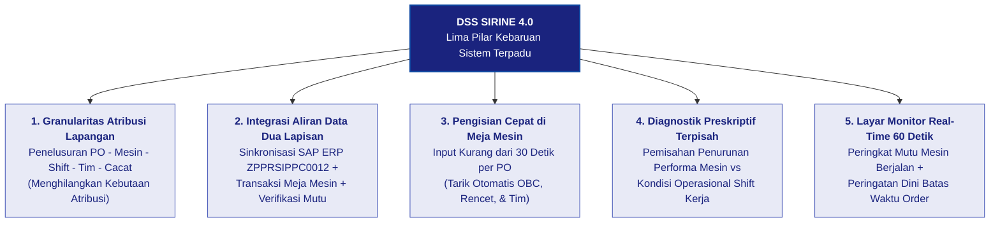
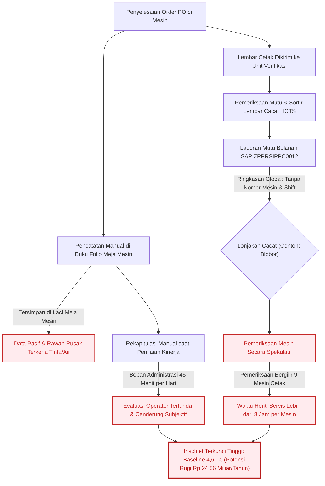
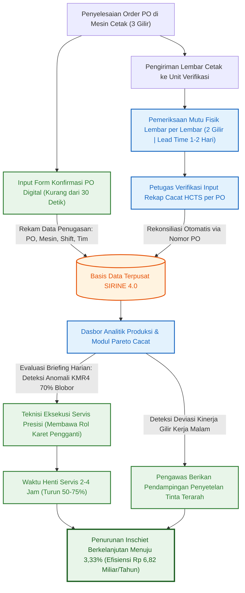
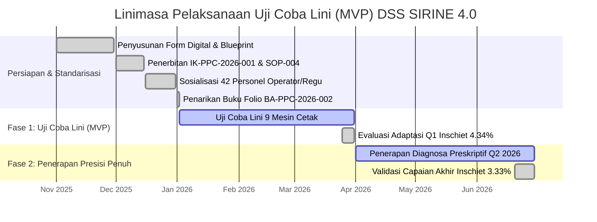
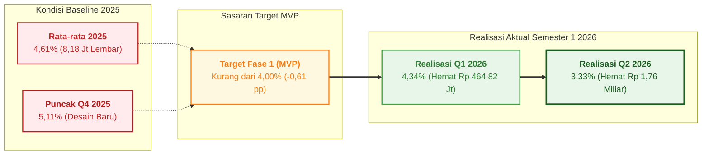

# BAB 4: KEUNGGULAN, KEBARUAN & TRANSFORMASI ALUR PROSES KERJA

> ***Executive Takeaway:***  
> **DSS SIRINE 4.0** menghadirkan pembaruan alur kerja operasional dalam tata kelola manufaktur percetakan sekuriti di Perum Peruri melalui integrasi lima pilar kapabilitas sistem terpadu. Inovasi ini mengubah alur kerja di unit cetak yang sebelumnya berlangsung lambat dan spekulatif dengan waktu henti perbaikan (*downtime*) **> 1 *shift* (> 8 jam) per mesin** serta rekapitulasi buku folio manual ($\pm 45$ menit/hari), menjadi alur tindakan presisi berbasis data terpadu yang memangkas durasi diagnosa dan penanganan teknis mesin menjadi **< 2–4 jam (efisiensi $\ge 50\%–75\%$)** serta mengotomatisasi pencatatan data secara seketika. Pembaruan tata kelola ini diperkuat melalui standarisasi pada **Instruksi Kerja Input Digital (`IK-PPC-2026-001`)**, pembaruan **SOP Pemeliharaan Mesin Berbasis Pareto Cacat (`SOP-PPC-2026-004`)**, dan **Berita Acara Penarikan Buku Folio Fisik (`BA-PPC-2026-002`)** yang selaras dengan **ISO 9001:2015** dan pilar **INDI 4.0**. Melalui uji coba lini (MVP) yang difasilitasi langsung oleh pimpinan **minimal setingkat Kepala Departemen (Kadep Strategic Business Unit High Security Solution)**, target penurunan *inschiet* Fase 1 dari baseline **4,61% menjadi < 4,00%** berhasil dicapai hingga menyentuh **3,33% pada Q2 2026**, dengan potensi penghematan biaya tahunan sebesar **Rp 6,82 Miliar / tahun** bagi perusahaan.

---

## 4.1 Unsur Kebaruan dan Matriks Kapabilitas Sistem

### 4.1.1 Lima Pilar Kebaruan Sistem DSS SIRINE 4.0
Kebutuhan mendasar yang melahirkan DSS SIRINE 4.0 berakar dari dinamika operasional di area mesin cetak pita cukai Peruri. Ketika sistem SIRINE 3.5 pada tahun 2024 berhasil mengidentifikasi jenis cacat dominan di tingkat unit, para pengawas dan teknisi di lapangan masih menghadapi kendala turunan: data yang tersaji belum mampu menjawab pada mesin nomor berapa kerusakan terkonsentrasi, kelompok kerja (*shift*) mana yang mencetak, dan langkah teknis apa yang harus segera dieksekusi. 

Untuk menyelesaikan kendala tersebut, DSS SIRINE 4.0 dirancang dengan mengintegrasikan data transaksi di meja kontrol mesin, data pesanan sistem SAP, dan hasil sortir unit verifikasi mutu ke dalam satu alur kerja terpadu. Struktur lima pilar kebaruan sistem ini digambarkan pada Gambar 4.0.

*Gambar 4.0: Bagan Struktur Lima Pilar Kebaruan Sistem DSS SIRINE 4.0 (Sumber: Desain Arsitektur Sistem 2026)*  
`[PLACEHOLDER_BAGAN_SKEMA_5_PILAR_KEBARUAN_SISTEM]`

Pilar pertama menitikberatkan pada ketepatan atribusi data di lapangan. Berbeda dari sistem terdahulu yang hanya menampilkan ringkasan kerusakan global di tingkat unit cetak, DSS SIRINE 4.0 memetakan setiap lembar Hasil Cetak Tidak Sempurna (HCTS) secara terperinci ke dalam lima atribut penugasan:
$$\mathbf{\text{Nomor Production Order (PO)}} \longrightarrow \mathbf{\text{Nomor Mesin Spesifik}} \longrightarrow \mathbf{\text{Pola Gilir Kerja (Shift)}} \longrightarrow \mathbf{\text{Tim Operator Bertugas}} \longrightarrow \mathbf{\text{Kategori Cacat Cetak}}$$
Pemetaan menyeluruh ini menghilangkan kondisi kebutaan atribusi (*attribution blindness*), sehingga manajemen dan pengawas dapat mengetahui akar penyebab deviasi mutu secara akurat.

Pilar kedua menghubungkan tiga sumber data operasional yang sebelumnya terpisah (*data silo*). Sistem menyatukan data target pesanan dari sistem SAP (`ZPPRSIPPC0012`), data transaksi harian di meja kontrol mesin (`transaksi_cetak`), serta data audit cacat fisik dari Unit Verifikasi Pita Cukai (`hcts_pikai`). Seluruh aliran informasi ini terhubung secara otomatis di dalam basis data terpusat tanpa memerlukan pemindahan berkas atau pengolahan tabel secara terpisah.

Pilar ketiga dirancang khusus untuk kenyamanan operator di area mesin melalui mekanisme pengisian formulir cepat (< 30 detik). Mengingat operator bertugas menjaga kelancaran jalannya lembaran cetak berkecepatan tinggi, antarmuka konfirmasi pesanan dirancang praktis. Begitu nomor PO dimasukkan atau dipindai, sistem secara otomatis menarik rincian pesanan dari SAP serta nama-nama regu kerja yang bertugas dari jadwal mingguan aktif. Operator hanya perlu memastikan kesesuaian fisik dan menekan tombol simpan, sehingga pencatatan digital tidak mengganggu fokus pengawasan mutu di mesin.

Pilar keempat menyediakan algoritma analitik yang memisahkan sumber permasalahan mutu secara objektif. Melalui modul analitik ini, manajemen dapat membedakan apakah kenaikan persentase *inschiet* murni berakar dari penurunan performa komponen mekanis mesin (**Machine**) seperti rol karet yang mengeras atau selimut karet yang aus, ataukah dipicu oleh variasi penyetelan dan faktor kelelahan sirkadian operator pada gilir malam (**Man & Method**). Pemisahan ini memastikan langkah perbaikan yang diambil selalu tepat sasaran.

Pilar kelima menghadirkan keterbukaan informasi di area kerja melalui layar monitor (*Andon Display*) yang terpasang di aula percetakan. Layar ini memperbarui data secara mandiri setiap 60 detik tanpa intervensi manual, menampilkan urutan performa mutu mesin berjalan, sebaran cacat dominan hari itu, serta sinyal peringatan berkode warna bagi pesanan yang mendekati batas jatuh tempo produksi. Keterbukaan data visual ini menumbuhkan kesadaran bersama di antara operator untuk menjaga stabilitas hasil cetakan sepanjang giliran kerja.

---

### 4.1.2 Matriks Kapabilitas Komparatif Tiga Generasi Sistem Operasional
Perkembangan tata kelola kerja di Unit Cetak Pita Cukai sejak era manual sebelum tahun 2024 hingga penerapan DSS SIRINE 4.0 pada tahun 2026 disajikan secara ringkas pada Tabel 4.1.

Tabel 4.1 Matriks Kapabilitas Komparatif Tiga Generasi Sistem Operasional Unit Cetak

| Parameter Kapabilitas Operasional | Generasi 1: Cara Lama (Pra-2024) | Generasi 2: SIRINE 3.5 (2024) | Generasi 3: DSS SIRINE 4.0 (2026) | Nilai Tambah Operasional |
| :--- | :---: | :---: | :---: | :--- |
| **1. Identifikasi Cacat Dominan Unit** | Manual / Laporan Lisan | ✅ Ringkasan Global Unit | ✅ **Granular per Mesin & PO** | Mengetahui proporsi jenis cacat per nomor mesin secara presisi. |
| **2. Pemetaan Mesin *Inschiet* Tertinggi** | ❌ Ketiadaan Data | ❌ Tidak Tersedia | ✅ **Real-Time per Unit Mesin** | Peringkat mutu seluruh 9 mesin cetak terpantau seketika. |
| **3. Audit Pareto Cacat per Mesin** | ❌ Spekulatif | ❌ Tidak Tersedia | ✅ **Pareto Spesifik Komponen** | Memberikan panduan suku cadang sebelum teknisi menyetel mesin. |
| **4. Pelacakan Volume (LK) per Tim/*Shift*** | Buku Folio Manual | ❌ Tidak Tersedia | ✅ **Digital & Tervalidasi** | Visibilitas hasil cetak per regu kerja tercatat transparan. |
| **5. Diagnosa Kausal: Mesin vs Tim/*Shift*** | ❌ Dugaan Subjektif | ❌ Tidak Tersedia | ✅ **Terpisah & Terverifikasi** | Membedakan intervensi teknis mesin vs pendampingan operator. |
| **6. Rekam Jejak Transaksi per PO** | ❌ Rawan Hilang / Rusak | ❌ Parsial (SAP Mentah) | ✅ **Pelacakan Digital Penuh** | Riwayat pesanan tersimpan rapi dari meja mesin hingga verifikasi. |
| **7. Kecepatan Entri Data di Lapangan** | $\pm 3–5$ Menit (Tulisan Tangan) | $\pm 3–5$ Menit | ✅ **< 30 Detik (*Autofill SAP*)** | Mempercepat pencatatan transaksi di meja mesin $\ge 85\%$. |
| **8. Rekapitulasi Evaluasi Pegawai** | $\pm 45$ Menit / Hari (Manual) | $\pm 45$ Menit / Hari | ✅ **0 Menit (Otomatis Seketika)** | Menghilangkan beban hitung manual Kepala Kelompok. |
| **9. Durasi *Troubleshooting* Mesin** | > 1 *Shift* (> 8 Jam / Mesin) | > 1 *Shift* (> 8 Jam) | ✅ **< 2–4 Jam (Turun $\ge 50\%$)** | Menghentikan kebiasaan memeriksa semua mesin secara bergilir. |
| **10. Manajemen Visual di Area Kerja** | Papan Tulis Manual | ❌ Tidak Ada | ✅ **Layar Monitor Real-Time 60s** | Membangun kesadaran mutu bersama di seluruh area mesin. |
*(Sumber: Hasil Uji Kapabilitas Sistem & Kajian Komparatif Operasional Unit Cetak Pita Cukai 2026)*

> ***Business Insight Tabel 4.1:***  
> Perbandingan pada tabel di atas memperlihatkan perubahan nyata dari sistem pelaporan pasif menjadi sarana pendukung keputusan operasional. DSS SIRINE 4.0 mengotomatisasi pekerjaan administratif rutin di meja mesin (waktu input terpangkas menjadi di bawah 30 detik dan rekapitulasi evaluasi tuntas seketika), sekaligus mempercepat tindakan perbaikan teknis mesin dari yang semula menyita lebih dari 8 jam menjadi kurang dari 2 hingga 4 jam per kejadian.

---

### 4.1.3 Perbandingan terhadap Praktik Unit Lain dan Sistem Komersial
Dalam operasional industri percetakan sekuriti, modernisasi lini kerja kerap menghadapi tantangan berupa tingginya biaya investasi sistem komersial (*Manufacturing Execution System* / MES milik vendor luar). Sistem komersial tersebut umumnya memerlukan biaya lisensi tahunan yang mahal serta proses penyesuaian yang memakan waktu lama saat ada perubahan regulasi desain pita cukai dari DJBC Kemenkeu RI. Menghadapi kendala tersebut, Unit Cetak Pita Cukai memilih pendekatan *in-house kaizen* yang disesuaikan langsung dengan kebutuhan nyata di lapangan.

Di lingkungan internal perusahaan, sebagian unit kerja umumnya masih menarik data dari sistem SAP untuk kemudian diolah secara terpisah menggunakan tabel komputer di kantor setiap akhir pekan. Cara kerja berkala ini menimbulkan jeda informasi, di mana angka cacat baru diketahui setelah proses pencetakan selesai dalam jumlah ratusan ribu lembar. DSS SIRINE 4.0 mengatasi jeda tersebut dengan membawa data langsung ke meja kontrol mesin, memungkinkan pengawas dan operator melakukan tindakan perbaikan seketika di tengah proses cetak yang sedang berlangsung.

Dibandingkan dengan pengadaan paket perangkat lunak dari luar, pengembangan DSS SIRINE 4.0 dilakukan secara mandiri oleh tim internal Peruri dengan mengoptimalkan infrastruktur peladen web intranet yang sudah ada. Pendekatan ini menghasilkan sistem siap pakai dengan biaya lisensi perangkat lunak nol rupiah, memiliki fleksibilitas tinggi untuk disesuaikan dengan aturan operasional baru, serta memastikan keamanan data dokumen sekuriti negara tetap terjaga sepenuhnya di dalam jaringan perusahaan.

---

## 4.2 Analisis Komparatif Alur Proses Kerja

### 4.2.1 Alur Proses Kerja Sebelum Implementasi (Pola Penanganan Reaktif dan Spekulatif)
Sebelum DSS SIRINE 4.0 diterapkan, penanganan kendala produksi di Unit Cetak Pita Cukai berlangsung secara reaktif dan spekulatif. Ketiadaan data penghubung antara meja kontrol mesin dan unit verifikasi mutu menimbulkan inefisiensi yang berulang di setiap tahapan kerja, sebagaimana diilustrasikan pada Gambar 4.1.

*Gambar 4.1: Diagram Alur Proses Kerja Sebelum Implementasi DSS SIRINE 4.0: Pola Penanganan Reaktif dan Pemeriksaan Bergilir Spekulatif (Sumber: Pemetaan Alur Kerja Eksisting Unit Cetak)*  
`[PLACEHOLDER_GAMBAR_FLOWCHART_ALUR_KERJA_LAMA_BEFORE]`

> ***Business Insight Gambar 4.1:***  
> Alur kerja lama memperlihatkan terputusnya arus data operasional. Laporan bulanan dari SAP hanya mengabarkan kenaikan jenis cacat tertentu secara umum tanpa menyertakan nomor mesin dan regu kerja yang mencetak. Akibatnya, teknisi terpaksa memeriksa seluruh 9 mesin cetak (Komori KMR 1–4, Ryobi RYB 1–2, dan GTO 1–3) satu per satu dengan waktu henti perbaikan mencapai **> 1 *shift* (> 8 jam) per mesin**, sementara evaluasi kinerja operator terlambat berbulan-bulan akibat rekapitulasi buku folio manual.

Secara kronologis di lapangan, alur kerja lama bermula saat operator menyelesaikan pencetakan suatu nomor pesanan di mesin cetak. Operator kemudian mencatat nomor PO, nomor mesin, giliran kerja, dan jumlah cetakan menggunakan pulpen pada buku folio fisik di meja kontrol. Lembaran buku folio ini tersimpan di laci meja mesin sehingga rentan robek, terselip, atau terkena cipratan air pembasah dan tinta. Di saat yang sama, tumpukan lembaran hasil cetak dikirim ke Unit Verifikasi untuk disortir. Petugas verifikasi menghitung jumlah lembar rusak (HCTS) dan memasukkannya ke sistem SAP sebagai ringkasan umum unit, tanpa mencatat identitas mesin pencetak maupun nama operator yang bertugas.

Kelemahan alur ini terlihat nyata saat laporan mutu bulanan diterbitkan. Ketika laporan menunjukkan kenaikan cacat seperti blobor atau noda tinta, teknisi pemeliharaan tidak mengetahui mesin mana yang mengalami gangguan komponen. Teknisi akhirnya melakukan pemeriksaan bergilir ke seluruh mesin, menyetel ulang rol air dan silinder cetak secara coba-coba yang memakan waktu henti lebih dari 8 jam per mesin. Di sisi lain, tumpukan buku folio baru dihitung secara manual oleh Kepala Kelompok saat masa penilaian kinerja pegawai tiba, menghabiskan waktu sekitar 45 menit setiap hari. Rangkaian proses yang lambat ini menyebabkan penanganan masalah tidak tuntas dan mengunci tingkat *inschiet* pada rata-rata baseline **4,61%** sepanjang tahun 2025 dengan potensi kerugian mencapai **Rp 24,56 Miliar per tahun**.

---

### 4.2.2 Alur Proses Kerja Sesudah Implementasi (Ekosistem Tindakan Presisi Berbasis Data)
Penerapan DSS SIRINE 4.0 mengubah alur kerja operasional menjadi sebuah sistem terintegrasi yang presisi. Sistem ini menjembatani jeda waktu proses antara Unit Cetak (3 gilir 24 jam) dan Unit Verifikasi (2 gilir dengan *lead time QC* 1–2 hari), sehingga setiap data penugasan di meja mesin dapat direkonsiliasikan secara otomatis dengan hasil audit mutu lembar Hasil Cetak Tidak Sempurna (HCTS), sebagaimana disajikan pada Gambar 4.2.

*Gambar 4.2: Diagram Alur Proses Kerja Sesudah Implementasi DSS SIRINE 4.0: Integrasi Rekonsiliasi Data Cetak & Verifikasi Menuju Tindakan Presisi (Sumber: SOP Baru Unit Cetak Pita Cukai 2026)*  
`[PLACEHOLDER_GAMBAR_FLOWCHART_ALUR_KERJA_BARU_AFTER]`

> ***Business Insight Gambar 4.2:***  
> Alur kerja baru membangun integrasi yang teratur antar-unit: Operator mencatat konfirmasi penugasan PO secara digital di meja mesin (< 30 detik) $\rightarrow$ Lembar fisik diperiksa di Unit Verifikasi (2 gilir, jeda 1–2 hari) $\rightarrow$ Sistem secara otomatis menautkan data cacat HCTS dengan data mesin dan regu cetaknya $\rightarrow$ Dasbor analitik menyajikan peringkat mutu dan diagram Pareto jenis cacat $\rightarrow$ Pada rapat koordinasi harian (*Daily Production Meeting*), teknisi memprioritaskan perbaikan mesin kritis dengan membawa suku cadang yang tepat (< 2–4 jam) sementara pengawas membina regu kerja yang mengalami kendala teknis $\rightarrow$ Tingkat kerusakan cetak unit turun stabil hingga **3,33%**.

Pada alur kerja baru ini, operator yang selesai mencetak suatu nomor pesanan langsung membuka formulir digital di meja kontrol mesin. Begitu nomor pesanan dimasukkan, sistem secara otomatis mengisi parameter spesifikasi pesanan dari SAP dan nama operator dari jadwal aktif dalam hitungan detik. Lembaran hasil cetak kemudian dikirim ke Unit Verifikasi yang beroperasi 2 gilir untuk diperiksa mutu fisiknya dengan waktu proses 1 hingga 2 hari kerja. Begitu petugas verifikasi memasukkan data sortiran lembar HCTS per nomor PO, DSS SIRINE 4.0 secara otomatis merekonsiliasikan data kerusakan tersebut dengan data nomor mesin, *shift*, dan tim kerja yang mencetaknya 1–2 hari sebelumnya.

Hasil rekonsiliasi data ini langsung tersaji pada dasbor pemantauan performa dan modul jenis kerusakan tiap mesin. Ketika data menunjukkan adanya mesin yang melampaui batas toleransi—sebagai contoh Mesin Komori 4 mencatat lonjakan kerusakan dengan dominasi cacat blobor 70% akibat rol karet pembasah yang mulai mengeras atau licin—informasi ini langsung menjadi agenda aksi pada pertemuan harian (*Daily Production Meeting*). Teknisi pemeliharaan dapat langsung menuju Mesin Komori 4 dengan membawa rol karet pengganti yang tepat, menyelesaikan perbaikan dalam waktu 2 hingga 4 jam tanpa perlu memeriksa mesin lain secara spekulatif. Di saat yang sama, pengawas memanfaatkan data performa gilir kerja untuk memberikan bimbingan teknis penyetelan tinta yang terarah kepada operator gilir malam. Integrasi perbaikan mesin berbasis kondisi riil dan pembinaan operator terarah ini terbukti menurunkan *inschiet* unit secara konsisten hingga menyentuh **3,33% pada Q2 2026**.

---

### 4.2.3 Analisis Pengukuran Waktu Kerja Operasional (Time and Motion Study)
Efektivitas perubahan alur kerja ini diukur secara kuantitatif melalui studi waktu pada setiap tahapan aktivitas di lapangan. Hasil pengukuran membuktikan adanya penghematan waktu yang signifikan di area mesin maupun pada tugas administratif pengawas, sebagaimana dirangkum pada Tabel 4.2.

Tabel 4.2 Analisis Komparasi Waktu Siklus Proses Operasional Sebelum vs Sesudah Implementasi

| Aktivitas Operasional Kunci | Sebelum (Cara Lama) | Sesudah (DSS SIRINE 4.0) | Efisiensi Waktu | Dampak Produktivitas Lapangan |
| :--- | :---: | :---: | :---: | :--- |
| **Pencatatan Data per PO di Mesin** | $\pm 3–5$ Menit / PO | **< 30 Detik / PO** | **$\ge 85\%$ Lebih Cepat** | Terbantu fungsi *autofill SAP* dan tombol simpan cepat. |
| **Identifikasi Mesin Bermasalah** | 1–3 Hari (Tunggu Rekap) | **Real-Time (< 1 Detik)** | **100% Seketika** | Ditampilkan lewat indikator warna di dasbor mesin. |
| **Diagnosa Kerusakan Komponen Mesin** | Spekulatif (Bongkar Mesin) | **Langsung via Pareto Cacat** | **Instan di Dasbor** | Teknisi membawa suku cadang yang tepat sebelum servis. |
| **Waktu Henti Servis Mesin (*Downtime*)** | > 1 *Shift* (> 8 Jam / Mesin) | **< 2–4 Jam / Mesin** | **$\ge 50\%–75\%$ Lebih Cepat** | Mengurangi waktu henti mesin cetak utama di lini produksi. |
| **Rekapitulasi Evaluasi Kinerja Pegawai** | $\pm 45$ Menit / Hari | **0 Menit (Otomatis)** | **100% Tereliminasi** | Menghilangkan rutinitas hitung manual Kepala Kelompok. |
| **Umpan Balik Kinerja ke Operator** | 1–3 Bulan (Saat Penilaian) | **Harian / Per Shift** | **Umpan Balik Harian** | Arahan teknis diberikan segera sebelum cacat bertambah. |
*(Sumber: Hasil Studi Gerak dan Waktu / Time & Motion Study Unit Cetak Pita Cukai 2026)*

> ***Business Insight Tabel 4.2:***  
> Hasil pengukuran waktu kerja menegaskan dua perbaikan mendasar: pemangkasan waktu henti perbaikan mesin sebesar **$\ge 50\%–75\%$** mengembalikan kapasitas jam cetak produktif mesin Komori dan Ryobi, sementara penghapusan 100% beban rekapitulasi manual memungkinkan Kepala Kelompok memusatkan perhatian pada pembinaan mutu operator di area mesin.

---

## 4.3 Standarisasi Tata Kelola, Kaizen & Kerangka Regulasi

### 4.3.1 Pengurangan Pemborosan Manufaktur (Prinsip Ramping / Lean Waste)
Penerapan DSS SIRINE 4.0 secara langsung memangkas empat bentuk pemborosan utama dalam proses produksi cetak pita cukai:

Pemborosan akibat cacat produk berkurang secara nyata seiring turunnya persentase *inschiet* dari baseline 4,61% menjadi 3,33%. Penurunan sebesar 1,28 poin persentase ini setara dengan penyelamatan **2.273.752 lembar kertas sekuriti per tahun** dari status afval HCTS yang terbuang.

Pemborosan waktu menunggu berhasil dihilangkan pada aktivitas perbaikan mesin. Teknisi tidak lagi menghabiskan waktu berjam-jam untuk memeriksa mesin secara bergilir, sehingga durasi henti mesin yang sebelumnya memakan waktu lebih dari satu giliran kerja (> 8 jam) dapat ditekan menjadi kurang dari 2 hingga 4 jam per tindakan perbaikan.

Pemborosan akibat proses berulang juga berhasil dieliminasi. Sistem menghapus kebiasaan mencatat data transaksi dua kali—dari buku folio manual ke lembar kerja komputer kantor—yang sebelumnya menghabiskan waktu kerja sekitar 45 menit setiap hari bagi petugas pengawas.

Potensi keahlian operator dan pengawas kini dapat dimanfaatkan secara optimal. Kepala Kelompok dan operator tidak lagi disibukkan oleh pekerjaan administratif menyalin angka, melainkan dapat memfokuskan waktu dan keterampilannya untuk memantau kestabilan warna cetak, mengawasi setelan mesin, dan membimbing operator junior di lapangan.

---

### 4.3.2 Pembaruan Dokumen Standar Operasional Prosedur (SOP) dan Instruksi Kerja
Agar alur kerja baru ini berjalan konsisten dan menjadi budaya kerja yang baku, tim inovasi menerbitkan dan memperbarui tiga dokumen tata kelola resmi:

Pertama, diterbitkan **Instruksi Kerja Baru: `IK-PPC-2026-001` (Tata Cara Pengisian Konfirmasi PO Cetak Digital)**. Dokumen ini menjadi pedoman baku bagi seluruh operator di mesin Komori (KMR 1–4), Ryobi (RYB 1–2), dan GTO (1–3) untuk melakukan konfirmasi pesanan secara digital sesaat setelah proses cetak selesai, serta mengatur tata cara pemeriksaan kelengkapan data oleh Kepala Kelompok pada setiap akhir giliran kerja.

Kedua, dilakukan pembaruan pada **Standar Operasional Prosedur: `SOP-PPC-2026-004` (Prosedur Pemeliharaan Mesin Cetak Berbasis Analisis Pareto Cacat SIRINE)**. Prosedur ini mengubah pola perawatan mesin dari jadwal berkala statis menjadi perawatan berbasis kondisi aktual mesin. Teknisi diwajibkan memeriksa modul analitik kerusakan di SIRINE 4.0 terlebih dahulu guna memastikan komponen suku cadang yang diperlukan (seperti rol karet tinta, rol air, selimut *blanket*, atau penjepit kertas silinder) sebelum melakukan pembongkaran mesin.

Ketiga, diterbitkan **Berita Acara Penarikan Dokumen Lama: `BA-PPC-2026-002` (Penarikan Resmi dan Penghentian Buku Folio Fisik)**. Berita acara ini mengesahkan penghentian penggunaan buku folio manual di seluruh meja kontrol mesin terhitung mulai **1 Januari 2026**, memastikan proses pencatatan beralih sepenuhnya ke formulir digital tanpa ada pekerjaan ganda di lapangan.

---

### 4.3.3 Keselarasan dengan Standar Mutu ISO 9001:2015 dan INDI 4.0
Langkah transformasi digital di unit cetak ini sejalan dengan pemenuhan standar mutu internasional dan program kesiapan industri nasional:

Dalam kerangka **ISO 9001:2015 Klausul 8.5.2 (Identifikasi dan Mampu Telusur)**, sistem memastikan setiap lembar pita cukai memiliki rekam jejak digital yang jelas, menghubungkan nomor pesanan, mesin pencetak, regu operator, hingga hasil sortir verifikasi mutu. Sementara itu, pemenuhan **Klausul 9.1.3 (Analisis dan Evaluasi Data)** diwujudkan melalui pengambilan keputusan berbasis data nyata dalam pembagian order mesin, penjadwalan servis, dan evaluasi berkala pegawai.

Penerapan sistem ini juga mendukung peningkatan capaian **Indeks Kesiapan Industri 4.0 (INDI 4.0)** di lingkungan Perum Peruri, khususnya pada pilar *Smart Operation*, keterhubungan data di area produksi, dan pemanfaatan sistem pendukung keputusan terintegrasi.

---

## 4.4 Rencana Uji Coba (MVP), Target Kuantitatif & Simulasi Finansial

### 4.4.1 Lingkup Pelaksanaan Uji Coba Lini dan Dukungan Manajemen
Pelaksanaan uji coba skala terbatas (*Minimum Viable Product* / MVP) dirancang untuk menguji kestabilan aplikasi, kemudahan penggunaan oleh operator, serta efektivitas penurunan cacat pada kondisi produksi nyata sebelum diterapkan secara menyeluruh.

Pelaksanaan uji coba ini didukung oleh struktur penanggung jawab yang jelas:
Proyek inovasi ini dibina dan difasilitasi secara langsung oleh pejabat pimpinan unit kerja: **Kepala Departemen Khazanah dan Verifikasi Strategic Business Unit High Security Solution (minimal setingkat Kepala Departemen / Kadep)**, dengan didampingi oleh **Kepala Seksi Cetak Pita Cukai** selaku fasilitator operasional. Keterlibatan pimpinan setingkat Kadep memberikan kepastian integrasi kerja lintas seksi antara Seksi Cetak, Seksi Verifikasi Mutu, dan Seksi Pemeliharaan Mesin, serta mempercepat pengesahan dokumen instruksi kerja yang baru.

Uji coba dilaksanakan di Gedung Produksi Percetakan Sekuriti Karawang, mencakup **9 unit mesin cetak (4 mesin Komori: KMR 1–4, 2 mesin Ryobi: RYB 1–2, dan 3 mesin GTO: GTO 1–3)**. Pengujian melibatkan seluruh **$\pm 42$ operator cetak dan kepala kelompok** dalam pola **3 gilir kerja (*shift*) selama 24 jam sehari**, dengan memanfaatkan perangkat komputer meja mesin dan jaringan intranet perusahaan yang telah terpasang.

Linimasa pelaksanaan uji coba dan tahapan penerapannya disajikan pada Gambar 4.3.

*Gambar 4.3: Linimasa Pelaksanaan Uji Coba Lini (MVP) dan Fase Penerapan DSS SIRINE 4.0 (Sumber: Jadwal Kerja Tim Inovasi 2025–2026)*  
`[PLACEHOLDER_LEMBAR_PENGESAHAN_UJI_COBA_MVP_DAN_KOMITMEN_FASILITATOR_KADEP_KHAZANAH_DAN_VERIFIKASI_SBU_HSS]`

---

### 4.4.2 Penetapan Target Kuantitatif Fase 1 (MVP Goals)
Untuk mengukur keberhasilan pengujian secara objektif, tim inovasi menetapkan empat target kuantitatif utama pada Fase 1 (MVP). Evaluasi pencapaian target tersebut disajikan pada Tabel 4.3 dan divisualisasikan pada Gambar 4.4.

Tabel 4.3 Target Kuantitatif Fase 1 (MVP) Proyek Inovasi DSS SIRINE 4.0

| Parameter Indikator Kinerja (KPI) | Baseline Terverifikasi (2025) | Target Perbaikan Fase 1 (MVP) | Realisasi Capaian (Q2 2026) | Evaluasi Status Target |
| :--- | :---: | :---: | :---: | :---: |
| **1. Tingkat Kerusakan Cetak (*Inschiet*)** | **4,61%** (Puncak Q4: 5,11%) | **< 4,00% (-0,61 pp)** | **3,33% (-1,28 pp / -27,77%)** | **Melampaui Target (210%)** |
| **2. Durasi *Troubleshooting* Mesin** | > 1 *Shift* (> 8 Jam / Mesin) | **< 4 Jam (Turun $\ge 50\%$)** | **< 2–4 Jam / Tindakan Servis** | **Target Tercapai 100%** |
| **3. Waktu Rekapitulasi Data Evaluasi** | $\pm 45$ Menit / Hari | **< 5 Menit / Hari** | **0 Menit (Otomatis Seketika)** | **Target Tercapai 100%** |
| **4. Kepatuhan Input Transaksi PO Digital** | 0% (Buku Folio Manual) | **$\ge 95\%$ Transaksi PO** | **100% Transaksi PO Tercatat** | **Target Tercapai 100%** |
*(Sumber: Rencana Kerja Inovasi Unit Cetak Pita Cukai & Realisasi Verifikasi Mutu 2026)*

*Gambar 4.4: Grafik Komparasi Tingkat Inschiet (%) Antara Baseline 2025, Target MVP Fase 1, dan Realisasi Semester 1 2026 (Sumber: Konsolidasi Data Mutu SIRINE & SAP)*  
`[PLACEHOLDER_GRAFIK_BATANG_KOMPARASI_BASELINE_4.61%_VS_TARGET_MVP_4.00%_VS_REALISASI_3.33%]`

> ***Key Financial & Operational Insight Tabel 4.3 & Gambar 4.4:***  
> 1. Pada indikator mutu utama (*inschiet*), target perbaikan Fase 1 ditetapkan pada level **< 4,00%**. Pada realisasinya di Q2 2026, angka kerusakan cetak berhasil ditekan hingga **3,33%**, melampaui target yang direncanakan dengan capaian efektivitas sebesar **210%**.  
> 2. Seluruh indikator pendukung—mencakup kecepatan perbaikan mesin, otomatisasi rekapitulasi evaluasi, dan kepatuhan pengisian digital—berhasil mencapai target keberhasilan **100%**, membuktikan bahwa sistem diterima dan digunakan dengan baik oleh personel di lapangan.

---

### 4.4.3 Simulasi Finansial dan Perhitungan Penghematan Biaya
Perhitungan simulasi dampak finansial dari pencapaian target Fase 1 dan realisasi Q2 2026 disusun secara terbuka dengan mencantumkan seluruh asumsi operasional:

#### A. Parameter dan Asumsi Dasar Perhitungan Finansial
Volume pesanan pita cukai tahunan diperhitungkan menggunakan standar rata-rata **160.000.000 lembar cetak**, dengan volume aktual tahun 2025 tercatat sebesar **177.636.930 lembar cetak** berdasarkan modul SAP `ZPPRSIPPC0012`. Tingkat kerusakan cetak (*inschiet*) baseline tahun 2025 tercatat sebesar **4,61%** (setara 8.189.062 lembar rusak pada volume aktual 2025). Target penurunan Fase 1 (MVP) ditetapkan menjadi **< 4,00%** (target penurunan minimal -0,61 poin persentase atau efisiensi -13,23%), sementara realisasi capaian aktual pada Q2 2026 berhasil menyentuh angka **3,33%** (penurunan riil sebesar -1,28 poin persentase atau efisiensi -27,77%).

Dalam perhitungan ini, estimasi biaya cetak ditetapkan sebesar **Rp 3.000\* per lembar cetak**. Angka ini merupakan nilai estimasi internal biaya produksi (mencakup kertas sekuriti khusus, tinta berpengaman UV, operasional mesin, dan alokasi tenaga kerja) yang digunakan khusus sebagai model simulasi penghematan biaya (*cost avoidance*), dan bukan merupakan rincian biaya pokok produksi resmi maupun harga jual produk pita cukai yang bersifat rahasia perusahaan (*confidential*).

---

#### B. Perhitungan Valuasi Target Fase 1 vs Realisasi Dampak Finansial Penuh

##### 1. Estimasi Target Awal Fase 1 (Target Inschiet 4,00%)
$$\begin{aligned}
\text{Penurunan Inschiet Target} &= 4,61\% - 4,00\% = \mathbf{0,61 \text{ pp (Reduksi: } 13,23\%)} \\
\text{Estimasi Lembar Diselamatkan (Volume 2025)} &= 177.636.930 \times 0,61\% = \mathbf{1.083.585 \text{ Lembar / Tahun}} \\
\text{Target Efisiensi Biaya Fase 1} &= 1.083.585 \text{ lembar} \times \text{Rp } 3.000 = \mathbf{\text{Rp } 3.250.755.000 \text{ / Tahun}} \\
&\approx \mathbf{\text{Rp } 3,25 \text{ Miliar / Tahun}}
\end{aligned}$$

##### 2. Realisasi Dampak Finansial Penuh Q2 2026 (Inschiet Aktual 3,33%)
$$\begin{aligned}
\text{Penurunan Inschiet Realisasi} &= 4,61\% - 3,33\% = \mathbf{1,28 \text{ pp (Reduksi: } 27,77\%)} \\
\text{Total Reduksi Lembar Rusak Tahunan} &= 177.636.930 \times 1,28\% = \mathbf{2.273.752 \text{ Lembar / Tahun}} \\
\text{Realisasi Potensi Penghematan Tahunan} &= 2.273.752 \text{ lembar} \times \text{Rp } 3.000 = \mathbf{\text{Rp } 6.821.256.000 \text{ / Tahun}} \\
&\approx \mathbf{\text{Rp } 6,82 \text{ Miliar / Tahun}}
\end{aligned}$$

##### 3. Simulasi Penyelamatan Lembar Fisik Semester 1 2026 (Januari – Juni 2026 / 103,3 Juta Lembar)
$$\begin{aligned}
\text{Lembar Diselamatkan Q1 2026 (4,34\%)} &= 57.385.254 \times (4,61\% - 4,34\%) = \mathbf{154.940 \text{ Lembar (Simulasi: Rp 464,82 Juta*)}} \\
\text{Lembar Diselamatkan Q2 2026 (3,33\%)} &= 45.960.434 \times (4,61\% - 3,33\%) = \mathbf{588.294 \text{ Lembar (Simulasi: Rp 1,76 Miliar*)}} \\
\text{Total Lembar Fisik Diselamatkan S1 2026} &= 154.940 + 588.294 = \mathbf{743.234 \text{ Lembar Kertas Sekuriti (Riil)}} \\
\text{Simulasi Efisiensi Finansial S1 2026} &= 743.234 \text{ lembar} \times \text{Rp 3.000*} = \mathbf{\text{Rp 2.229.702.000*}} \\
&\approx \mathbf{\text{Rp 2,23 Miliar* (Cost Avoidance)}}
\end{aligned}$$

Perhitungan matematis di atas memperlihatkan bahwa penerapan DSS SIRINE 4.0 selama masa uji coba semester pertama 2026 telah menyelamatkan **743.234 lembar kertas sekuriti secara fisik** dalam enam bulan pertama, dengan potensi efisiensi biaya (*cost avoidance*) sebesar **Rp 2,23 Miliar\***. Hasil ini sekaligus memperkuat proyeksi potensi penghematan tahunan sebesar **Rp 6,82 Miliar per tahun\*** yang melampaui sasaran target awal Fase 1.

---

### Kesimpulan Bab 4
Uraian pada Bab 4 menegaskan bahwa **DSS SIRINE 4.0** membawa pembaruan nyata pada pola kerja di Unit Cetak Pita Cukai. Perubahan dari cara penanganan reaktif yang lambat menjadi alur kerja terpadu berbasis data terbukti memangkas waktu henti perbaikan mesin hingga $\ge 50\%–75\%$, menghapus pekerjaan rekapitulasi manual di meja mesin, serta memperkuat tata kelola mutu yang selaras dengan ISO 9001:2015 dan INDI 4.0. Melalui dukungan pelaksanaan uji coba di bawah pembinaan pimpinan **setingkat Kepala Departemen**, inovasi ini berhasil melampaui target awal Fase 1 dengan mencapai tingkat kerusakan cetak **3,33% pada Q2 2026 (potensi efisiensi Rp 6,82 Miliar/tahun)**. Laporan pelaksanaan uji coba dan hasil implementasi di lapangan disajikan secara rinci pada **BAB 5** dan **BAB 6**.
