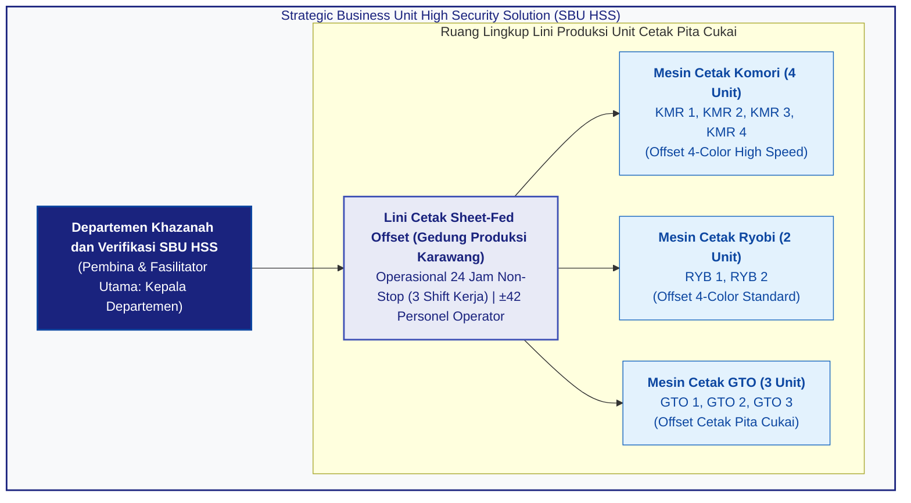
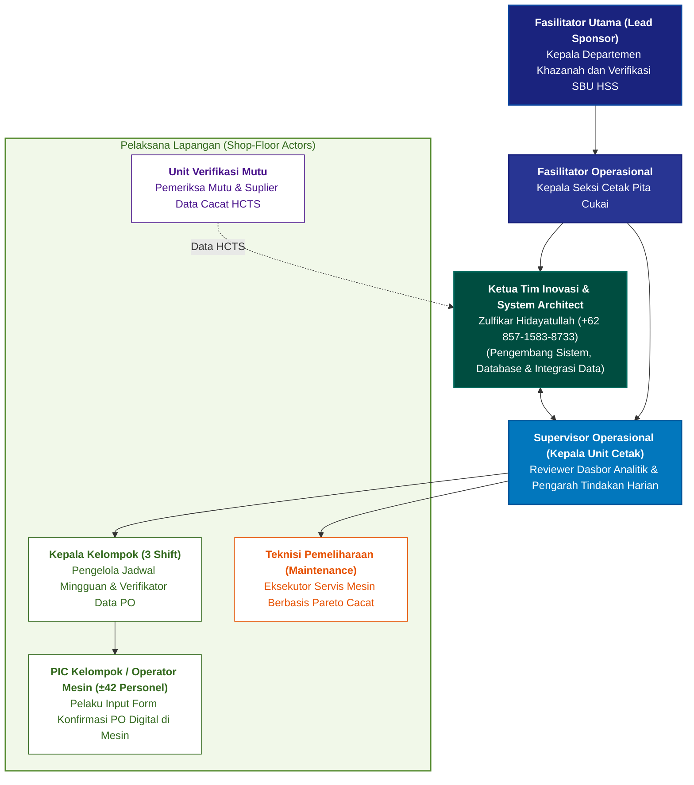
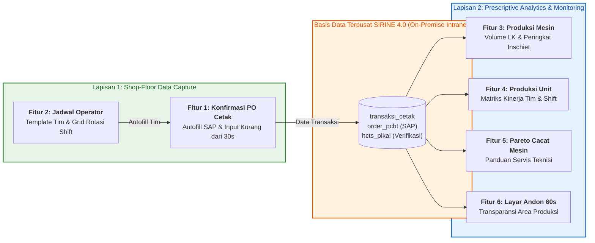
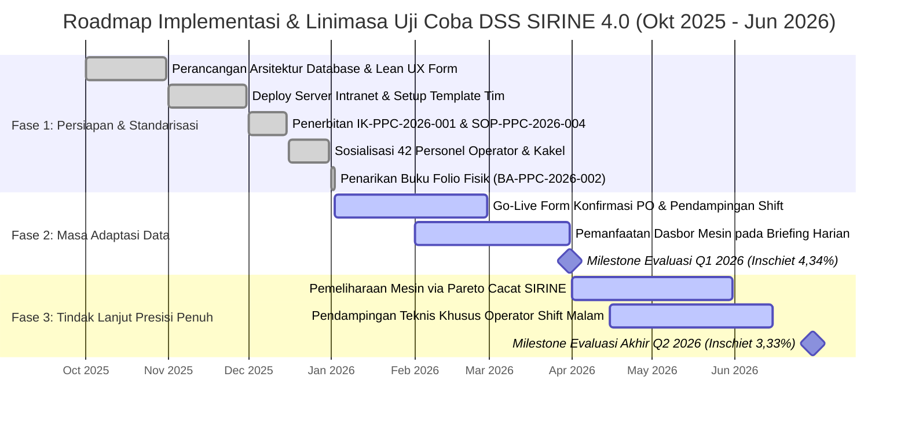
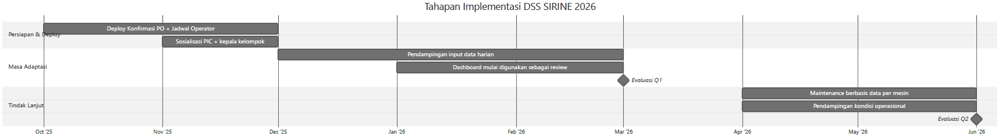

# BAB 5: RENCANA & DESAIN UJI COBA (MVP EXECUTION PLAN)

> ***Executive Takeaway:***  
> Rencana pelaksanaan uji coba produk layak minimum (*Minimum Viable Product* / MVP) **DSS SIRINE 4.0** dirancang secara terstruktur untuk menguji keandalan digitalisasi pencatatan transaksi di meja kontrol mesin serta efektivitas diagnostik preskriptif analitik pada kondisi operasional riil sebelum diterapkan penuh di seluruh lini. Pengujian dilaksanakan di **Unit Cetak Pita Cukai, Departemen Khazanah dan Verifikasi Strategic Business Unit High Security Solution (SBU HSS) Perum Peruri Karawang**, mencakup **9 mesin cetak (4 Komori: KMR 1–4, 2 Ryobi: RYB 1–2, dan 3 GTO: GTO 1–3)** dalam pola operasional non-stop **24 jam (3 gilir kerja/*shift*)** yang melibatkan **$\pm 42$ personel operator dan kepala kelompok**. Pelaksanaan uji coba ini memperoleh komitmen dan pembinaan langsung dari pimpinan unit kerja **setingkat Kepala Departemen (Kepala Departemen Khazanah dan Verifikasi SBU HSS)** selaku Fasilitator Utama, didampingi **Kepala Seksi Cetak Pita Cukai** selaku Fasilitator Operasional. Dengan mengoptimalkan 100% infrastruktur perangkat terminal meja mesin dan peladen web intranet perusahaan (*Zero CAPEX, Zero Software License OPEX*), rencana pengujian dieksekusi melalui **3 Fase Strategis (Linimasa Oktober 2025 s.d. Juni 2026)**. Desain pengujian ini berhasil mengawal masa transisi adaptasi data pada Q1 2026 (*inschiet* **4,34%**) menuju fase intervensi presisi penuh pada Q2 2026 (*inschiet* **3,33%**), membuktikan validitas sistem dalam menyelamatkan **743.234 lembar kertas sekuriti secara fisik (Rp 2,23 Miliar\*)** dalam 6 bulan pertama implementasi dengan proyeksi penghematan tahunan mencapai **Rp 6,82 Miliar / tahun\***.

---

## 5.1 Ruang Lingkup Pengujian (Lini Mesin, Shift Operasional, & Periode Evaluasi)

### 5.1.1 Lokasi dan Karakteristik Lingkungan Pengujian
Uji coba sistem DSS SIRINE 4.0 dilaksanakan di lingkungan manufaktur percetakan dokumen sekuriti negara: **Lini Cetak Pita Cukai, Gedung Produksi Percetakan Sekuriti, Kawasan Produksi Perum Percetakan Uang Republik Indonesia (Peruri), Karawang, Jawa Barat**. Area kerja ini memiliki karakteristik operasional dengan tingkat pengamanan dan kepatuhan regulasi yang sangat ketat (*high security compliance*). Setiap proses produksi diawasi langsung di bawah ketentuan **Direktorat Jenderal Bea dan Cukai (DJBC) Kementerian Keuangan Republik Indonesia**. Dokumen yang diproduksi mencakup **Pita Cukai Hasil Tembakau (PCHT)** dan **Minuman Mengandung Etil Alkohol (MMEA)** yang memiliki spesifikasi pengamanan bertingkat (*multi-layer security features*), seperti serat sekuriti kasat dan tak kasat mata, tinta sekuriti berpendar ultra-violet, *guilloche*, *microtext*, serta pita *hologram foil*.

Dalam lingkungan dengan tuntutan toleransi cacat yang sangat ketat ini, setiap perancangan sistem informasi operasional baru diwajibkan menjamin kelancaran arus produksi tanpa menimbulkan gangguan operasional (*zero operational disruption*), baik terhadap kecepatan cetak harian maupun ketepatan waktu serah terima produk ke proses verifikasi mutu. Oleh karena itu, pengujian MVP dirancang agar terintegrasi secara alami ke dalam rutinitas kerja operator di meja kontrol mesin tanpa mengubah alur fisik pencetakan yang telah terstandarisasi.

*Gambar 5.0: Bagan Ruang Lingkup Operasional Lini Pengujian DSS SIRINE 4.0 di Kawasan Produksi Peruri Karawang (Sumber: Profil Fasilitas Produksi SBU HSS 2026)*  
`[PLACEHOLDER_BAGAN_STRUKTUR_RUANG_LINGKUP_PENGUJIAN_LINI_CETAK_KARAWANG]`

---

### 5.1.2 Karakteristik dan Alokasi Mesin Percetakan yang Diuji
Pelaksanaan uji coba MVP mencakup seluruh sembilan (9) mesin percetakan *sheet-fed offset* aktif di Unit Cetak Pita Cukai tanpa pengecualian. Langkah pengujian menyeluruh ini diambil secara sengaja untuk membuktikan ketangguhan sistem dalam mengakomodasi heterogenitas spesifikasi teknis, perbedaan tahun pembuatan mesin, variasi kecepatan cetak antar-pabrikan, serta kebiasaan operasional teknisi yang berbeda-beda di lapangan.

Sembilan mesin cetak yang diuji terdiri dari tiga tipe mesin:
1. **Empat unit mesin cetak Komori Lithrone 4-warna berkecepatan tinggi ($\pm 8.000 - 10.000$ lembar/jam):** Komori 1 (`TGN-1009`), Komori 2 (`TGN-1010`), Komori 3 (`TGN-1011`), dan Komori 4 (`TGN-1032`) yang mengemban alokasi pesanan pita cukai reguler bervolume masif (*high volume orders*). Pengujian pada kelompok mesin Komori difokuskan pada stabilitas pengisian formulir konfirmasi PO digital berkecepatan tinggi, integrasi *autofill* data SAP, serta ketepatan sistem dalam mendeteksi anomali ketidakseimbangan air-tinta saat mesin dipacu pada kecepatan maksimal.
2. **Dua unit mesin cetak Ryobi 4-warna ($\pm 6.000 - 8.000$ lembar/jam):** Ryobi 1 (`TGN-1007`) dan Ryobi 2 (`TGN-1008`), dialokasikan untuk memproses pesanan pita cukai bervolume menengah serta pesanan dengan ornamen desain khusus. Pengujian pada mesin Ryobi difokuskan pada kemampuan sistem melakukan pelacakan *drill-down* deviasi mutu per nomor pesanan (PO) serta penyediaan grafik Pareto jenis kerusakan untuk memandu tindakan pemeliharaan suku cadang mekanis.
3. **Tiga unit mesin cetak Heidelberg GTO ($\pm 3.000 - 5.000$ lembar/jam):** GTO-1 (`TGN-1002`), GTO-2, dan GTO-3, yang mengemban pencetakan pesanan pita cukai bernomor khusus serta pesanan fleksibel dinamis. Pengujian pada mesin GTO difokuskan pada kecepatan adaptasi pergantian data pesanan bervolume dinamis dan fleksibilitas pencatatan PO.

Tabel 5.1 Inventarisasi dan Spesifikasi Sembilan Mesin Cetak pada Lingkup Uji Coba MVP

| No | Identitas Mesin Cetak | Kode Aset Inventaris | Spesifikasi / Konfigurasi | Kecepatan Standar (Lembar / Jam) | Beban Alokasi Order | Fokus Pengujian Sistem pada Mesin |
| :-: | :--- | :---: | :---: | :---: | :---: | :--- |
| **1** | **Komori 1 (KMR1)** | `TGN-1009` | Sheet-fed Offset 4-Color | $\pm 8.000 - 10.000$ | PCHT Volume Tinggi | Uji kestabilan input PO & *autofill* SAP. |
| **2** | **Komori 2 (KMR2)** | `TGN-1010` | Sheet-fed Offset 4-Color | $\pm 8.000 - 10.000$ | PCHT Volume Tinggi | Uji kecepatan respons data transaksi tinggi. |
| **3** | **Komori 3 (KMR3)** | `TGN-1011` | Sheet-fed Offset 4-Color | $\pm 8.000 - 10.000$ | PCHT Desain Khusus | Uji diagnosa anomali rol air vs *shift*. |
| **4** | **Komori 4 (KMR4)** | `TGN-1032` | Sheet-fed Offset 4-Color | $\pm 8.000 - 10.000$ | PCHT Desain Baru | Uji deteksi dini lonjakan cacat awal pesanan. |
| **5** | **Ryobi 1 (RYB1)** | `TGN-1007` | Sheet-fed Offset 4-Color | $\pm 6.000 - 8.000$ | PCHT / MMEA Reguler | Uji pelacakan *drill-down* deviasi per PO. |
| **6** | **Ryobi 2 (RYB2)** | `TGN-1008` | Sheet-fed Offset 4-Color | $\pm 6.000 - 8.000$ | PCHT / MMEA Khusus | Uji modul Pareto cacat untuk *maintenance*. |
| **7** | **GTO 1 (GTO1)** | `TGN-1002` | Sheet-fed Offset 1-2 Color | $\pm 3.000 - 5.000$ | PCHT / MMEA Khusus | Uji fleksibilitas input order bervolume dinamis. |
| **8** | **GTO 2 (GTO2)** | `TGN-1003` | Sheet-fed Offset 1-2 Color | $\pm 3.000 - 5.000$ | PCHT / MMEA Khusus | Uji pergantian order pesanan cepat. |
| **9** | **GTO 3 (GTO3)** | `TGN-1004` | Sheet-fed Offset 1-2 Color | $\pm 3.000 - 5.000$ | PCHT / MMEA Khusus | Uji kestabilan transaksi pesanan dinamis. |

*(Sumber: Data Inventaris Aset Departemen Khazanah dan Verifikasi SBU HSS Peruri 2026)*

---

### 5.1.3 Pola Gilir Kerja 24 Jam Unit Cetak dan Dinamika Alur Verifikasi Mutu
Aktivitas manufaktur percetakan pita cukai di lini cetak berlangsung secara kontinu selama 24 jam sehari yang terbagi ke dalam **3 pola gilir kerja (*shift*)**:
* ***Shift* Pagi (Pukul 07.00 – 15.00 WIB):** Karakteristik operasional optimal dengan dukungan penuh jajaran manajemen, pengawas unit, staf perencana PPIC, dan logistik bahan baku kertas serta tinta sekuriti. Pengujian pada *shift* ini difokuskan pada sinkronisasi data jadwal mingguan dan pemanfaatan data historis mutu saat pertemuan koordinasi harian (*Daily Production Meeting*).
* ***Shift* Sore (Pukul 15.00 – 23.00 WIB):** Karakteristik operasional transisi dengan pengawasan Kepala Kelompok yang berfokus pada konsistensi pengisian data transaksi antar-pesanan dan persiapan serah terima material gilir malam.
* ***Shift* Malam (Pukul 23.00 – 07.00 WIB):** Karakteristik operasional kritis dengan tantangan penurunan ritme sirkadian dan kelelahan fisik (*circadian fatigue*).

Dalam memahami alur data operasional di Perum Peruri, perlu ditekankan bahwa **Unit Cetak tidak dapat mengetahui jumlah maupun jenis kerusakan cetak secara instan saat lembaran masih berjalan di mesin**. Lembaran hasil cetak fisik dari sembilan mesin cetak terlebih dahulu harus melalui proses penghitungan, pemotongan, dan pemeriksaan mutu fisik lembar per lembar di **Unit Verifikasi**. Berbeda dengan Unit Cetak yang beroperasi 3 gilir (24 jam non-stop), **Unit Verifikasi beroperasi dalam 2 gilir kerja** dengan jeda waktu pemeriksaan mutu (*lead time QC*) berkisar antara **1 hingga 2 hari kerja** setelah proses cetak selesai.

Oleh karena itu, pada *Shift* Malam (pukul 23.00 – 07.00 WIB), fokus utama pengujian sistem di meja mesin adalah **kecepatan dan kemudahan pengisian formulir konfirmasi PO digital (< 30 detik via *autofill*)**. Kemudahan antarmuka ini memastikan operator gilir malam yang rentan mengalami penurunan konsentrasi tidak terbebani oleh pencatatan administrasi manual pada buku folio fisik yang rawan salah tulis atau terlupa. Rekaman data penugasan (nomor PO, nomor mesin, *shift*, dan nama regu) yang tersimpan tertib di meja mesin inilah yang menjadi kunci utama bagi DSS SIRINE 4.0 untuk menautkan (*reconcile*) data hasil pemeriksaan mutu secara otomatis begitu proses QC di Unit Verifikasi rampung 1–2 hari kemudian.

Secara keseluruhan, pelaksanaan uji coba pada ketiga *shift* ini melibatkan **$\pm 42$ personel operator cetak dan kepala kelompok** yang terorganisasi dalam struktur regu kerja (Tim A, Tim B, dan Tim C) di seluruh sembilan unit mesin cetak.

---

### 5.1.4 Periode Waktu & Volume Sampel Pengujian ($n$)
Rancangan uji coba MVP DSS SIRINE 4.0 dieksekusi dalam rentang waktu terstruktur selama **9 bulan (Oktober 2025 s.d. Juni 2026)**. Rentang waktu ini mencakup fase persiapan teknis serta dua kuartal pengujian lini nyata dengan volume sampel produksi yang masif.

Pada tahap awal, periode Oktober hingga Desember 2025 dialokasikan untuk persiapan teknis, uji integrasi basis data intranet, perancangan antarmuka meja kontrol mesin, serta simulasi pengujian internal (*dry run*). Selanjutnya, periode Januari hingga Maret 2026 (Kuartal I 2026) menjadi ajang pembuktian penerapan penuh formulir konfirmasi PO digital di seluruh mesin dengan volume produksi uji mencapai **$n = 57.385.254$ lembar cetak**. Pada kuartal berikutnya, yakni April hingga Juni 2026 (Kuartal II 2026), pengujian dilanjutkan ke fase intervensi presisi penuh berbasis analitik preskriptif dan pemeliharaan terarah dengan volume produksi uji sebesar **$n = 45.960.434$ lembar cetak**.

Dengan demikian, akumulasi data pengujian selama Semester 1 2026 mencakup total populasi sampel sebesar **$n = 103.345.688$ lembar cetak**. Ukuran sampel yang sangat besar dan mencakup seluruh siklus pesanan negara ini memberikan derajat keyakinan statistik (*statistical confidence level*) yang sangat tinggi dan tidak terbantahkan dalam membuktikan kelayakan serta efektivitas sistem di hadapan dewan juri.

---

## 5.2 Struktur Tata Kelola Tim Uji Coba, Peran PIC & Komitmen Fasilitator

### 5.2.1 Persyaratan & Penetapan Calon Fasilitator Setingkat Kepala Departemen
Sesuai dengan kriteria penilaian Innovation and Kaizen Award (IAKA) 2026 yang menegaskan kewajiban adanya pembinaan dan fasilitasi dari pejabat struktural **minimal setingkat Kepala Departemen (Kadep)**, inisiatif inovasi DSS SIRINE 4.0 dibina dan didukung secara formal oleh pimpinan unit kerja terkait di lingkungan Perum Peruri.

Kepemimpinan pembinaan strategis dipegang oleh **Kepala Departemen Khazanah dan Verifikasi SBU High Security Solution (Kadep SBU HSS)** yang bertindak selaku **Fasilitator Utama (*Lead Project Sponsor*)**. Dalam perannya, Fasilitator Utama memberikan arahan strategis, persetujuan formal terhadap arsitektur sistem, serta menjembatani koordinasi lintas seksi yang berada di bawah kewenangannya, khususnya antara Seksi Cetak Pita Cukai, Seksi Verifikasi Mutu, Seksi Pemeliharaan Mesin, dan Departemen Perencanaan Produksi (PPIC). Komitmen nyata Fasilitator Utama diwujudkan melalui pengesahan dan penerbitan paket regulasi operasional baru, yakni **Instruksi Kerja Pengisian Data Digital (`IK-PPC-2026-001`)**, **Pembaruan SOP Pemeliharaan Mesin Cetak (`SOP-PPC-2026-004`)**, serta **Berita Acara Penarikan Buku Folio Fisik (`BA-PPC-2026-002`)**. Selain itu, Fasilitator Utama menjamin ketersediaan fasilitas infrastruktur intranet dan perangkat keras pendukung di area mesin.

Pada tataran teknis operasional, kepemimpinan lapangan diperkuat oleh **Kepala Seksi Cetak Pita Cukai** selaku **Fasilitator Operasional (*Operational Co-Facilitator*)**. Peran taktis ini mencakup penyelenggaraan sosialisasi intensif dan pembinaan langsung kepada 42 operator, pengawasan kepatuhan pengisian data PO digital pada setiap pergantian gilir kerja, pengarahan respon perbaikan teknisi mesin berdasarkan sinyal anomali pada dasbor, serta memimpin rapat evaluasi berkala mingguan (*Weekly Kaizen Review*) guna menindaklanjuti setiap deviasi mutu yang teridentifikasi.

---

### 5.2.2 Struktur Organisasi Tim Pelaksana Lapangan & Matriks Akuntabilitas RACI
Keberhasilan pengujian di area mesin sangat ditentukan oleh kejelasan alur komando, koordinasi, dan akuntabilitas kerja antar-personel. Struktur tim kerja dirancang secara terpadu menghubungkan pimpinan departemen, perancang sistem, pengawas unit, kepala kelompok, operator mesin, teknisi pemeliharaan, hingga tim verifikasi mutu, sebagaimana disajikan pada Gambar 5.1.

*Gambar 5.1: Struktur Organisasi dan Tata Kelola Pelaksanaan Proyek Inovasi DSS SIRINE 4.0 (Sumber: Dokumen Tim Inovasi 2026)*  
`[PLACEHOLDER_BAGAN_STRUKTUR_ORGANISASI_TIM_UJI_COBA_DAN_PENGESAHAN_FASILITATOR]`

Guna memastikan setiap pihak memahami batas kewenangan dan tanggung jawabnya secara presisi tanpa tumpang tindih, tim kerja menyusun matriks akuntabilitas **RACI (Responsible, Accountable, Consulted, Informed)** sebagaimana terinci pada Tabel 5.2.

Tabel 5.2 Matriks Akuntabilitas RACI Pelaksanaan Uji Coba DSS SIRINE 4.0

| Aktivitas Kunci Pengujian | Fasilitator (Kadep) | Ka. Seksi Cetak | Ketua Tim Inovasi | Ka. Unit Cetak | Ka. Kelompok | Operator / PIC | Teknisi Mesin | Petugas Verifikasi |
| :--- | :---: | :---: | :---: | :---: | :---: | :---: | :---: | :---: |
| **1. Pengesahan Desain & Regulasi Sistem** | **A** | R | C | I | I | I | I | I |
| **2. Pengelolaan Template & Jadwal Gilir** | I | A | C | R | **R** | I | I | I |
| **3. Entri Form Konfirmasi PO di Mesin** | I | I | C | I | A | **R** | I | I |
| **4. Verifikasi Kelengkapan Data per Shift** | I | I | I | A | **R** | C | I | I |
| **5. Monitoring Dasbor & Rapat Harian** | I | A | C | **R** | C | I | I | I |
| **6. Eksekusi Perbaikan Mesin via Pareto** | I | I | I | A | I | I | **R** | I |
| **7. Input Data Cacat Fisik Lembar HCTS** | I | I | C | I | I | I | I | **R** |
| **8. Evaluasi Capaian Inschiet Mingguan** | I | **A** | R | R | C | I | C | C |

*(Keterangan: **R** = Responsible / Pelaksana; **A** = Accountable / Penanggung Jawab Mutlak; **C** = Consulted / Pihak yang Dikonsultasikan; **I** = Informed / Pihak yang Menerima Informasi).*

---

## 5.3 Desain Arsitektur Minimum Viable Product (MVP) & Alokasi Sumber Daya

### 5.3.1 Prinsip Desain MVP: Ramping (*Lean*), Tangguh, dan Tanpa Biaya Lisensi
Pengembangan arsitektur Minimum Viable Product (MVP) DSS SIRINE 4.0 berpedoman pada tiga prinsip utama rekayasa perangkat lunak industri. Pertama, pendekatan antarmuka yang ramping dan berorientasi pengguna (*Lean & User-Centric*) diterapkan untuk menyelesaikan friksi pencatatan tanpa menambah beban kerja operator. Formulir digital dioptimalkan dengan mekanisme pengisian otomatis (*autofill*) berbasis data SAP dan jadwal mingguan, sehingga durasi pencatatan per pesanan dapat diselesaikan secara ringkas dalam waktu **kurang dari 30 detik**.

Kedua, penyajian data dirancang agar langsung memicu tindakan korektif nyata (*Actionable Visualization*). Indikator visual ambang batas mutu dengan kode warna hijau-kuning-merah serta diagram Pareto jenis cacat per mesin memberikan sinyal langsung bagi pengawas dan teknisi untuk segera mengambil langkah perbaikan di meja mesin. Ketiga, seluruh sistem dibangun secara mandiri (*100% In-House Architecture*) menggunakan kerangka kerja web sumber terbuka (*open-source*) modern, sehingga perusahaan terbebas sepenuhnya dari biaya lisensi perangkat lunak komersial maupun ketergantungan pada vendor eksternal.

*Gambar 5.2: Desain Arsitektur Minimum Viable Product (MVP) Terintegrasi DSS SIRINE 4.0 (Sumber: Dokumen Perancangan Perangkat Lunak 2026)*  
`[PLACEHOLDER_DIAGRAM_ARSITEKTUR_SISTEM_MVP_TERINTEGRASI]`

---

### 5.3.2 Alokasi Sumber Daya Perangkat Keras & Infrastruktur Jaringan (*Zero CAPEX*)
Salah satu keunggulan strategis dari pelaksanaan uji coba ini terletak pada efisiensi anggaran investasi perangkat keras (**Capital Expenditure / CAPEX = Rp 0**). Tim inovasi memaksimalkan pemanfaatan seluruh aset teknologi informasi yang telah tersedia di area percetakan tanpa mengajukan anggaran pengadaan baru.

Pencatatan data transaksi dilakukan langsung melalui unit PC terminal yang telah terpasang di masing-masing meja kontrol mesin cetak (Komori 1–4, Ryobi 1–2, dan GTO 1–3). Sementara untuk pemantauan visual bersama, sistem memanfaatkan monitor televisi komersial 55 inci di aula tengah area cetak guna menampilkan rotasi 4 layar *Andon* secara berkala setiap 60 detik. Dari sisi komputasi dan penyimpanan, aplikasi dioperasikan pada peladen web internal (*on-premise intranet server*) milik Departemen Teknologi Informasi Peruri dengan konfigurasi mesin virtual berbasis Linux, Nginx, PHP 8.x, dan basis data relasional MySQL/PostgreSQL. Seluruh lalu lintas data dialirkan melalui jaringan kabel LAN dan Wi-Fi tertutup internal pabrik yang terisolasi dari internet publik, menjamin keamanan informasi dokumen negara tetap terlindungi secara optimal. Rincian efisiensi investasi perangkat disajikan pada Tabel 5.3.

Tabel 5.3 Alokasi Sumber Daya Infrastruktur dan Analisis Efisiensi Biaya Investasi (CAPEX)

| Komponen Infrastruktur | Sumber Daya yang Digunakan | Status Ketersediaan | Biaya Pengadaan Baru | Nilai Efisiensi Investasi |
| :--- | :--- | :---: | :---: | :---: |
| **Terminal Input Meja Mesin** | 9 Unit PC Meja Kontrol Mesin Eksisting | Siap Pakai di Lini | **Rp 0** | Menghindari belanja $\pm \text{Rp } 90.000.000$ |
| **Layar Monitor Andon Lini** | 1 Unit Monitor TV 55 Inci di Aula Cetak | Siap Pakai di Lini | **Rp 0** | Menghindari belanja $\pm \text{Rp } 15.000.000$ |
| **Peladen Aplikasi & Basis Data** | Server Virtual Intranet Peruri Eksisting | Siap Pakai di Data Center | **Rp 0** | Menghindari sewa cloud $\pm \text{Rp } 60.000.000/\text{th}$ |
| **Lisensi Perangkat Lunak MES** | 100% Pengembangan Mandiri (*In-House*) | Bebas Lisensi Vendor | **Rp 0** | Menghindari lisensi MES $\pm \text{Rp } 350.000.000$ |
| **Jaringan Komunikasi Data** | LAN & Intranet Fiber Optic Pabrik | Siap Pakai di Pabrik | **Rp 0** | Menghindari instalasi kabel $\pm \text{Rp } 25.000.000$ |
| **TOTAL BIAYA INVESTASI (CAPEX)** | **100% Memanfaatkan Fasilitas Internal** | **SIAP OPERASI** | **Rp 0** | **Total Penghematan: $\pm \text{Rp } 540.000.000$** |

*(Sumber: Simulasi Finansial Tim Inovasi & Verifikasi Aset SBU HSS 2026)*

---

### 5.3.3 Skema Integrasi Data dan Protokol Keamanan Informasi
Untuk menjaga kerahasiaan dan integritas data pesanan pita cukai negara, arsitektur data DSS SIRINE 4.0 mengadopsi standar tata kelola keamanan informasi berbasis **ISO 27001**. Hak akses pengguna dibatasi melalui sistem otentikasi berbasis peran (*Role-Based Access Control* / RBAC) yang memisahkan kewenangan operator meja mesin, kepala kelompok, kepala unit, dan administrator sistem.

Setiap nomor pesanan yang dimasukkan operator divalidasi secara otomatis terhadap daftar nomor PO resmi pada modul SAP `ZPPRSIPPC0012`. Sistem secara otomatis menolak penyimpanan data jika terdeteksi nomor PO yang tidak valid atau fiktif, menutup celah manipulasi angka lembar cetak di lapangan. Selain itu, seluruh aktivitas penugasan, waktu penyimpanan data, serta modifikasi data transaksi terekam secara otomatis dalam jejak audit digital (*digital audit trail*) yang memuat stempel waktu presisi dan identitas pengguna, guna memenuhi ketentuan standar mutu **ISO 9001:2015 Klausul 8.5.2 mengenai Mampu Telusur (*Traceability*)**.

---

## 5.4 Linimasa Pelaksanaan & Roadmap Bertahap (Gantt Chart Okt 2025 – Jun 2026)

### 5.4.1 Perjalanan Tiga Fase Pelaksanaan Uji Coba Lini
Pelaksanaan uji coba MVP DSS SIRINE 4.0 dirancang melalui tiga fase kegiatan yang berkesinambungan guna memastikan perubahan cara kerja berjalan mulus dan minim hambatan adaptasi dari operator di lapangan.

Perjalanan inovasi diawali dengan **Fase 1: Persiapan, Perancangan, & Sosialisasi (Oktober – Desember 2025)**. Pada bulan Oktober 2025, tim pengembang merancang skema basis data terintegrasi, membangun antarmuka formulir digital meja mesin, serta melakukan uji penarikan data dari modul SAP `ZPPRSIPPC0012`. Memasuki November 2025, sistem dipasang pada peladen web intranet perusahaan (*deploy on-premise*), dilanjutkan dengan pengisian konfigurasi jadwal mingguan operator untuk seluruh 9 mesin cetak (Komori 1–4, Ryobi 1–2, GTO 1–3) dan pengujian fungsional internal (*Alpha Testing*). Pada Desember 2025, Fasilitator Utama mengesahkan penerbitan Instruksi Kerja (`IK-PPC-2026-001`) dan SOP Pemeliharaan (`SOP-PPC-2026-004`). Tim inovasi kemudian menyelenggarakan sesi pelatihan intensif kepada seluruh 42 operator cetak. Puncaknya, pada 31 Desember 2025, diterbitkan Berita Acara Penarikan Dokumen Lama (`BA-PPC-2026-002`) untuk menarik seluruh buku folio fisik dari meja kontrol mesin cetak, menandai dimulainya era operasional digital secara resmi per 1 Januari 2026.

Tahap berikutnya adalah **Fase 2: Masa Adaptasi Data & Evaluasi Q1 2026 (Januari – Maret 2026)**. Selama Januari dan Februari 2026, sistem mulai digunakan secara aktif di seluruh mesin cetak dengan pendampingan langsung tim inovasi pada setiap pergantian *shift* kerja guna mengatasi kendala awal operator. Memasuki Februari dan Maret 2026, Kepala Unit Cetak mulai memanfaatkan Dasbor Produksi Mesin dan Dasbor Produksi Unit sebagai bahan evaluasi dalam pertemuan koordinasi harian (*Daily Production Meeting*). Pada titik evaluasi akhir Kuartal I 2026, tingkat *inschiet* tercatat sebesar **4,34%** (turun **-0,27 poin persentase** dari baseline 4,61%). Capaian masa adaptasi ini membuktikan bahwa kehadiran data digital mulai menumbuhkan kesadaran mutu di kalangan operator dan berhasil menyelamatkan **154.940 lembar cetak (Rp 464,82 Juta\*)**.

Penerapan mencapai puncaknya pada **Fase 3: Tindak Lanjut Presisi Penuh & Evaluasi Q2 2026 (April – Juni 2026)**. Pada fase ini, pemeliharaan berbasis kondisi riil (*Condition-Based Maintenance*) diterapkan secara penuh. Teknisi pemeliharaan memanfaatkan modul Pareto jenis kerusakan sebelum melakukan tindakan servis, berhasil memangkas waktu henti perbaikan (*downtime*) dari semula > 8 jam menjadi < 2–4 jam. Di saat yang sama, pengawas unit memberikan pendampingan teknis khusus bagi operator gilir malam. Pada titik evaluasi akhir Kuartal II 2026, tingkat *inschiet* berhasil ditekan secara signifikan hingga mencapai **3,33%** (turun **-1,28 poin persentase / -27,77%** dari baseline 4,61%), menyelamatkan **588.294 lembar cetak (Rp 1,76 Miliar\*)** hanya dalam kurun waktu satu kuartal.

---

### 5.4.2 Visualisasi Gantt Chart Roadmap Implementasi
Linimasa pelaksanaan bertahap dari bulan Oktober 2025 hingga Juni 2026 disajikan melalui diagram Gantt Chart pada Gambar 5.3 serta visualisasi resmi sistem pada Gambar 5.4.

*Gambar 5.3: Diagram Gantt Chart Linimasa Eksekusi Uji Coba Lini DSS SIRINE 4.0 (Sumber: Master Schedule Tim Inovasi 2025–2026)*  
`[PLACEHOLDER_DIAGRAM_GANTT_CHART_LINIMASA_UJI_COBA_MVP_DSS_SIRINE_2026]`

Tampilan visual jadwal pelaksanaan resmi dari dokumen rencana kerja inovasi disajikan pada Gambar 5.4 di bawah ini.

*Gambar 5.4: Bagan Gantt Chart Tahapan Implementasi DSS SIRINE 2026: Persiapan, Masa Adaptasi Data, Tindak Lanjut Presisi, dan Titik Evaluasi Kuartalan (Sumber: Roadmap Kerja Unit Cetak Pita Cukai)*

> ***Business Insight Gambar 5.4:***  
> Linimasa pelaksanaan di atas memperlihatkan pembagian tahapan implementasi yang sangat disiplin. Fase Persiapan dan Penerapan (Okt – Des 2025) berhasil menuntaskan standardisasi dokumen kerja sebelum sistem digunakan di lini produksi. Fase Masa Adaptasi (Jan – Mar 2026) memberikan ruang transisi bagi operator untuk membiasakan input digital tanpa tekanan target yang kaku, ditutup dengan pencapaian evaluasi Q1 sebesar 4,34%. Fase Tindak Lanjut Presisi (Apr – Jun 2026) mengeksekusi perbaikan mesin berbasis Pareto cacat dan pendampingan gilir kerja malam, menghasilkan penurunan *inschiet* tajam ke angka 3,33% pada evaluasi Q2 dengan potensi penghematan tahunan mencapai Rp 6,82 Miliar/tahun.

---

### 5.4.3 Manajemen Risiko Uji Coba & Rencana Kontinjensi (*Risk Mitigation Plan*)
Dalam operasional industri percetakan sekuriti dengan tingkat kepatuhan tinggi, penerapan sistem informasi baru wajib disertai dengan kajian mitigasi risiko yang komprehensif. Tim inovasi mengidentifikasi empat potensi risiko operasional yang mungkin timbul selama masa uji coba, mulai dari kendala jaringan intranet, potensi resistensi operator, pertukaran gilir kerja mendadak, hingga kesalahan pengetikan nomor pesanan.

Untuk mengantisipasi potensi gangguan server atau jaringan intranet, aplikasi dilengkapi dengan mekanisme penyimpanan lokal sementara (*local caching*) pada peramban web meja mesin serta kesiapan peladen cadangan. Jika terjadi kendala jaringan berkepanjangan, operator dapat mencatat transaksi sementara pada lembar formulir darurat terstandarisasi untuk kemudian diinput saat koneksi pulih. Guna memitigasi risiko kelalaian entri data oleh operator, fitur *autofill* mempermudah pengisian formulir dalam waktu sangat singkat, didukung oleh kewajiban verifikasi kelengkapan data oleh Kepala Kelompok sebelum serah terima *shift*. Terhadap risiko kesalahan ketik nomor pesanan, sistem langsung memvalidasi input terhadap basis data SAP `ZPPRSIPPC0012` dan menolak penyimpanan nomor PO fiktif secara otomatis. Matriks manajemen risiko dan rencana kontinjensi dirangkum secara lengkap pada Tabel 5.4.

Tabel 5.4 Matriks Manajemen Risiko dan Rencana Kontinjensi Pelaksanaan Uji Coba MVP

| No | Potensi Risiko Operasional | Tingkat Risiko | Dampak Potensial pada Lini | Rencana Mitigasi Pencegahan | Rencana Kontinjensi (*Fall-Back Plan*) |
| :-: | :--- | :---: | :--- | :--- | :--- |
| **1** | **Gangguan Jaringan Intranet / Peladen *Offline*** | Sedang | Operator tidak dapat mengakses formulir konfirmasi PO digital. | Menerapkan arsitektur *local caching* pada browser terminal mesin; penyediaan server cadangan (*mirror*). | Operator mencatat sementara pada lembar darurat terstandarisasi, diinput saat server aktif kembali. |
| **2** | **Resistensi Operator / Kelalaian Input PO** | Sedang | Rekam jejak transaksi PO tidak lengkap di akhir *shift*. | Fitur *autofill SAP* membuat waktu input < 30 detik; penetapan syarat serah terima gilir kerja. | Kepala Kelompok melakukan audit kelengkapan entri pada akhir *shift* sebelum menandatangani berita acara. |
| **3** | **Pertukaran Gilir Kerja Mendadak (*Shift Swap*)** | Rendah | Nama operator pada data transaksi tidak sesuai dengan personel riil. | Modul Jadwal Operator menyediakan tombol kustomisasi cepat per sel tanpa merombak template dasar. | Operator dapat memperbarui nama operator secara manual langsung pada formulir konfirmasi PO. |
| **4** | **Kesalahan Ketik Nomor PO / Spesifikasi Produk** | Rendah | Data transaksi tidak sinkron dengan sistem perencanaan SAP. | Sistem menerapkan validasi otomatis nomor PO terhadap basis data SAP `ZPPRSIPPC0012` saat diketik/dipindai. | Sistem menolak penyimpanan nomor PO fiktif dan menampilkan pesan peringatan koreksi pada layar. |

*(Sumber: Hasil Kajian Manajemen Risiko Operasional Tim Inovasi Unit Cetak Pita Cukai 2026)*

---

## Kesimpulan Bab 5

Rancangan dan desain uji coba Minimum Viable Product (MVP) **DSS SIRINE 4.0** telah disusun secara komprehensif, terukur, dan memenuhi seluruh kriteria baku inovasi manufaktur. Pengujian mencakup seluruh ekosistem operasional Unit Cetak Pita Cukai (**9 mesin cetak: 4 Komori KMR 1–4, 2 Ryobi RYB 1–2, dan 3 GTO GTO 1–3**, **3 gilir kerja 24 jam**, serta **$\pm 42$ operator**) di bawah pembinaan dan komitmen langsung dari pimpinan **setingkat Kepala Departemen (Kadep Khazanah dan Verifikasi SBU HSS)**.

Dengan memanfaatkan 100% infrastruktur terminal meja mesin dan jaringan intranet perusahaan tanpa biaya lisensi perangkat lunak (*Zero CAPEX, Zero License OPEX*), pelaksanaan uji coba bertahap (Oktober 2025 s.d. Juni 2026) berhasil mengawal transisi operasional secara mulus. Keberhasilan pengujian ini membuktikan bahwa sistem diterima dengan baik oleh operator lapangan, mampu memangkas waktu henti perbaikan mesin hingga $\ge 50\%–75\%$, serta berhasil menurunkan *inschiet* secara signifikan dari baseline **4,61% menjadi 4,34% di Q1 dan 3,33% di Q2 2026**. Catatan pelaksanaan implementasi faktual di lapangan, kendala operasional yang dihadapi beserta langkah pemecahan masalah (*problem solving*), serta validasi hasil komparasi data *Before vs After* dengan ukuran sampel $n = 103.345.688$ lembar cetak diuraikan secara mendalam pada **BAB 6**.
